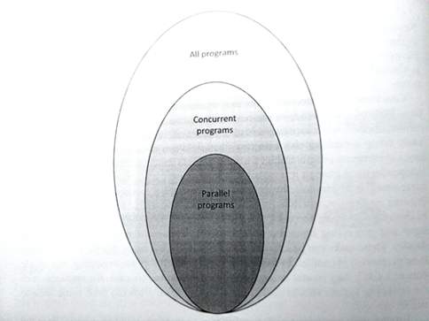

# 1.4 并发和并行编程模型

尝试使用OpenCL进行应用开发之前，需要来讨论一下并行和并发执行模型，以便于我们选择合适的模型。虽然，后面的模型OpenCL都能支持，不过具体的底层硬件可能会有一些限制，这就需要进行一定的尝试。

当我们在讨论并发编程时，就意味着独立的系统在执行多个独立的任务。不过，人们一般不会关心这些任务是否真正的在系统中同时执行。例如一个简单的绘图程序，其收到用户使用鼠标和键盘发送过来的输入信号，或更新当前显示的图片。应用可以并发的接收输入信号，并处理与显示相关的对应信号，从而更新显示图像。这些任务的表现看起来是并发的，不过这些任务实际是并行执行。实际上，这些任务执行在一个CPU上，它们不能并行的执行。在这个例子中，应用或操作系统需要在不同任务间进行切换，确保这些任务都能执行在同一个内核上。

并行化关心的是两个或多个事件同时执行，以提高整体性能。比如如下的赋值语句：

```
// 代码清单1.2
Step 1: A = B + C
Step 2: D = E + G
Step 3: R = A + D
```

A和D分别在第一和第二步进行赋值，并且这两步之间没有数据依赖，相互独立。第一步和第二步等号左右的数据均不相同，所以第一步和第二步可以并行的执行。第三步数据依赖于第一步和第二步的结果，所以其只能在第一步和第二步执行完成之后执行。

并行编程必须是并发的，不过并发编程不一定并行。虽然很多并发程序可以并行执行，但是互相有依赖的并发任务就不能并行了。比如：交错执行就符合并发的定义，而不能并行的执行。所以，并行是并发的一个子集，并发程序是所有程序集的一个子集。图1.6展示了这三种程序集间的关系。



图1.6：三种程序集间的关系

接下来的章节中，会介绍一些知名的方式进行异构编程。这里对并发和并行的介绍，是为第2和第3章介绍OpenCL做好铺垫。

