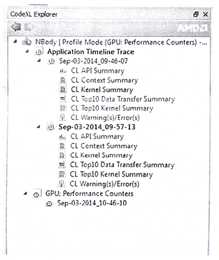
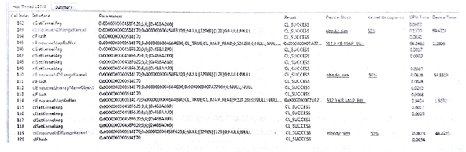
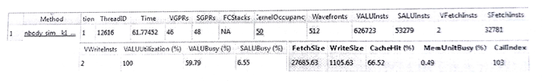

#10.4 如何使用AMD CodeXL

性能分析模式下，CodeXL可以作为性能分析工具将OpenCL运行时和AMD GPU执行时的数据汇总在一起。我们可以通过这种方式找到应用的瓶颈所在，并且找到最佳的方式在AMD平台上对应用性能进行优化。在这之后，我们将性能分析模式下的CodeXL称为*分析器*(profiler)。

为了在Visual Studio中使用CodeXL插件，只需要简单的将解决方案导入Visual Studio即可。通常，CodeXL事件浏览窗口和Visual Studio解决方案窗口停靠在一起。再将某一个C/C++工程设置为启动工程，并且在CodeXL菜单栏中选定Proflie Mode。这个模式可以获取到的信息如下所示：

- GPU应用时间线轨迹
- GPU在执行内核时的性能计数
- 收集CPU在执行时的性能信息

菜单栏中，我们可以收集一个应用的时间线轨迹或GPU性能计数器。当应用完成执行，分析器会对收集到的信息进行处理，然后在界面上进行显示。CodeXL独立运行时也可以完成该功能，可以通过一个命令工具——sprofile(在CodeXL的安装路径下)。使用sprofile的方式不需要加载源码，只需要执行对应的二进制文件即可。

每一次执行对于分析器来说都是一个新的任务，所以分析器会将其分为多个任务。图10.1中展示了具有三个任务的CodeXL分析器。

图10.1 CodeXL分析模式下的任务。两个任务获取的的是应用时间线，另一个获取的是GPU计数器

##10.4.1 OpenCL应用的跟踪信息

OpenCL跟踪链表中的信息都是有关OpenCL API的调用。对于每次的API调用，分析器都会记录其输入参数，以及输出结果。另外，分析器同时也记录了CPU上代码的时间戳和OpenCL运行时的时间戳信息。输出数据记录在一个文本格式的文件中，称为应用性能跟踪文件。

对于OpenCL程序的跟踪对于理解复杂程序的高级框架是十分有帮助的。OpenCL应用的跟踪数据可助我们了解如下信息：

- 通过时间线的角度，我们可以了解应用的高级架构。并且，可以确定应用中创建的OpenCL上下文数量，以及命令队列创建的数量和其在应用中的应用。内核执行和数据传输操作的时间也在时间线上可见。
- 总结页面可以帮助我们了解，当前应用的瓶颈是否在内核执行或数据传输上。我们找到最耗时的10个内核和数据传输操作，以及API调用(调用次数最多的API或执行最耗时的API)。
- 可以通过API跟踪的页面，来了解和调试所有API的输入参数和输出数据。
- 查看警告，并尝试使用最佳的方式调用OpenCL API。

应用的时间线(如图10.2所示)提供了应用在执行时的甘特图。最顶部的时间线是时间格，用来表示该应用总体的耗时情况。其计时的方式是以第一次OpenCL的调用作为起始，最后一个OpenCL调用作为结束。下面的时间线中，主机端线程对OpenCL的调用都展示在事件先中。对于每个主机端线程，OpenCL API调用都会在甘特图中绘制成一个单独的时间格。

图10.2 Nbody应用在CodeXL性能分析模式下的时间线。我们能看到数据传输和内核运行的耗时情况。

下面的主机线程中，OpenCL树展示了所有创建的上下文和命令队列，以及数据传输操作和每个命令队列中的内核执行事件。我们可以对事件线进行缩放、平移、折叠和展开，或选择一段感兴趣的区域。我们也可以通过相关的API调用，看到API的时间格，反之亦然。时间线另外一个很实用的功能是，右键点击对应的API，可以显示该API在源码中的位置。

用时间线对于调试OpenCL应用十分有用。下面介绍一下时间线所带来的好处：

- 你需要确定你应用中的外部框架是否正确。通过测试时间线，你可以确定队列和上下文对象的创建，与你的期望是否一致。
- 可以增加对同步操作的信心。例如，当内核A需要依赖一个内存操作，并且这个内存的数据来源于内核B，那么内核A就应该出现在内核B之后的时间线中。通过传统的调试方式，我们很难找到同步所引发的错误。
- 最后，你可以了解到应用是利用硬件是否高效。时间线展示了同时执行的独立内核和数据传输操作。

##10.4.2 跟踪主机端API

主机端API跟踪展示(如图10.3)，列出了每个主机线程调用OpenCL API的情况。这里我们使用AMD OpenCL SDK中的Nbody应用作为测试用例。每个调用过OpenCL API的线程都会展示在表中。

图10.3 Nbody应用在CodeXL性能分析模式下对API调用的跟踪

主机API跟踪包含一系列主机线程对OpenCL API的调用。对于每一次调用，列表中都会用相应的索引(根据执行顺序)进行表示，API函数的名称，传入参数和返回值都会进行记录。当要了解传入的参数时，分析器就会尝试去解应用指针、反编码枚举值等方式，给开发者提供尽可能多有用的信息。双击主机API，就可以看到对应API在主机线程中对应时间线的位置。

主机API跟踪允许我们对每个API的输入和输出结果进行分析。例如，可以简单查询所有API是否都返回了CL_SUCCESS，或对应的数组对象是否使用正确的标识进行创建。这里我们也可以看到冗余的API使用。

##10.4.3 总结页面信息

应用跟踪事件时间线同样也提供对OpenCL应用的性能总结。通常，会告诉我们应用的瓶颈所在。总结页面在每个CodeXL分析器中都有，可以通过打开对应的界面看到。总结页面的主要汇总信息介绍如下：

- **API总结页面**：页面展示了主机端调用的所用OpenCL API
- **上下文总结页面**：页面统计了每个上下文对象上的所有内核和数据传输操作，也展示了数组和图像对象创建的个数。
- **内核总结页面**：页面统计了应用所创建的所有内核。
- **10个最耗时数据传输操作的总结页面**：页面将数据传输操作耗时进行排序，展示10个耗时最长的数据传输操作。
- **10个最耗时内核的总结页面**：页面将内核执行耗时进行排序，展示了10个耗时最长的内核。
- **警告/错误页面**：展示应用可能存在的问题。其能为未释放的OpenCL资源、OpenCL API失败的调用，以及如何改进能获取更优的性能。点击相关OpenCL API的超链接，就能看到相应API的一些信息。

上下文总结表中，就能看到内核执行或数据传输是如何限制应用的性能。如果应用的性能瓶颈在于数据传输，那么就意味着有大量数据尽心传输(读、写、拷贝或映射)。之后我们可对相关算法进行分析，看是否能减少相应的数据传输。总结页面中的时间线可以帮助我们了解，应用的执行过程中，是否使用了最高效的数据传输方式——同内核执行并发执行。

如果应用的瓶颈在于内核执行，就要看一下哪个内核的耗时过长。如果确定了对应的内核，将可以通过GPU执行的性能数据，对该内核的瓶颈进行具体分析。

##10.4.4 GPU内核性能计数

API跟踪只提供时间戳信息，通过时间戳我们可以得到内核执行的时间。其不会告诉我们内核中的性能瓶颈在哪里。当我们使用跟踪数据发现哪个内核需要优化时，我们可以收集相关内核在GPU设备上的执行信息。

GPU内核性能计数器可以用来在内核执行时，发现内核可能存在的瓶颈。这些数据可以提供给开发者，让开发者来确定具体的瓶颈。AMD Radeon GPU支持性能计数器，GPU是否支持性能计数器的信息可以在CodeXL的文档中找到。

图10.4 CodeXL分析器展示了Nbody内核在GPU上执行的性能计数情况

图10.4中展示了Nbody内核GPU上的性能计数情况。使用性能计数器，我们可以做下面的事情：

- 决定内核所需要分配的资源数量(通用寄存器，局部内存大小)。这些资源会受到正在GPU中运行的波面阵的影响。可以分配较高的波面阵数量来隐藏数据延迟。
- 决定在GPU运行指令时，所要是用ALU的数量，以及全局和局部内存的数量。
- 可以了解缓存的命中率，以及写入或读取全局内存中的数据量。
- 决定使用相应的向量ALU单元和内存单元。
- 了解任意局部内存(局部共享数据)的块冲突，SIMD单元尝试读取或写入同一个局部共享数据的相同位置，这样导致访存串行化，并且增加访问延迟。

输出数据记录在一个csv(comma-separated-variable)格式的文件中。你可以点击相应的内核名称，进入“Method”列找到OpenCL内核源码，AMD中间码(IL，Intermediate language)，以及GPU指令集(ISA)，或是内核的CPU汇编代码。根据图10.4中的信息，我们可以尝试对内核性能进行优化。例如，尽管有大量的向量指令(626723每工作项)，没有分支(VALU利用率100%)，对应矢量ALU在执行的时候也只有59%的使用率。每个工作项只有两个获取指令，所以内核中不可能被内存访问所限制，所以原因可能是缓存的命中率过低。这就解释了为什么矢量ALU使用率低下的原因。重构代码当然是一个不错的选择，不过工作量有点大，也可以尝试增加波面阵的数量，用来掩盖缓存未命中的延迟。这两种选择都可以对应用进行优化。

##10.4.5 使用CodeXL对CPU性能进行分析

CodeXL也提供了很多CPU分析方式。CodeXL对CPU代码的分析是通过基于指令的采样，或是基于时间的采样获得。CPU性能数据有助于开发者对分支、数据访问、指令访问和L2缓存的行为进行了解，从而进行研究。

本章着重是告诉OpenCL开发者如何使用CodeXL，如果读者想要了解CodeXL对CPU的分析详情，可以阅读最先版本的CodeXL的用户指南。用户指南的获取地址为：http://developer.amd.com/tools-and-sdks/opencl-zone/codexl/ [译者注：书中的地址已经404，[新地址](http://gpuopen.com/compute-product/codexl/?webSyncID=dcc7dd2d-c047-1d25-0893-e75291622902&sessionGUID=9a4a8d26-e132-c584-67b8-e88956971a45)]

