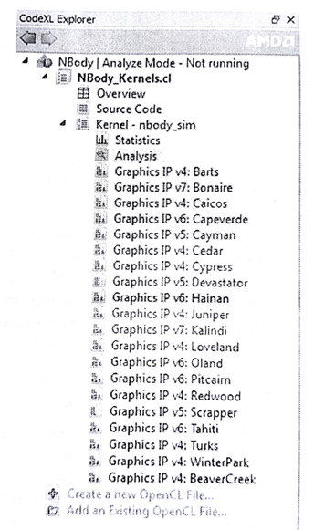
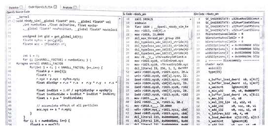
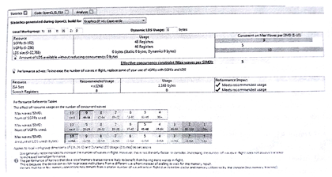
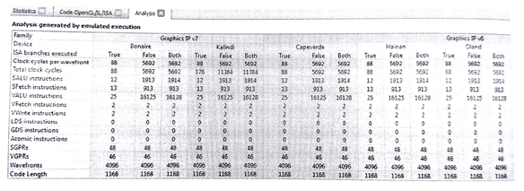

#10.5 使用CodeXL分析内核

分析模式下，CodeXL可以当做静态分析工具使用。在AMD显卡上，分析模式可以用来编译、分析和反汇编一个OpenCL内核。分析模式可选择界面方式和命令行方式。在这之后我们就称CodeXL为“内核分析器”。内核分析器也可以通过命令行使用，在CodeXL安装目录下，有一个CodeXLAnalyzer.exe，可以直接在命令行中执行。

内核分析器是一个离线编译器，还是一个分析工具。也就是说其能将内核源码编译成任意支持的GPU(需要驱动支持)上可执行的二进制文件。为了使用内核分析器，AMD OpenCL运行时需要提前在系统中安装好。为了对OpenCL内核进行静态分析，内核必须由内核分析器编译。为了使用内核分析器编译内核，只需要将OpenCL内核源码放置在CodeXL的主窗口内(如图10.6所示)即可。内核分析器可以带来以下一些收益：

1. 使用OpenCL内核源码：内核分析器不需要编译主机端源码，只需要编译OpenCL内核即可，其对于OpenCL内核源码来说，是一个很有用的工具。内核分析器包含一个离线编译器，这个编译器可以编译和反汇编OpenCL内核，并且通过分析工具能看到内核的ISA码。编译中出现的错误将出现在输出界面中。当不同的GPU设备支持不同的OpenCL扩展和内置函数时，内核分析器可以对内核进行检查，看其是否能在不同的GPU设备上编译通过。
2. 生成OpenCL二进制文件：通常开发者不会希望将自己的内核源码进行发布。在这种情况下，OpenCL内核会以二进制文件和主要执行库或可执行文件一起发布。同样，OpenCL API也能对内核进行编译，并且保存成二进制文件。生成的二进制文件，只能用于同一平台上的设备。内核分析器命令行方式也可以生成二进制内核文件，用户使用这个工具可以生成AMD平台上支持的二进制内核。另外，内核分析器将一些选项的设置在内核二进制ELF文件中的某些字段中。这样就能避免以源码的形式发布内核了。这个二进制文件中只包含了ISA或LLVM的中间码，或源码。OpenCL内核二进制中不同字段所扮演的角色不同：
	· ISA字段：如果开发者要包含一种特殊GPU设备的ISA码在二进制内核中，那么就要为其他OpenCL设备重新生成相应的二进制内核。
    · LLVM IR字段：OpenCL二进制俄日那劲中的LLVM IR(或AMD IL)都支持大部分AMD设备。在OpenCL运行时，会将IR翻译成对应GPU的ISA。
3. 预先对内核的性能进行评估：因为每个内核都能相对于主机端代码单独执行。这样就不需要知道太多OpenCL程序实现的细节。从而，能根据目标机器的信息对内核提前进行性能评估。

在内核分析器载入内核源码时，内核分析器可以只构建OpenCl内核，并且完成对该内核的分析。在执行`build and Analyze`这步时，内核分析器会展示一些Graphics IP版本号(如图10.5所示)。每一个Graphics IP版本都会展示相应的AMD IL和GPU ISA代码(如图10.6所示)。

图10.5 AMD CodeXL的分析莫啊是。NBody中OpenCL内核在不同版本的图像架构下的不同中间码展示。

图10.6 内核分析的ISA显示页面。NBody OpenCL内核在多个GPU架构下编译。对于每个GPU架构，AMD IL码和GPU ISA码都可以进行评估。

下一节中，将会展开上面的内容，继续介绍内核分析器，并且也会讨论分析内核IL和ISA代码的好处。内核分析器包括了ISA页面显示，统计显示和分析显示页面。

##10.5.1 内核分析器的统计和ISA码展示页面

与X86的ISA相同，GPU的ISA也是一段很复杂的指令队列。有时这些代码对于非常牛X的开发者来说，都很难读懂。不过，内核分析器基于高阶分析所产生的GPU ISA码，可在应用早期阶段帮助OpenCL应用开发者提升应用性能。为指定设备进行内核优化时，通常就会对ISA码进行分析。了解ISA码的益处，如下所示：

- 可以看到使用了多少通用寄存器，并且了解使用的寄存器数量是否会过多。要是过多的话，应用就会使用全局内存来替代这些寄存器，从而造成访存的高延迟。寄存器使用的统计有助于我们对内核代码进行重构，从而减少或复用一定数量的通用寄存器，或者更多的使用局部内存。
- 可以看到不同的显卡架构，ISA指令中进行了不同次数的读取和存储，这些指令使用的数量，对于开发者来说是可控的。在了解指令数量之后，可以尽可能减少每个工作项读取或存储数据的尺寸。
- 可以通过类似循环展开的方式观察生成ISA码有和不同，从而达到优化的目的。而且开发者可以了解OpenCL的一些内置函数(比如原子操作)是如何进行实现的。

这样我们就可以通过分析ISA码，对OpenCl内核源码进行优化。优化之后的内核代码可使用内核分析器生成ISA代码，观察相应的分支是出现了，还是消失了。不过这种方式很那将OpenCL源码与ISA码关联到一起。开发者可以选择使用`-O0`作为内核分析器的编译选项，不让编译器对OpenCL内核进行任何的优化。

内核分析器的统计界面，如图10.7所示。统计页面可以帮助开发者了解OpenCL内核使用了多少资源。AMD OpenCL编译器会将OpenCL内核所要使用GPU资源进行记录。当每个计算单元上的波面阵数量确定，那么内核就会使用占用的方式使用对应资源。现代AMD GPU可以在每个SIMD单元上并发执行10个波面阵，从而能够很好的隐藏延迟。计算单元上，波面阵数量的分配，也是要根据相应的资源(局部内存，矢量和标量寄存器)进行。NBody中内核占用的资源如图10.7所示。我们可以看到Nbody内核被计算单元中的向量寄存器所限制。

图10.7 内核分析器中对于NBody内核的统计显示。我们可以看到并发波面阵的数量，其分配数量被向量寄存器的数量所限制。

##10.5.2 内核分析器的分析界面

