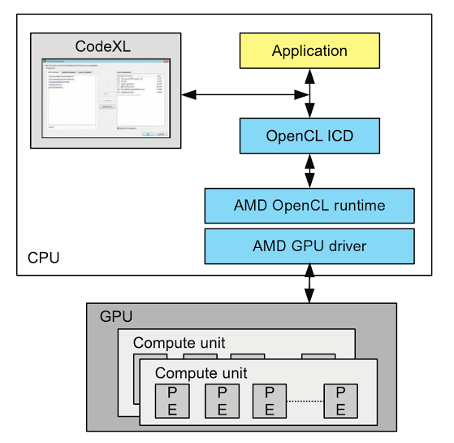
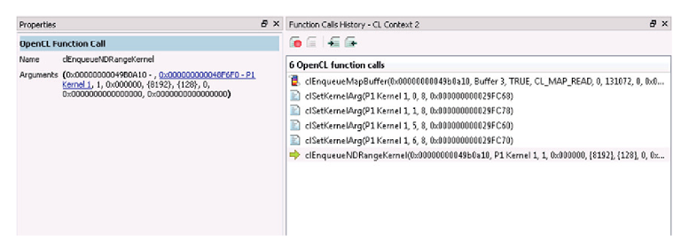
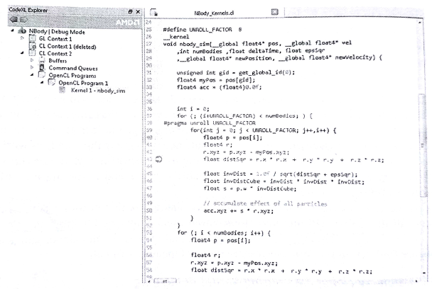
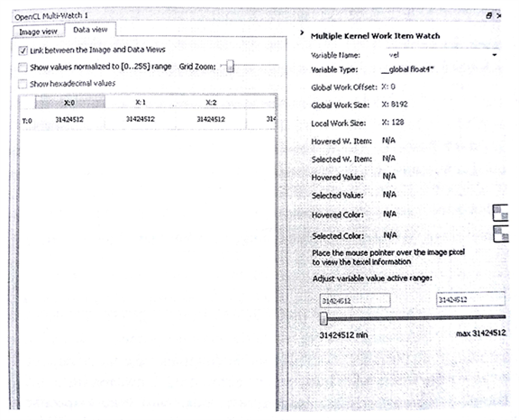

#10.6 使用CodeXL调试OpenCL内核

之前章节中，我们已经了解了如何对我们的OpenCL内核源码进行优化。不过，优化的前提是程序运行结果，必须是正确的。通常，调试并行程序就已经很困难了，现在需要对使用异构设备的程序进行调试，这无疑是难上加难。

OpenCL中，开发人员只需要调用相关的API，不需要知道平台底层是如何进行实现。调试器让平台底层实现以“白盒”的方式展示给开发者，开发者可以清晰的了解到，每个命令对于并行计算系统的影响。这种方式可以帮助开发者找到错误使用OpenCL的地方，以及是否是在对应平台上的优化所带来的问题。本节，我们将来了解一下，如何使用CodeXL在异构下进行调试。在调试模式下，CodeXL可以作为OpenCL和OpenGL的调试器，以及内存分析工具。其能帮助开发者找到应用中的错误，优化OpenCL的性能，以及优化内存的使用。

图10.9 以抽象层级的方式展示了CodeXL和OpenCL应用间的互动关系。

图10.9展示了一个简单的的层级结构，其描述了CodeXL如何在调试模式下，和OpenCL设备进行互动。这里会展示一些比较重要的模块或组件。CodeXL会截获应用和OpenCL *可安装客户端驱动*(ICD, Installable client driver)。这就使能了CodeXL对OpenCL API调用的记录、所有OpenCL对象记录，以及汇总了这些对象上所携带的数据。下面的章节中，我们将简要了解一下CodeXL调试的能力，以及在调试模式下如何使用CodeXL。西面我们就简要的介绍一下CodeXL的调试模式。

之前说过，异构应用有两部分不同的代码构成：

1. API级别的代码(比如，clCreateBuffer(), clEnqueueNDRangeKenrel())。这些调用执行在主机端。
2. OpenCL命令，包括设备执行和数据传输。

CodeXL允许开发者使用断点的方式(主机端和设备端皆可)的方式调试OpenCL应用。我们这里简要了解一下CodeXL如何进行主机端代码和内核的调试。

##10.6.1 API级别调试

我们先用NBody作为一个例子，来了解一下如何进行API级别的调试。为了进行API级别的调试，CodeXL必须先切换到调试模式。API级别的调试中，CodeXL可以看到每个API运行时所传入的参数。API级别的调试具有如下的一些特性：

- **API函数断点**：CodeXL可以设置断点，断点设置和使用的方式与其他常用调试器相同。
- **记录OpenCL API调用情况**：调试模式会让应用暂停执行，CodeXL会给我们展示在之前的运行过程中的最后一次OpenCL API的调用情况。图10.10展示了CodeXL作为调试器回溯该应用中所使用到的OpenCL命令。
- **程序和内核信息**：OpenCL上下文对象包含多个程序对象和内核对象。CodeXL可以验证哪些程序对象与哪个上下文对象相关联。如果程序是使用`clCreateProgramWithSource()`创建，我们还可以看到传入到该函数的内核源码。
- **图像和数组对象数据**：一个OpenCL上下文对象中包含多个数组对象和图像对象。CodeXL也可以让开发者直接查看这些对象中的数据。对于图像类型，CodeXL允许我们以图像的角度来查看图像对象中的数据。
- **内存检查**：CodeXL可以让我们了解对应上下文对象的数组对象中内存内存使用情况。内存检查功能可以用来检查内存泄漏，因为在设备端，由于内存不能直接被查看到，所以要查到相关问题会非常的困难。
- **API使用统计**：CodeXL展示了当前选择的上下文对象中的统计的API使用信息。通过分解API在上下文中的调用，我们就能知道一个函数被调用了多少次。

图10.10 CodeXL对于OpenCL程序进行API调用的回溯。

##10.6.2 调试内核

CodeXL可以在运行时对OpenCL内核进行调试，可以检查每个工作项对应变量的值，以及工作组中对应变量的值，还可以查看到内核调用堆栈等信息。CodeXL有几种方式可以进行对OpenCL应用进行调试：

1. **OpenCL内核断点**：开发者可以在内核源码文件上进行断点设置。
2. **进入式调试**：开发者可以通过单步进入式调试的方式，直接从相关`clEnqueueNDRangeKernel()`函数进入相关内核中去。
3. **内核函数断点**：可以在断点对话框中添加相应的内核函数名作为函数断点。当内核运行匹配到相应函数名时，对应内核开始执行，调试结束是在内核函数开始运行的时候(这个也就是用来观察内核调用顺序，如果不在内核内部设置断点，调试过程是无法进入内核内部的)。

图10.11展示了OpenCL内核在调试时的窗口状态。在调试OpenCL应用时，需要持续的跟踪大量工作项的状态。一个内核通常会在一个GPU设备上启动成千上万个工作项。CodeXL可以帮助开发者聚焦于对应的工作项，并展示对应工作项中变量的值。

CodeXL也会提供一个统一的断点对话框，可让开发者看到调试描述下所有的断点(包括API和内核)，以及可以通过"Add/Remobe Breakpoints"选项对断点进行添加或删除。在对话框中，开发者也能对CodeXL进行配置，让其自动断在任意一次OpenCL API的调用处。

图10.11 对NBody内核设置断点

*多角度观察——在内核调试时查看数据*

CodeXL允许我们在内核中设置断点，并且单步对内核进行调试。这样就可以帮助我们确定，对应的内核是否按照我们的想法进行操作。不过，为了写出正确的程序，能看到输入和输出，以及内核执行时的中间数据，对于调试来说也很重要。调试器就提供了多个监视窗口，对数据进行观察。

图10.12展示了多个监视窗口的模式。我们可以看到，多观察窗口允许我们观察全局内存中的数据。其也提供观察图像对象的选项。多个窗口方便我们观察多个工作项中的变量。

图10.12 多监视窗口可以展示全局内存的值。图像对象中的数据也可以通过该方式进行查看