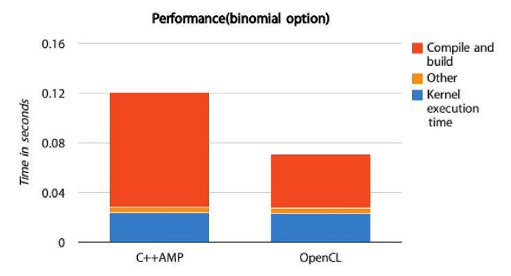

#11.12 初步结果

为了我们的`C++ AMP`实现的性能，我们使用了两种方式对二项式期权进行了[性能测试](http://bitbucket.org/UncleHandsome/benchmark)。第一种方式是直接使用OpenCL实现，并使用一种较为特殊的实现完成该程序。第二种方式是通过`C++ AMP`的方式，编译使用CLamp，在实验中我们将执行的OpenCL代码转换成相同平台，以便进行对比。我们使用的配置如下：

- GPU: AMD Radeon R7 260X
- Linux kernel: 3.16.4-1-ARCH
- AMD Catalyst driver: 14.301.1001
- AMD OpenCL accelerated parallel processing(APP) software development kit (SDK): v2.9-1

表中展示了`C++ AMP`所生成的执行内核，与直接写成的OpenCL内核完成时间几乎相同，不过在编译阶段`C++ AMP`还是用时过长。这是因为当前的实现中，编译阶段会取添加一些数学函数，让内核源码代码的长度比直接使用OpenCL内核代码的长度长10倍。其他的时间就是对OpenCL内存进行写入，以及参数的传递。因为在性能测试中使用了`CL_MEM_USE_HOST_PTR`对于当前测试版本的`C++ AMP`来说，没有多余的性能开销。

通常情况下，应用中只需要对内核加载一次，所以编译的时间通常不会算在计算时间内。不过，对于不同的用户，所关注的点不一样，所以用户可以从自己的角度对这两应用版本进行对比。

这次对二项式期权的比较当中，OpenCL主机端和设备端的代码加起来一共160行，而`C++ AMP`的代码只有80行。这就能很明显的看出，具有高级编程模式的`C++ AMP`使用起来要比OpenCL更为简单。