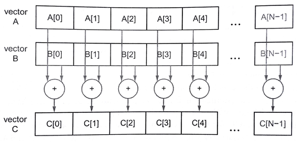

#11.2 简单介绍C++ AMP

`C++ AMP`是一个编程模型，可将`C++`实现的算法数据并行化。与OpenCL和CUDA C比起来，`C++ AMP`封装了很多底层的细节，包括数据转移之类的，这样会然改程序看上去更加整洁。`C++ AMP`还是包含了非常多的特性，能让编程者在错综复杂的系统中进行性能加速。

因为`C++ AMP`的标准是开源的，所以可以有很多不同的实现。我们这里所使用的`C++ AMP`基于开源Clnag和LLVM编译器，多核(MulticoreWare)公司发布了`CLamp`——GPU上使用OpenCL实现的`C++ AMP`。其可以在Linux和Mac OS X上运行，并且能支持大多数不同供应商的GPU卡，比如AMD、Intel和NVIDIA。

`C++ AMP`已经作为`C++11`标准的一个扩展。添加了一些标准头文件，这些头文件中定义了一些已经模板化的数据并行算法，还另外的为`C++`编程语言添加了两条规则。第一条：添加的函数限定于运行在GPU上；第二条：允许GPU线程共享数据。本章并不是要对`C++ AMP`进行详细的介绍。我们会主要关注`C++ AMP`一些重要的核心特性，并且介绍一个`C++ AMP`编译器是如何使用OpenCL实现这些特性的。如果有读者对`C++ AMP`本身很感兴趣，微软已经发布了一本关于`C++ AMP`的书籍[1]，可以作为`C++ AMP`的入门。

下面让我们通过一个向量相加的例子，来了解一下`C++ AMP`:

```c++
#include <amp.h>
#include <vector>

using namespace concurrency;

int main(void){
  const int N = 10;
  std::vector<float> a(N);
  std::vector<float> b(N);
  std::vector<float> c(N);
  
  float sum = 0.f;
  for (int i = 0; i < N; i++){
    a[i] = 1.0f * rand() / RAND_MAX;
    b[i] = 1.0f * rand() / RAND_MAX;
  }
  
  array_view<const float, 1> av(N, a);
  array_view<const float, 1> bv(N, b);
  array_view<float, 1> cv(N, c);
  
  parallel_for_each(cv.get_extent(),
  		[=](index<1> idx)restrict(amp){
        	cv[idx] = av[idx] + bv[idx];
        });
  cv.synchronize();
  return 0;
}
```

图11.1 `C++ AMP`代码示例——向量相加

向量相加的原理图，如图11.2所示：



图11.2 向量相加的原理图

图11.1的第1行包含了`C++ AMP`的头文件——amp.h，该头文件了包含了核心特性的声明。`C++ AMP`类和函数都属于`concurrency`命名空间。使用“using”的方式可以让我们在这段简单的代码中，不用为相应的函数加上前缀`concurrency::`。

主函数在第4行，其启动了一个主机线程，该线程包含一段已加速的数据并行计算。`C++ AMP`中的“主机”这个术语的意思和OpenCL是一样的。不过，在OpenCL中还存在“设备”的概念，也就是帮助主程序加速的执行设备，而在`C++ AMP`中使用“加速器”这一概念来表述。`C++ AMP`其中的一个高级特性就是支持Lambda表达式，Lambda的使用可以让主机和加速器的代码放在一起，甚至放在同一个函数中。所以在`C++ AMP`中就几乎没有主机和加速器代码之分。后面将会介绍，编译器如何将`C++ AMP`中的Lambda编译到OpenCL上下文中。

##11.2.1 C++ AMP array_view

`C++ AMP`中，类模板array_view作为数据读写的传媒。一个array_view对象是一个多维的数据集合。这种方式并不是将已有数据拷贝到一个新的位置，而是使用一种新的方式去访问原始数据所在的地址。模板有两个参数：数据的类型和数据的维度。通过不同维度上的索引，可以访问到不同等级的类型或对象。本例中，我们使用了1维，数据类型为float的array_view(或“一个等级为1的array_view”)。

图11.1中的第14行，array_view使用标准`C++ vector`a创建了一个实例——av(a)。这里`C++ AMP`编译器使用一段常量数据作为输入，认为其是一维数组，并且认为数组的长度为给定的数值N。

第16行对cv进行构建是，设置的两个参数，第一个表示数据元素的个数。av，bv和cv中元素的数量都为N。通常这里设置的N称为预设值。为了表示和操作这个值，`C++ AMP`提供了一个预设值模板`extent`——只需要设置一个整型作为模板参数，用来获取数据等级。具有维度的类模板，有些就支持指定特定的预设值指定一个或者多个整型数值，就像对cv的操作一样。cv构造函数传入的第二个参数是用来存储主机数据的数组。

##11.2.2 C++ AMP parallel_for_each，或调用内核

图11.1中第16行使用了parallel_for_each结构，其属于`C++ AMP`数据并行计算的代码段。其类似于对OpenCL内核的启动。`C++ AMP`中对于数据集的操作称为*计算区域*(compute domain)，并且定义了一个预设值对象。与OpenCL类似，每个线程都调用的是同一个函数，并且线程间都由自己区域，是完全分开的(类似于NDRange)。

与`C++ STL`中标准算法for_each类似，parallel_for_each函数模板就是将指定函数应用到对应的数据集上。第一个参数为一个预设值对象，其用指定数据并行计算的范围。本例中，我们要对array_view上的每个数据执行了对应的操作，所以传入的预设值为cv array_view的范围。这里，我们通过成员函数获取array_view的范围值(cv.get_extent())。这一个1维的预设值，其计算区域的整型值的范围为[0，n)。

**与内核一样的仿函数**

parallel_for_each的第二个参数是一个`C++`函数对象(或仿函数)。图11.1中，我们使用了`C++11`中的Lambda语法的方式，很容易的创建这个函数对象(或仿函数对象)。parallel_for_each会将这个函数对象(或仿函数)应用到计算区域的每个数据中。

**获取内核参数**

`[=]`字符使用的是Lambda表达式中的“获取”方式，让当前范围内中所声明的变量，以引用的方式传入Lambda函数中。本例中，我们将三个array_view对象传入Lambda函数中。函数调用时，这些函数已经在主线程中初始化完毕。对于的index就是对应向量的长度或数量，其值与预设值的等级值相同。index参数idx用来索引array_view对象中的值，第20行。

**amp的限定修饰**

本例中使用了一个扩展特性:restrict(amp)限定修饰符。`C++ AMP`中借用了C99中的关键字“restrict”，并且允许在其之后可以跟某个函数的函数列表(包括Lambda函数)。restrict关键字后面允许使用括号，括号内可以有一个或者多个限定符。`C++ AMP`只定义了两个限定符：`amp`和`cpu`。从限定符的字面意思也能猜出，这无疑是指定哪种计算设备作为加速代码执行的设备，不是将加速代码编译成CPU代码，就是将其代码编译成C++语言子集中的某种代码。

如第18行所示，在传给paralle_for_each必须在调用操作符时使用restrict(amp)进行指定。其他函数也许要以类似的限定方式调用。restrict(amp)限定了指定函数必须以调用硬件加速器。当没有进行限定指定，那么就默认为restrict(cpu)方式。有些函数也可以进行双重指定，restrict(cpu, amp)，这种方式函数可能会在主机或加速器上执行，这需要对创建两种限定设备的上下文。

之前说过，限定符支持使用`C++`语言子集作为函数体。在第一个`C++ AMP`的发布版本中，限定符反应了当前GPU在作为数据并行加速器时的一些限制。例如，`C++`的new操作符、递归，以及不允许使用虚函数。随着时间的推移，我们能期待这些限定逐渐解除，并且希望`C++ AMP`路线图上特性的限制越来越少。restrict(cpu)限定符，允许`C++`的所有操作，因为`C++ AMP`加速器代码是要在主机端运行。相较restrict(cpu)，restrict(amp)的限定则会更多一些。

restrict(amp)中的Lambda函数体，其连续调用了几个array_view对象。只要在函数生命域内的变量都能被Lambda函数所捕获。这里每个值都能在加速器运行加速代码时所使用到。对于`C++11`中的不可变Lambda函数，其不会在函数体中改变获取变量的值。**不过，array_view对象中的元素将被改变，并且这些改变将会返回主机端。**本例中，我们在parallel_for_each中对cv进行修改，这些修改将会影响主机端向量c中的值。

-------------

[1] K. Gregory, A. Miller, `C++ AMP： Accelerated Massive Parallelism with Microsoft Visual C++`, Microsoft, 2012, 326 pp., ISBN:9780735664729.