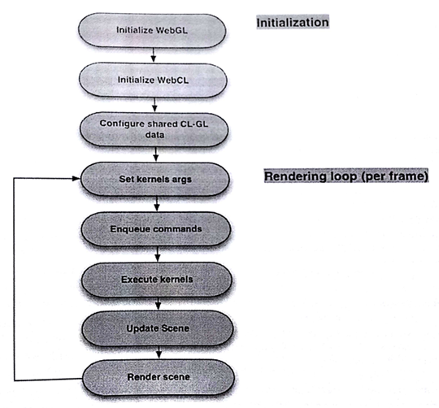

#12.4 WebCL的交互性

再来说一下WebCL在计算方面的使用(而非渲染)。不过，数据已经在图形处理器处的时候，需要对数据进行渲染，是直接使用这段内存直接让OpenGL进行显式比较高效，还是将数据拷贝到CPU端，再让CPU交由OpenGL去显示高效呢？这里就需要WebGL的扩展能力了。

WebGL需要先创建上下文，然后再创建一个共享的WebCL上下文。这也就是WebGL能够将数据分享给WebCL的原因(流程见图12.3)，二者能够共享的内存对象如下：

- 纹理对象：包含图像的纹理信息
- 顶点数组对象：包含顶点信息，比如坐标、颜色和法向量
- 渲染数组对象：包含图像对象所用到的WebGL帧缓存对象[4]

图12.3 运行时调用WebCL和WebGL

------

[4] Iñigo Quilez. ShaderToy with Mandelbule shader, http://www.iquilzles.org/apps/shadertoy/?p$=$mandelbulb