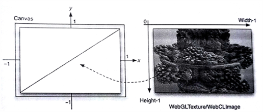

#12.5 应用实例

对于图像处理应用，通常会将轨迹跟踪输出到屏幕上。对于这样的应用，其表面都会使用多个三角形进行构成，然后通过WebGL进行渲染。计算内核代码提供了更加自由的方式，方便我们对通用计算进行优化。片元渲染器相较计算渲染器要难优化许多。更重要的是，纹理内存是缓存在处理器中，这样要比通过全局内存的方式访问CPU内存高效的多。不过，有些设备不支持图像内存，可以使用WebCLBuffer创建像素数组对象，从而更新WebGL的纹理。

本节中，我们使用Iñigo Quilez片元渲染器所渲染的影子玩具——曼德尔球[1]，将这个例子转化成一个WebCL内核，如图12.4所示。WebGL使用两个纹理三角形对画面进行填充。WebCL每帧都会生成新的纹理。因此，考虑到画布的大小(width，height)，WebCL将会生成width x height个像素点。



图12.4 WebGL中两个三角形可以画一幅WebCL生成的图像。

当WebCL要使用WebGL内存进行计算时，WebGL上下文必须要进行初始化，并且在WebGL上下文上共享产生WebCL的上下文，然后就可以WebCL就能使用WebGL的相关内存对象进行计算。下面的代码中展示了，如何创建WebGL的纹理，并且将其用于WebCL进行计算：

```JavaScript
// retrieva a <canvas> object with id glcanvas in HTML page
var canvas = documnet.getElementById("glcanvas");

// Try to grab the standard context. If it fails, fallback to experimental.
var gl = canvas.getContext("webcl") || canvas.getContext("experimental-webgl");

// Create OpenGL texture object
Texture = gl.createTexture();
gl.bindTexture(gl.TEXTURE_2D, Texture);
gl.texParameteri(gl.TEXTURE_2D, gl.TEXTURE_MAG_FILTER, gl.NEAREST);
gl.texParameteri(gl.TEXTURE_2D, gl.TEXTURE_MIN_FILTER, gl.NEAREST);

gl.texImage2D(gl.TEXTURE_2D, 0, gl.RGBA, TextureWidth, TextureHeight, 0, gl.RGBA, gl.UNSIGNED_BYTE, null);
gl.bindTexture(gl.TEXTURE_2D, null);

// Create OpenCL representation (a WebCLImage) of OpenGL texture
try{
  clTexture = context.createFormGLTexture2D(cl.MEM_WRITE_ONLY, gl.TEXTURE_2D, 0, Texture);
} catch(ex) {
  throw "Error: Failed to create WebCLImage." + ex;
}

// To use this texture, somewhere in your code, do as usual:
glBindTexture(gl.TEXTURE_2D, Texture);
```

将这个纹理作为参数传入内核。

```JavaScript
kernel.setArg(0, clTexture);
kernel.setArg(1, new Uint32Array([TextureWidth]));
kernel.setArg(2, new Uint32Array([TextureHeight]));
```

最后，在内核代码中对WebCLImage对象进行调用。

```c++
__kernel
void compute(__write_only image2d_t pix, uint width, uint height){
  const int x = get_global_id(0);
  const int y = get_global_id(1);
  
  // compute pixel color as a float4
  write_imagef(pix, (in2)(x, y), color);
}
```


--------

[1] Iñigo Quilez。 ShaderToy with Mandelbulb shader, http://www.iquilezles.org/apps/shadertoy/?p$=$mandelbulb