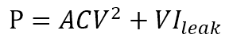
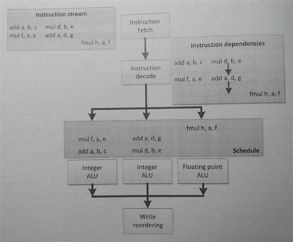
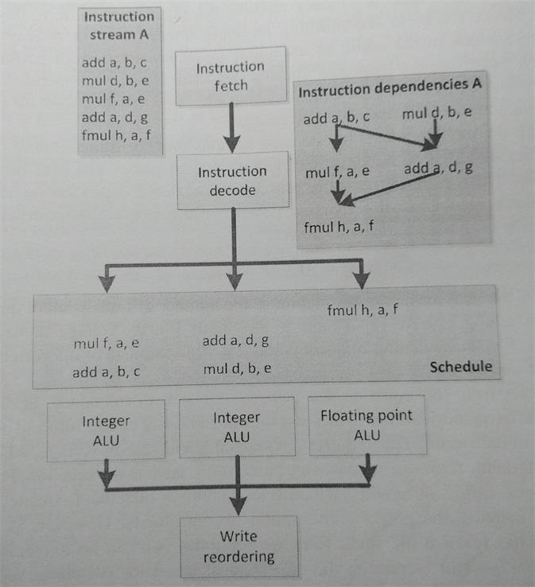
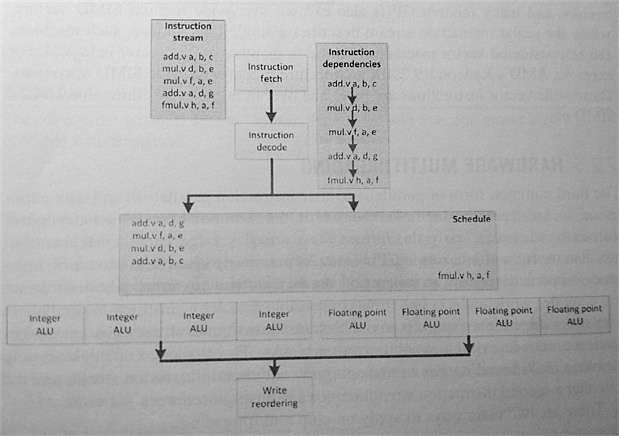
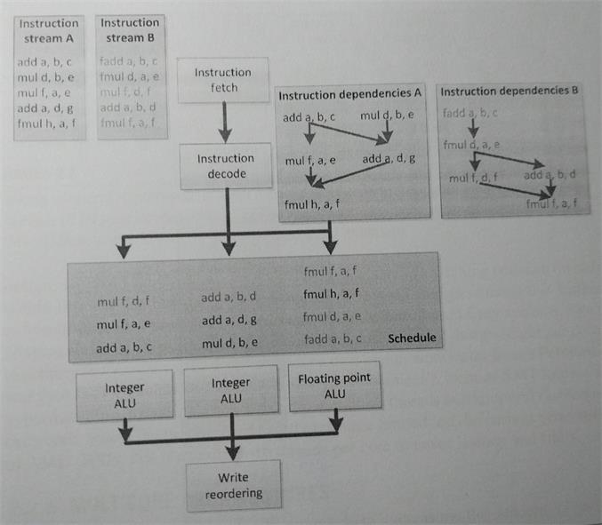
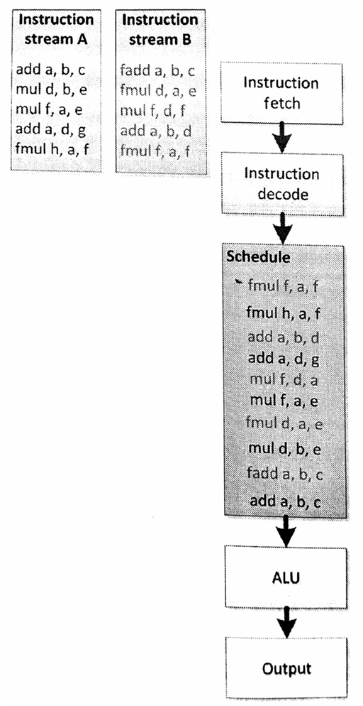
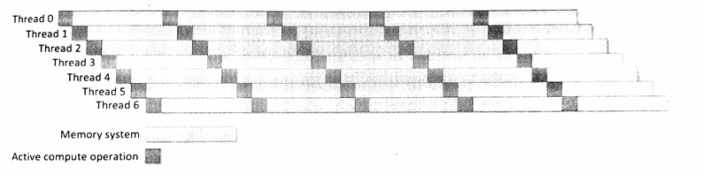

#2.2 硬件的权衡

之前对OpenCL历史的介绍，如果在有点使用图形API和像素渲染器的经验的话，就更容易明白为什么OpenCL是以GPU作为目标设计的一门语言。如今，在高性能计算市场上，OpenCL已经是一种很流行的编程方式。不过，随着支持OpenCL平台数量的增长(特别是嵌入式领域)，OpenCL的影响力在逐渐增强。

如果对GPU不是很了解的话，也不用担心，请安心的继续阅读。不过，当要为GPU写一份通用的代码，那么就会有很多问题。比如：设备就是一个图像处理器，还是更通用的设备么？如果是图像处理器，那么该设备就一定具有图像特定的逻辑特点，还是因为其整体架构？

更加深入下去还有很多问题会冒出来。那么，问个简单点的：一个GPU有多少个芯呢？要回答这个问题，需要看一下这个“芯”是如何定义的。还有，“多芯”设备和“多核”设备又有什么不同？通常，因为不同架构上的功耗和晶体管数量是不同的，所以会选择不同的方式进行加速。比起要权衡如何原始电气单元进行计算，硬件开发者们通常还要为如何在硬件上编程进行考虑。权衡这些因素后，硬件开发者会创建出一个具有“很大发散性”的设计。

多核处理器的设计，在保留了单个处理器的时钟周期和硬件复杂度同时，增加更多处理核。这样的设计不会让处理器上晶体管数量增加，以减少功耗。谨慎的设计下，处理器的功耗被控制在可接受的范围内。SIMD和VLIW(*very long instruction word*)架构能够通过提升算术运算和逻辑控制的比值，做更多工作。这样的情况下ALU对于如此至少工作量感到不满。因此，多线程从另一个角度来解决这个问题。与增加算术计算和逻辑控制的比值不同，多线程增加了工作量，在进行计算的同时，进行逻辑控制，比如内存搬运。这样，可以增加我们队设备的利用率。权衡缓存和内存系统的同时(不同的架构下进行不同的访存方式)，也要权衡在这期间处理器使用分配。

在这种情况下，根据对核芯的定义，我们需要权衡是使用单个核芯，还是多个核芯的硬件。不过，对与整个设备的不同功能单元，需要进行不同程度的权衡。异构化硬件能够同时对多种算法开启硬件优化，这样就能从硬件方面提高算法性能。当代的系统级别PC，大多数都是GPU+CPU的架构组合(系统中还分布着其他低性能处理器)。最新一代的高性能处理器将GPU和CPU融合到一个设备上，AMD将这种架构成为加速处理单元(APU)[1]。

现实社会中，我们也能看到这些不同的设计结合了不同方面的因素，以不同的价格对应不同的市场。

本节我们会研究一些架构的特点，并讨论各种常见架构如今的应用程度。

##2.2.1 频率提升带来的性能提升和局限性

作为一个开发人员，试想我们正在编写一款线性执行软件：执行一个任务，完成这个任务，继续执行下一个任务。对于写惯线性程序的人来说，去编写并行代码很困难；也就是SIMD或向量并行与图形设备上处理的方式差不多。多组像素将相对简单的逻辑映射到编程层面。其他程序中，逻辑层面没有有效的编程向量，提取SIMD操作将会更加困难。因此架构在转为并行化、极端化多线程并行前，旨在为单一线程的架构提升性能。而现在的架构市场，则在向高性能专业机器转变。

##2.2.2 超标量执行

超标量和乱序作为扩展解决方案，已经在CPU上存在了很久；奔腾时代开启时，这两个扩展就包含在x86的设计中。在这种设计中，CPU主要依赖的信息为指令流中的指令，或是对未使用功能单元的调度(如果该信息可用的话)。图2.1中就展示了一个这样的例子。

图2.1 指令流中简单汇编指令的乱序执行。注意，在这种汇编语法中，目标寄存器列在最前面。例如：add a, b, c为a = b + c。

乱序逻辑的主要受益人就是软件开发者们。硬件上自动将编程者代码并行化，串行的代码不需要做任何修改就能比原来执行的速度快很多。超标量让CPU主频设计领先了10多年，其让CPU总体性能成超线性增长的趋势，即使是在流行大规模生产设备的时代，这种设计都未过时。不过，这种超时代的设计，也是有缺陷的。

乱序调度逻辑需要是用到大量的晶体管，需要增加[译者注1]CPU的芯片面积，以存储队列中未完成(in-flight)的指令和存储指令间的依赖关系，以应对执行期间硬件上的动态调度。另外，要让投机(speculative)指令迅速执行，就需要扩大并行的乱序指令窗口。投机指令的结果是一次性，并且会浪费更多的资源。结果就是，乱序执行让CPU的回报逐渐减少；行业上已经采取其他方式通过减少晶体管的体积，来达到增加性能的目的，所以即使在这样产生的高性能设备上，超标量逻辑依旧是可行的。嵌入式和其他特殊设备上，硬件不会并行化串行代码，这些较为特殊的设备的设计方案都很小众化，在芯片发展历史上可能都不常见。

良好的超标量处理器数不胜数，控制数据公司的西摩·克雷在90年代设计的[CDC 600](https://en.wikipedia.org/wiki/CDC_6600)[译者注2]就是一款很不错的多RISC(*Reduced Instruction Set Computer，精简指令集计算机*)设计。目前，高端CPU基本上都支持超标量处理。很多GPU同样具有超标量的能力。

##2.2.3 超长指令字

为了增强处理器的指令并行性，VLIW的执行十分依赖于编译模式。其比完全依赖于复杂的乱序控制逻辑，依赖硬件要方便的多，超标量和VLIW的执行都会依赖于编译器的分析。为了替代现有的标量指令流，在VLIW处理器上发出的每一条指令，都包含了多个并发的子指令，并且，这些指令会直接映射到处理器的执行流水线上。

VLIW的执行流程如图2.2所示，这幅图和图2.1是一样的。不过2.2中预取去了三条，而不像2.1中那样一条一条的取指令。我们现在看到的这些指令流的依赖结构都是线性的，并且硬件将也会是这样处理这些指令，而不是提取和跟踪出一个更加复杂的依赖图。VLIW指令包都是已编码的，并且指令流中的每个独立的部分，都会映射到处理器上特定的计算单元执行。很多VLIW设计中，计算单元都是异构的，因此这些指令只会安排给特定的VLIW指令流。其他很多架构都能作为异构硬件，比如：能在任意位置发出任意指令，并且可能只有依赖信息对这样的架构有所限制。

图2.2 依赖于图2.1中的乱序图表

图2.2所示例子中，我们能看到指令的分配有间隙：前两条VLIW包都缺少了第三条子指令，并且第三条VLIW包缺少了第一和第二条子指令。显然，这个例子很简单，包中几乎没有什么指令，不过这对于VLIW架构来说是一种通病，因为编译器没有办法将所有指令包都填满，所以执行效率不会特别高。这可能是编译器的限制，或是这种指令流的先天缺陷。后面的例子的情况都不会比乱序执行更复杂，通过对硬件调度的改良，降低复杂度反而能得到更好的性能。前面的例子中，都可以从执行效率的损失和从减少硬件控制开销提高性能两方面，对硬件进行权衡。另外，VLIW指令在执行方面还有另外一部分开销，那就是相应编译器的开发的成本，而超标量的执行就没有这部分开销。

VLIW设计通常出现在数字信号处理芯片上。当前的高端设备包括Intel的安腾处理器(以显式并行指令计算著称)和AMD的HD6000系列GPU。

##2.2.4 SIMD和向量操作

SIMD旨在将向量并行通用化，这种方式与之前提及的方式有些不同。VLIW和硬件管理的超标量执行方式都是通过查询地址，并行执行同指令流中不相关的指令，而SIMD与向量并行可以让指令在数据上并行执行。

封装单个的SIMD指令，需要其能同时对多个数据元素执行某种操作。相比标量操作，其他的方式都是要将指令并行化。向量操作将向量化操作通用化，并且向量操作通常会用来处理较长连续的数据序列，通常会使用流水线的形式进行向量操作，而非同时对多个数据进行操作，并且向量操作对连续、密集的内存读写给予了更多的支持。

图2.3中的流水和之前图中的不大一样，图2.3中是顺序的，之前的都是乱序的。不过，现在这些指令以向量的形式在四个ALU上执行。整型指令会一个接一个的通过左边四个整型向量ALU，而浮点指令则以相同的方式通过右边四个浮点ALU。需要注意的是，这个例子中指令以线性的顺序触发，不过没理由排除这些操作不是在超标量或VLIW的流水线上完成，这两种架构我们在之前的章节中已经讨论过。

图2.3 SIMD顺序执行单个指令，多个ALU同时对数据进行处理

SIMD的优势与ALU的工作方式有关，大量的调度工作和逻辑解码工作都可以省去。现在，我们能使用一条指令执行四个操作，单条指令只对调度有依赖，而不用去管其他指令是否与该指令有关。

当然，这里也要给出硬件权衡的建议。因为很多代码无法数据并行化，那么就无法使用向量操作来进行提高性能。另外，这个工作没发交给编译器，因为编译器很难对数据并行的代码进行提取。例如，向量化循环就是一项从未停止的挑战，即使很简单的情况都很难成功。在很多情况下，因为晶体管瓦数(功耗)的原因，也可能会将ALU用尽。

向量处理器源于超级计算机领域，不过SIMD设计在很多领域都有应用。CPU通常会包含SIMD流水线，用来显式执行标量指令流中的SIMD指令。x86芯片上包含了多种指令集，比如：SIMD扩展(SSE)和高级向量扩展(AVX)；PowerPC上又AltiVec扩展指令集；ARM上有NEON扩展指令集。GPU架构在历史上为了支持像素向量，其显式包含了SIMD操作，很多现代GPU依旧能能显式的对SIMD向量进行操作。当然，GPU上也是单通道标量指令流。因为很多逻辑使用向量的方式进行处理，让这些支持向量操作的机器被称为向量机。例如：AMD的Radeon R9 290X架构就能支持64路SIMD操作。这种宽度的向量指令通过多个时钟周期，通过一个16通道的SIMD单元分发到流水线上。

##2.2.5 硬件多线程

并行的三种常见的形式：指令并行，数据并行和线程并行。换句话说，并行的方式就是执行多个独立的指令流。这种方式需要并行机器(多核)的支持，不过对于单核CPU来说这种方式也很用。如之前所讨论的那样，依赖硬件和编译器从指令流中抽取独立的指令是非常困难的事情，甚至是不可能的事情。从两个独立的线程中抽取可并行的指令是毫无意义的事情，因为线程已经确认其执行的就是相互独立的显式同步指令流块。实现硬件多线程的挑战在于管理额外的指令流，以及第二条指令流需要了解寄存器和高速缓存的状态。

这里有两种方式实现硬件多线程：

1. 并发多线程(SMT)

2. 时域多线程

图2.4中展示了SMT的方式。这种方式中，多线程的指令在执行资源上交替执行(通过超标量扩展的调度逻辑和线程资源)。

图2.4 一种是图2.1中的乱序调度形式，另一种是线程并发执行方式

图2.4中不管是哪种方式，出发点都是为了更好的利用执行资源。以更高的执行资源使用比例来做更多有用的工作。这种方式的缺点就是需要对更多的状态信息进行保存，并且会让指令间得依赖关系和调度逻辑变得更加复杂。就像图2.4中那样，要对两种不同依赖方式、执行资源，以及执行队列进行管理。

图2.5展示了一种更简单的方式，使用时间片的方式在硬件上实现多线程。这种方式中，每个线程都能通过轮询的方式连续执行。其目的很简单，图中两个线程共享一个ALU。

这种方式有以下几种优势：

1. 调度逻辑简单。

2. 流水线的延迟可以隐藏对多个线程的切换(调度)，减少转发逻辑。

3. 当有线程缓存未命中，或等待另一个分支计算的结果等之类事件，都能通过改变线程指令顺序进行掩盖，并且执行更多的线程能更好的掩盖流水线上的延迟。

图2.5 两个线程使用时间片的方式进行调度。

最后的这种方式，可以有效的降低实现复杂度。很多架构都能运行很多的线程(虽然有时候这样做事没有必要的)。当一个线程达到某些点时，就会从就绪队列中删除这个线程(就绪队列只存储已经调度了的可执行线程)。一旦这些点错过了，对应的线程将会放在就绪序列的最后。虽然这种方式会让单线程的执行速度没有乱序的方式快，不过这种方式的吞吐量保持在较高的水平，充分利用计算资源，并且让控制逻辑的复杂度过高。换个角度来看，这种重多线程的方式可以看做为吞吐量进行的计算：以延迟换取最大的吞吐量。原理图为图2.6。

图2.6 通过时域多线程的方式，来你做吞吐量的计算：多个线程交替执行，以保证设备处于忙碌状态，不过每个独立线程的执行时间要多于其理论最小执行时间。

两种硬件多线程实现方式是相同的。MTA设计源于Tera(一款经典的时间片多线程超级计算机)，这种设计难以投入实际生产；不过，Cray随后的实现就不一样了——MTA-2，其利用每个CPU上的128个寄存器迅速的切换线程(包括线程的状态)，并且忽略已经停止的线程。标准AMD皓龙处理是基于Cray的设计，其对MTA的扩展设计——XMT，将会更加适应未来的多线程处理器。Sun的尼亚加拉系列芯片就实现了多芯多线程的设计(每个芯上8个线程)，为了让数据中心的工作量，以到低耗能和高吞吐的方式完成。Intel奔腾4和之后的Nehalem和其他继承者们上都实现了一种名为“超线程”的SMT设计。现代GPU每个芯上可以在同一时域中运行大量的线程，具体线程的数量收到一般计算资源的限制：目前的这代AMD GPU中，通常一个芯开启8-16个线程，就能够隐藏延迟和停顿。

##2.2.6 多芯架构

##2.2.7 集成:片上系统和APU

##2.2.8 高速缓存层次结构和存储系统

-------

[1] Advanced Micro Devices, Incorporated, AMD Fusion Family of APUs: Enableing a Superior, Immersive PC Experience, Advanced Micro Devices, Incorporated, Sunnyvale, CA, 2011

[译者注1] 原文:*...hence CPU die area...*。通过对上下文的分析，译者认为这里的“hence”是误写的单词，正确的单词应该是“enhance”。文中使用“enhance”的译意。

[译者注2] 1964年，控制数据公司(Control Data Corporation)研制出了世界上首台超级计算机“CDC6600”。该超级计算机也是超级计算数据中心的现代鼻祖，由西摩·克雷(Seymour Cray)为伦斯辐射实验室而设计。