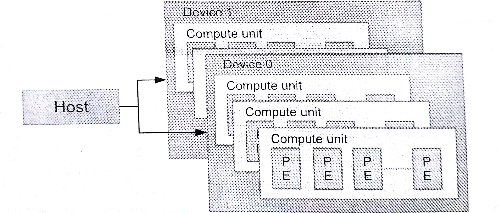

#3.2 OpenCL平台模型

OpenCL平台需要包含一个主处理器和一个或多个OpenCL设备。平台模型定义了host和device的角色，并且为device提供了一种抽象的硬件模型。一个device可以被划分成一个或多个计算单元，这些计算单元在之后能被分成一个或多个“处理单元”(*processing elements*)。具体的关系可见图3.1。



图3.1 OpenCL平台具有多个计算设备。每个计算设备都具有一个或多个计算单元。一个计算单元又由一个或多个处理元素(PEs)构成。系统中可以同时具有多个平台。例如，在一个系统中可以既有AMD的平台和Intel的平台。

平台模型是应用开发的重点，其保证了OpenCL代码的可移植性(在具有OpenCL能力的系统间)。即使只在一个系统中，这个系统也可以具有多个不同的OpenCL平台，这些平台可以被不同的应用所使用。平台模型的API允许一个OpenCL应用能够适应和选择对应的平台和计算设备，从而在相应平台和设备上运行应用。

应用可以使用OpenCL运行时API层面，选择对应提供商提供的对应平台。不过，平台上能指定和互动的设备，也只限于供应商提供的哪些设备。例如，如果选择了A公司的平台，那么就不能使用B公司的GPU。不过，平台硬件并不需要由供应商独家提供。例如，AMD和Intel的实现可以使用其他公司的x86 CPU作为设备。

编程者写编写OpenCL C代码时，设备架构会被抽象成平台模型。供应商只需要将抽象的架构映射到对应的物理硬件上即可。平台模型定义了具有一组计算单元的设备，且每个计算单元的功能都是独立的。计算单元也可以划分陈更多个处理单元。图3.1展示的就是这样的一种层级模型。举个例子，AMD Radeon R9 290X图形卡(device)包含44个向量处理器(计算单元)。每个计算单元都由4个16通道SIMD引擎，一共就有64个SIMD通道(处理单元)。Radeon R9 290X上每个SIMD通道都能处理一个标量指令。这就运行GPU设备能同时执行44x16x4=2816条指令。

##3.2.1 平台和设备

`clGetPlatformIDs()`这个API就是查找制定系统上的可用OpenCL平台的集合。在具体的OpenCL程序中，这个API一般会调用两次，用来查询和获取到对应的平台信息。第一次调用这个API需要传入`num_platforms`作为数量参数，传入NULL作为平台参数。这样就能获取在该系统上有多少个平台可供使用。编程者可以开辟对应大小的空间(指针命名为platforms)，来存放对应的平台对象(类型为 cl_platform_id)。第二次调用该API是，就可将platforms传入来获取对应数量的平台对象。在平台查找完成后，使用`clGetPlatformInfo()`API可以查询对应供应商所提供的平台，然后决定使用哪个平台进行运行OpenCL程序。本章中，`clGetPlatformIDs()`这个API需要在其他API之前调用，3.6节中可以从矢量相加的源码中进一步了解。

```c++
cl_int
clGetPlatformIDs(
  cl_uint num_entries,
  cl_platform_id *platforms,
  cl_uint *num_platforms)
```

当平台确定好之后，下一步就是要查询平台上可用的设备了。`clGetDeviceIDs()`API就是用来做这件事的，并且在使用流程上和`clGetPlatformIDs()`很类似。`clGetDeviceIDs()`多了平台对象和设备类型作为入参，不过也需要简单的三步就能创建device：第一，查询设备的数量；第二，分配对应数量的空间来存放设备对象；第三，选择期望使用的设备(确定设备对象)。`device_type`参数可以将设备限定为GPU(CL_DEVICE_TYPE_GPU)，限定为CPU(CL_DEVICE_TYPE_CPU)，或所有设备(CL_DEVICE_TYPE_ALL)，当然还有其他选项。这些参数都必须使用到`clGetDeviceIDs()`。相较于平台的查询API，`clGetDeviceInfo()`API可用来查询每个设备的名称、类型和供应商。

```c++
cl_int
clGetDeviceIDs(
  cl_platform_id platform,
  cl_device_type device_type,
  cl_uint num_entries,
  cl_device_id *devices,
  cl_uint *num_devices)
```

AMD的并行加速处理软件开发工具(APP SDK)中有一个clinfo的程序，其使用`clGetPlatformInof()`和`clGetDeviceInfo()`来获取对应系统中的平台和设备信息。硬件信息，比如内存总量和总线带宽也是可以用该程序获取。在了解其他OpenCL特性之前，我们先休息一下，了解一下clinfo的输入，如图3.2。

译者机器的clinfo显示，译者和原书使用的AMD APP SDK版本不大一样。从观察上来看，原书应该隐藏了一些硬件显示。
```
Number of platforms:                             3
  Platform Profile:                              FULL_PROFILE
  Platform Version:                              OpenCL 1.2 CUDA 8.0.0
  Platform Name:                                 NVIDIA CUDA
  Platform Vendor:                               NVIDIA Corporation
  Platform Extensions:                           
   cl_khr_global_int32_base_atomics 
   cl_khr_global_int32_extended_atomics 
   cl_khr_local_int32_base_atomics 
   cl_khr_local_int32_extended_atomics 
   cl_khr_fp64 
   cl_khr_byte_addressable_store 
   cl_khr_icd cl_khr_gl_sharing 
   cl_nv_compiler_options 
   cl_nv_device_attribute_query 
   cl_nv_pragma_unroll 
   cl_nv_d3d10_sharing 
   cl_khr_d3d10_sharing 
   cl_nv_d3d11_sharing 
   cl_nv_copy_opts

  Platform Profile:                              FULL_PROFILE
  Platform Version:                              OpenCL 1.2
  Platform Name:                                 Intel(R) OpenCL
  Platform Vendor:                               Intel(R) Corporation
  Platform Extensions:                           
   cl_intel_dx9_media_sharing 
   cl_khr_3d_image_writes 
   cl_khr_byte_addressable_store 
   cl_khr_d3d11_sharing 
   cl_khr_depth_images 
   cl_khr_dx9_media_sharing 
   cl_khr_gl_sharing 
   cl_khr_global_int32_base_atomics
   cl_khr_global_int32_extended_atomics 
   cl_khr_icd cl_khr_local_int32_base_atomics 
   cl_khr_local_int32_extended_atomics 
   cl_khr_spir
  Platform Profile:                              FULL_PROFILE
  Platform Version:                              OpenCL 2.0 AMD-APP (1800.8)
  Platform Name:                                 AMD Accelerated Parallel Processing
  Platform Vendor:                               Advanced Micro Devices, Inc.
  Platform Extensions:                           
   cl_khr_icd 
   cl_khr_d3d10_sharing 
   cl_khr_d3d11_sharing 
   cl_khr_dx9_media_sharing 
   cl_amd_event_callback 
   cl_amd_offline_devices

  Platform Name:                                 NVIDIA CUDA
Number of devices:                               1
  Device Type:                                   CL_DEVICE_TYPE_GPU
  Vendor ID:                                     10deh
  Max compute units:                             4
  Max work items dimensions:                     3
    Max work items[0]:                           1024
    Max work items[1]:                           1024
    Max work items[2]:                           64
  Max work group size:                           1024
  Preferred vector width char:                   1
  Preferred vector width short:                  1
  Preferred vector width int:                    1
  Preferred vector width long:                   1
  Preferred vector width float:                  1
  Preferred vector width double:                 1
  Native vector width char:                      1
  Native vector width short:                     1
  Native vector width int:                       1
  Native vector width long:                      1
  Native vector width float:                     1
  Native vector width double:                    1
  Max clock frequency:                           862Mhz
  Address bits:                                  64
  Max memory allocation:                         536870912
  Image support:                                 Yes
  Max number of images read arguments:           256
  Max number of images write arguments:          16
  Max image 2D width:                            16384
  Max image 2D height:                           16384
  Max image 3D width:                            4096
  Max image 3D height:                           4096
  Max image 3D depth:                            4096
  Max samplers within kernel:                    32
  Max size of kernel argument:                   4352
  Alignment (bits) of base address:              4096
  Minimum alignment (bytes) for any datatype:    128
  Single precision floating point capability
    Denorms:                                     Yes
    Quiet NaNs:                                  Yes
    Round to nearest even:                       Yes
    Round to zero:                               Yes
    Round to +ve and infinity:                   Yes
    IEEE754-2008 fused multiply-add:             Yes
  Cache type:                                    Read/Write
  Cache line size:                               128
  Cache size:                                    65536
  Global memory size:                            2147483648
  Constant buffer size:                          65536
  Max number of constant args:                   9
  Local memory type:                             Scratchpad
  Local memory size:                             49152
  Kernel Preferred work group size multiple:     32
  Error correction support:                      0
  Unified memory for Host and Device:            0
  Profiling timer resolution:                    1000
  Device endianess:                              Little
  Available:                                     Yes
  Compiler available:                            Yes
  Execution capabilities:
    Execute OpenCL kernels:                      Yes
    Execute native function:                     No
  Queue on Host properties:
    Out-of-Order:                                Yes
    Profiling :                                  Yes
  Platform ID:                                   000002D3A374DC10
  Name:                                          GeForce GTX 765M
  Vendor:                                        NVIDIA Corporation
  Device OpenCL C version:                       OpenCL C 1.2
  Driver version:                                375.95
  Profile:                                       FULL_PROFILE
  Version:                                       OpenCL 1.2 CUDA
  Extensions:                                    
   cl_khr_global_int32_base_atomics 
   cl_khr_global_int32_extended_atomics 
   cl_khr_local_int32_base_atomics 
   cl_khr_local_int32_extended_atomics 
   cl_khr_fp64 
   cl_khr_byte_addressable_store 
   cl_khr_icd 
   cl_khr_gl_sharing 
   cl_nv_compiler_options 
   cl_nv_device_attribute_query 
   cl_nv_pragma_unroll 
   cl_nv_d3d10_sharing 
   cl_khr_d3d10_sharing 
   cl_nv_d3d11_sharing 
   cl_nv_copy_opts

  Platform Name:                                 Intel(R) OpenCL
Number of devices:                               2
  Device Type:                                   CL_DEVICE_TYPE_GPU
  Vendor ID:                                     8086h
  Max compute units:                             20
  Max work items dimensions:                     3
    Max work items[0]:                           512
    Max work items[1]:                           512
    Max work items[2]:                           512
  Max work group size:                           512
  Preferred vector width char:                   1
  Preferred vector width short:                  1
  Preferred vector width int:                    1
  Preferred vector width long:                   1
  Preferred vector width float:                  1
  Preferred vector width double:                 0
  Native vector width char:                      1
  Native vector width short:                     1
  Native vector width int:                       1
  Native vector width long:                      1
  Native vector width float:                     1
  Native vector width double:                    0
  Max clock frequency:                           1150Mhz
  Address bits:                                  64
  Max memory allocation:                         427189862
  Image support:                                 Yes
  Max number of images read arguments:           128
  Max number of images write arguments:          128
  Max image 2D width:                            16384
  Max image 2D height:                           16384
  Max image 3D width:                            2048
  Max image 3D height:                           2048
  Max image 3D depth:                            2048
  Max samplers within kernel:                    16
  Max size of kernel argument:                   1024
  Alignment (bits) of base address:              1024
  Minimum alignment (bytes) for any datatype:    128
  Single precision floating point capability
    Denorms:                                     No
    Quiet NaNs:                                  Yes
    Round to nearest even:                       Yes
    Round to zero:                               Yes
    Round to +ve and infinity:                   Yes
    IEEE754-2008 fused multiply-add:             No
  Cache type:                                    Read/Write
  Cache line size:                               64
  Cache size:                                    262144
  Global memory size:                            1708759450
  Constant buffer size:                          65536
  Max number of constant args:                   8
  Local memory type:                             Scratchpad
  Local memory size:                             65536
  Kernel Preferred work group size multiple:     32
  Error correction support:                      0
  Unified memory for Host and Device:            1
  Profiling timer resolution:                    80
  Device endianess:                              Little
  Available:                                     Yes
  Compiler available:                            Yes
  Execution capabilities:
    Execute OpenCL kernels:                      Yes
    Execute native function:                     No
  Queue on Host properties:
    Out-of-Order:                                No
    Profiling :                                  Yes
  Platform ID:                                   000002D3A374C760
  Name:                                          Intel(R) HD Graphics 4600
  Vendor:                                        Intel(R) Corporation
  Device OpenCL C version:                       OpenCL C 1.2
  Driver version:                                20.19.15.4531
  Profile:                                       FULL_PROFILE
  Version:                                       OpenCL 1.2
  Extensions:                                    
   cl_intel_accelerator 
   cl_intel_advanced_motion_estimation 
   cl_intel_ctz 
   cl_intel_d3d11_nv12_media_sharing 
   cl_intel_dx9_media_sharing 
   cl_intel_motion_estimation
   cl_intel_simultaneous_sharing
   cl_intel_subgroups 
   cl_khr_3d_image_writes 
   cl_khr_byte_addressable_store 
   cl_khr_d3d10_sharing 
   cl_khr_d3d11_sharing
   cl_khr_depth_images
   cl_khr_dx9_media_sharing 
   cl_khr_gl_depth_images
   cl_khr_gl_event 
   cl_khr_gl_msaa_sharing
   cl_khr_global_int32_base_atomics 
   cl_khr_global_int32_extended_atomics 
   cl_khr_gl_sharing 
   cl_khr_icd 
   cl_khr_image2d_from_buffer 
   cl_khr_local_int32_base_atomics 
   cl_khr_local_int32_extended_atomics 
   cl_khr_spir

  Device Type:                                   CL_DEVICE_TYPE_CPU
  Vendor ID:                                     8086h
  Max compute units:                             8
  Max work items dimensions:                     3
    Max work items[0]:                           8192
    Max work items[1]:                           8192
    Max work items[2]:                           8192
  Max work group size:                           8192
  Preferred vector width char:                   1
  Preferred vector width short:                  1
  Preferred vector width int:                    1
  Preferred vector width long:                   1
  Preferred vector width float:                  1
  Preferred vector width double:                 1
  Native vector width char:                      32
  Native vector width short:                     16
  Native vector width int:                       8
  Native vector width long:                      4
  Native vector width float:                     8
  Native vector width double:                    4
  Max clock frequency:                           2400Mhz
  Address bits:                                  64
  Max memory allocation:                         2126515200
  Image support:                                 Yes
  Max number of images read arguments:           480
  Max number of images write arguments:          480
  Max image 2D width:                            16384
  Max image 2D height:                           16384
  Max image 3D width:                            2048
  Max image 3D height:                           2048
  Max image 3D depth:                            2048
  Max samplers within kernel:                    480
  Max size of kernel argument:                   3840
  Alignment (bits) of base address:              1024
  Minimum alignment (bytes) for any datatype:    128
  Single precision floating point capability
    Denorms:                                     Yes
    Quiet NaNs:                                  Yes
    Round to nearest even:                       Yes
    Round to zero:                               No
    Round to +ve and infinity:                   No
    IEEE754-2008 fused multiply-add:             No
  Cache type:                                    Read/Write
  Cache line size:                               64
  Cache size:                                    262144
  Global memory size:                            8506060800
  Constant buffer size:                          131072
  Max number of constant args:                   480
  Local memory type:                             Global
  Local memory size:                             32768
  Kernel Preferred work group size multiple:     128
  Error correction support:                      0
  Unified memory for Host and Device:            1
  Profiling timer resolution:                    427
  Device endianess:                              Little
  Available:                                     Yes
  Compiler available:                            Yes
  Execution capabilities:
    Execute OpenCL kernels:                      Yes
    Execute native function:                     Yes
  Queue on Host properties:
    Out-of-Order:                                Yes
    Profiling :                                  Yes
  Platform ID:                                   000002D3A374C760
  Name:                                          Intel(R) Core(TM) i7-4700MQ CPU @ 2.40GHz
  Vendor:                                        Intel(R) Corporation
  Device OpenCL C version:                       OpenCL C 1.2
  Driver version:                                5.2.0.10094
  Profile:                                       FULL_PROFILE
  Version:                                       OpenCL 1.2 (Build 10094)
  Extensions:                                    
   cl_khr_icd 
   cl_khr_global_int32_base_atomics 
   cl_khr_global_int32_extended_atomics 
   cl_khr_local_int32_base_atomics 
   cl_khr_local_int32_extended_atomics 
   cl_khr_byte_addressable_store 
   cl_khr_depth_images 
   cl_khr_3d_image_writes 
   cl_intel_exec_by_local_thread 
   cl_khr_spir 
   cl_khr_dx9_media_sharing 
   cl_intel_dx9_media_sharing 
   cl_khr_d3d11_sharing 
   cl_khr_gl_sharing 
   cl_khr_fp64

  Platform Name:                                 AMD Accelerated Parallel Processing
Number of devices:                               1
  Device Type:                                   CL_DEVICE_TYPE_CPU
  Vendor ID:                                     1002h
  Board name:
  Max compute units:                             8
  Max work items dimensions:                     3
    Max work items[0]:                           1024
    Max work items[1]:                           1024
    Max work items[2]:                           1024
  Max work group size:                           1024
  Preferred vector width char:                   16
  Preferred vector width short:                  8
  Preferred vector width int:                    4
  Preferred vector width long:                   2
  Preferred vector width float:                  8
  Preferred vector width double:                 4
  Native vector width char:                      16
  Native vector width short:                     8
  Native vector width int:                       4
  Native vector width long:                      2
  Native vector width float:                     8
  Native vector width double:                    4
  Max clock frequency:                           2394Mhz
  Address bits:                                  64
  Max memory allocation:                         2147483648
  Image support:                                 Yes
  Max number of images read arguments:           128
  Max number of images write arguments:          64
  Max image 2D width:                            8192
  Max image 2D height:                           8192
  Max image 3D width:                            2048
  Max image 3D height:                           2048
  Max image 3D depth:                            2048
  Max samplers within kernel:                    16
  Max size of kernel argument:                   4096
  Alignment (bits) of base address:              1024
  Minimum alignment (bytes) for any datatype:    128
  Single precision floating point capability
    Denorms:                                     Yes
    Quiet NaNs:                                  Yes
    Round to nearest even:                       Yes
    Round to zero:                               Yes
    Round to +ve and infinity:                   Yes
    IEEE754-2008 fused multiply-add:             Yes
  Cache type:                                    Read/Write
  Cache line size:                               64
  Cache size:                                    32768
  Global memory size:                            8506060800
  Constant buffer size:                          65536
  Max number of constant args:                   8
  Local memory type:                             Global
  Local memory size:                             32768
  Max pipe arguments:                            16
  Max pipe active reservations:                  16
  Max pipe packet size:                          2147483648
  Max global variable size:                      1879048192
  Max global variable preferred total size:      1879048192
  Max read/write image args:                     64
  Max on device events:                          0
  Queue on device max size:                      0
  Max on device queues:                          0
  Queue on device preferred size:                0
  SVM capabilities:
    Coarse grain buffer:                         No
    Fine grain buffer:                           No
    Fine grain system:                           No
    Atomics:                                     No
  Preferred platform atomic alignment:           0
  Preferred global atomic alignment:             0
  Preferred local atomic alignment:              0
  Kernel Preferred work group size multiple:     1
  Error correction support:                      0
  Unified memory for Host and Device:            1
  Profiling timer resolution:                    427
  Device endianess:                              Little
  Available:                                     Yes
  Compiler available:                            Yes
  Execution capabilities:
    Execute OpenCL kernels:                      Yes
    Execute native function:                     Yes
  Queue on Host properties:
    Out-of-Order:                                No
    Profiling :                                  Yes
  Queue on Device properties:
    Out-of-Order:                                No
    Profiling :                                  No
  Platform ID:                                   00007FFB80F36D30
  Name:                                          Intel(R) Core(TM) i7-4700MQ CPU @ 2.40GHz
  Vendor:                                        GenuineIntel
  Device OpenCL C version:                       OpenCL C 1.2
  Driver version:                                1800.8 (sse2,avx)
  Profile:                                       FULL_PROFILE
  Version:                                       OpenCL 1.2 AMD-APP (1800.8)
  Extensions:                                    
   cl_khr_fp64 
   cl_amd_fp64 
   cl_khr_global_int32_base_atomics 
   cl_khr_global_int32_extended_atomics 
   cl_khr_local_int32_base_atomics 
   cl_khr_local_int32_extended_atomics 
   cl_khr_int64_base_atomics 
   cl_khr_int64_extended_atomics 
   cl_khr_3d_image_writes 
   cl_khr_byte_addressable_store 
   cl_khr_gl_sharing 
   cl_ext_device_fission 
   cl_amd_device_attribute_query 
   cl_amd_vec3 
   cl_amd_printf 
   cl_amd_media_ops 
   cl_amd_media_ops2 
   cl_amd_popcnt 
   cl_khr_d3d10_sharing 
   cl_khr_spir 
   cl_khr_gl_event
```

原书clinfo信息
```
Number of platforms:                             1
  Platform Profile:                              FULL_PROFILE
  Platform Version:                              OpenCL 2.0 AMD-APP (1642.5)
  Platform Name:                                 AMD Accelerated Parallel Processing
  Platform Vendor:                               Advanced Micro Devices, Inc.
  Platform Extensions:                           
   cl_khr_icd 
   cl_khr_d3d10_sharing 
   cl_khr_icd 
   cl_amd_event_callback 
   cl_amd_offline_devices
  Platform Name:                                 AMD Accelerated Parallel Processing
Number of devices:                               2
  Vendor ID:                                     1002h
  Device Type:                                   CL_DEVICE_TYPE_GPU
  Board name:                                    AMD Radeon R9 200 Series
  Device Topology:                               PCI[B#1, D#0, F#0]
  Max compute units:                             40
  Max work group size:                           256
  Native vector width int:                       1
  Max clock frequency:                           1000Mhz
  Max memory allocation:                         2505572352
  Image support:                                 Yes
  Max image 3D width:                            2048
  Cache line size:                               64
  Global memory size:                            3901751296
  Platform ID:                                   0x7f54fb22cfd0
  Name:                                          Hawaii
  Vendor:                                        Advanced Micro Devices, Inc.
  Device OpenCL C version:                       OpenCL C 2.0
  Driver version:                                1642.5(VM)
  Profile:                                       FULL_PROFILE
  Version:                                       OpenCL 2.0 AMD-APP (1642.5)
  Extensions:                                    
   cl_khr_fp64_cl_amd_fp64 
   cl_khr_global_int32_base_atomics 
   cl_khr_global_int32_extended_atomics 
   cl_khr_local_int32_base_atomics

  Device Type:                                   CL_DEVICE_TYPE_CPU
  Vendor ID:                                     1002h
  Board name:
  Max compute units:                             8
  Max work items dimensions:                     3
    Max work items[0]:                           1024
    Max work items[1]:                           1024
  Name:                                          AMD FX(tm)-8120 Eight-Core Processor
  Vendor:                                        AuthenticAMD
  Device OpenCL C version:                       OpenCL C 1.2
  Driver version:                                1642.5(sse2, avx, fma4)
  Profile:                                       FULL_PROFILE
  Version:                                       OpenCL 1.2 (Build 10094)
```

图3.2 通过clinfo程序输出一些OpenCL平台和设备信息。我们能看到AMD平台上有两个设备(一个CPU和一个GPU)。这些信息都能通过平台API查询到。
