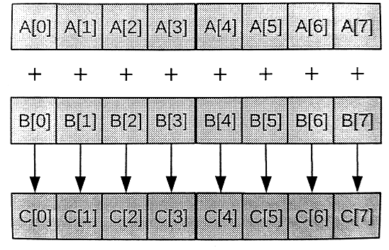
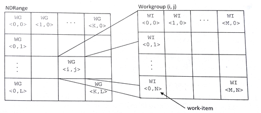

#3.4 内核和OpenCL编程模型

执行模型API能让应用管理OpenCL命令的执行。OpenCL命令通过数据转移和内核执行，对具体应用数据进行处理，从而执行一些有意义的任务。OpenCL内核也属于OpenCL应用中的一部分，并且这一部分实实在在的执行在设备上。与CPU并发模型类似，OpenCL内核在语法上类似于标准的C函数；不同在于添加了一些关键字，OpenCL的并发模型由内核实现构成。使用系统多线程API或OpenMP，开发一款执行在CPU上的并发应用时，开发者会考虑物理设备上有多少线程可以使用(比如：CPU核数)，如果使用的线程数量超过了可用的线程数，那么在物理线程不够用的基础上，多个线程会在不同时刻互相切换执行。OpenCL在的编程上，通常是以最细粒度的并行。OpenCL的一般性体现在，接口的通用性和底层内核直接映射物理资源。接下来展示三个不同版本的向量加法：①串行C实现，②多线程C实现，③OpenCL C实现。代码3.1中使用串行的方式实现向量加法(C语言)，其使用一个循环对每个元素进行计算。每次循环将两个输入数组对应位置的数相加，然后存储在输出数组中。图3.3展示了向量加法的算法。


// Perform an element-wise addition of A and B and store in C.
// There are N elements per array.

void vecadd(int *C, int *A, int *B, int N){
  for (int i = 0; i < N; ++i){
    C[i] = A[i] + B[i];
  }
}


代码3.1 串行加法实现



图3.3 向量加法的算法表示，其中每个元素可以单独进行加的操作

对于一个多核设备，我们要不就使用底层粗粒度线程API(比如，Win32或POSIX线程)，要不就使用数据并行方式(比如，OpenMP)。粗粒度多线程程序需要对任务进行划分(循环次数)。因为循环的迭代次数特别多，并且每次迭代的任务量很少，这时我们就需要增大循环迭代的粒度，这种技术叫做“条带处理”[1]。多线程版的代码如代码3.2所示。


// Perform an element-wise addition of A and B and store in C.
// There are N elements per array and NP CPU cores.

void vecadd(int *C, int *A, int *B, int N, int NP, int tid){
  
  int ept = N / NP; // 每个线程所要处理的元素个数

  for (int i = tid * ept; i < (tid + 1) * ept; ++i){
    C[i] = A[i] + B[i];
  }
}


代码3.2 分块处理向量加法，使用粗粒度多线程(例如，使用POSIX CPU线程)。输入向量上的不同元素被分配到不同的核上。

OpenCL C上的并发执行单元称为工作项(*work-item*)。每一个工作项都会执行内核函数体。这里就不用手动的去划分任务，这里将每一次循环操作映射到一个工作项中。OpenCL运行时可以创建很多工作项，其个数可以和输入输出数组的长度相对应，并且工作项在运行时，以一种默认合适的方式映射到底层硬件上(CPU或GPU核)。概念上，这种方式与并行机制中原有的功能性“映射”操作(可参考mapReduce)和OpenMP中对for循环进行数据并行类似。当OpenCL设备开始执行内核，OpenCL C中提供的内置函数可以让工作项知道自己的编号。下面的代码中，程序员调用`get_global_id(0)`来获取当前工作项的位置，以及访问到的数据位于数组中的位置。`get_global_id()`的参数用于获取指定维度上的工作项编号，其中“0”这个参数，可获取当前第一维上工作项的ID信息。


// Perform an element-wise addition of A and B and store in C.
// N work-items will be created to execute this kernel.
__kernel
void vecadd(__global int *C, __global int *A, __global int *B){
  int tid = get_global_id(0); // OpenCL intrinsic函数
  c[tid] = A[tid] + B[tid];
}


代码3.3 OpenCL版向量相加内核

OpenCL上运行的都是细粒度工作项，如果硬件支持分配细粒度线程，就可以在当前架构下产生海量的工作项(细粒度线程的可扩展性更强)。OpenCL使用的层级并发模型能保证，即使能够创建海量工作项的情况下，依旧可以正常的运行。当要执行一个内核时，程序员需要指定每个维度上工作项的数量(NDRange)。一个NDRange可以是一维、二维、三维的，其不同维度上的工作项ID映射的是相应的输入或输出数据。NDRange的每个维度的工作项数量由`size_t`类型指定。

向量相加的例子中，我们的数据是一维的，先假设有1024个元素，那么需要创建一个数组，里面记录三个维度上的工作项数量。host代码需要为1023个元素指定一个一维NDRange。下方的代码，就是如何指定各维度上的工作项数量：

```c++
size_t indexSpace[3] = {1024, 1, 1};
```

为了增加NDRange的可扩展性，需要将工作项继续的划分成更细粒度的线程，那么需要再被划分的工作项就称为工作组(*work-group*)(参考图3.4)。与工作项类似，工作组也需要从三个维度上进行指定，每个维度上的工作项有多少个。在同一个工作组中的工作项具有一些特殊的关系：一个工作组中的工作项可以进行同步，并且他们可以访问同一块共享内存。工作组的大小在每次分配前就已经固定，所以对于更大规模的任务分配时，同一工作组中的工作项间交互不会增加性能开销。实际上，工作项之间的交互开销与分发的工作组的大小并没有什么关系，这样就能保证在更大的任务分发时，OpenCL程序依旧能保证良好的扩展性。



图3.4 层级模型用于产生在NDRange时所使用的工作项，以及工作项所在的工作组

向量相加的例子中，可以参考以下方式指定工作组的大小：

```c++
size_t workgroupSize[3] = {64, 1, 1};
```

如果每个数组的工作项总数为1024，那么就会创建16个工作组(1024工作项/(64工作项每工作组)=16工作组)。为了保证硬件工作效率，工作组的大小通常都是固定的。之前的OpenCL标准中，每个维度上的工作项数目必须是工作组数目的倍数。这样的话，在内核执行的时候，有时候会有一些用不到的工作项，这些工作项只能直接返回，不做任何输出。不过，在OpenCL 2.0标准中，允许各维度上的工作项和工作组数量不成倍数关系，工作数量被分成两部分：第一部分是程序员指定给工作组的工作项，另一部分是剩余的工作组，这些工作可以没有工作项。当工作项与工作组的关系不成倍数，那么二维的NDRange尺寸就有4种可能，对于三维的NDRange尺寸就有8种可能。

向量相加程序中，每个工作项的行为都是独立的(即使在同一个工作组)，OpenCL允许程序员不去分配工作组的尺寸，其会在实现中进行自动的划分；这样的话，开发者就可以传递NULL作为工作组数组的尺寸。

##3.4.1 处理编译和参数

一个OpenCL program对象汇集了对应的OpenCL C内核，内核调用的函数，以及常量数据。例如，一个代数解决应用中，同一个OpenCL program可能包含一个向量相加内核，一个矩阵相乘的内核，和一个矩阵转置的内核。通过一系列运行时API的调用，可以让OpenCL内核源码得到编译。运行时编译能让系统为指定的计算设备，对OpenCL内核进行优化。运行时编译也能让OpenCL内核代码运行在之前不知是否支持OpenCL的设备上。运行时编译就不需要为区分AMD，NVIDIA或Intel平台而进行提前编译，只要计算设备提供OpenCL编译器，那么不需要为这些平台做任何改变。OpenCL的软连接只会在同一运行时层进行，由各个硬件平台提供的可安装客户端驱动(ICD)调用。ICD通常会以动态库的方式提供，不同的ICD代表着不同的供应商提供的运行时实现，可以通过动态库的接口激活对应的平台。

使用源码创建内核的步骤如下：

1. 将OpenCL C源码存放在一个字符数组中。如果源码以文件的形式存放在硬盘上，那么需要将其读入内存中，并且存储到一个字符数组中。

2. 调用`clCreateProgramWithSource()`通过源码可以创建一个`cl_program`类型对象。

3. 创建好的program需要进行编译，编译之后的内核才能在一个或多个OpenCL设备上运行。调用`clBuildProgram()`完成对内核的编译，如果编译有问题，该API会将输出错误信息。

4. 之后，需要创建`cl_kernel`类型的内核对象。调用`clCreateKernel()`，并指定对应的program对象和内核函数名，从而创建内核对象。

##3.4.2 设备上执行kernel


