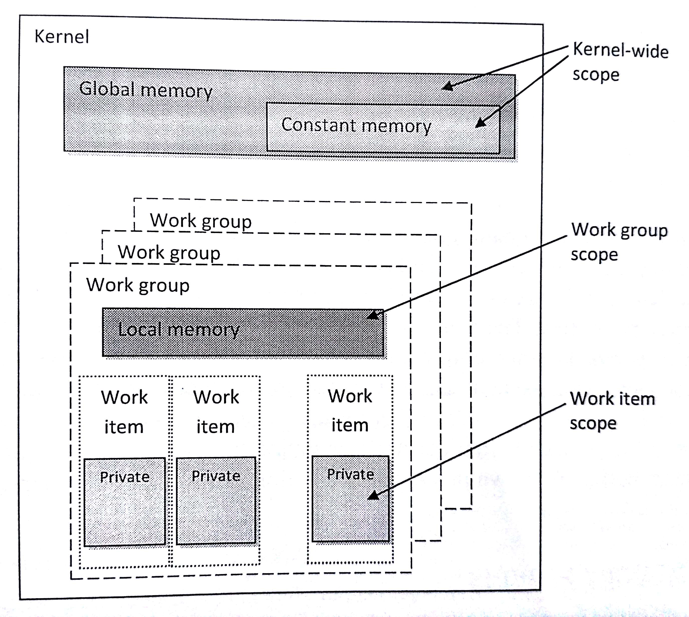
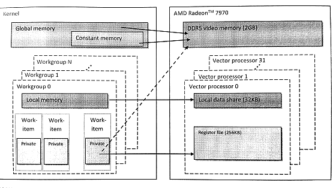

#3.5 OpenCL内存模型

内存与计算平台之间有比较大的差异。为了可移植性，OpenCL定义一个抽象的内存模型，其目的是为了能让编程者写出的代码对应到供应商所提供的实际硬件内存上。内存模型描述了，平台为了OpenCL程序所外现的内存(系统)结构。内存模型需要定义，如何让执行单元看到对应值的方式。内存模型是保证OpenCL程序正确性的关键。

内存模型可以实现编程者所期望的功能，对应内存操作能保证其发生的顺序，以及内存中实际的数值(当读取操作返回时)。OpenCL内存一致性模型基于ISO C11编程语言的内存模型。第6章和第7章会详细讨论内存模型的内存，包括一致性内存模型和共享虚拟内存。我们只需要了解一下OpenCL中定义的不同内存类型，其中内存区域是对抽象内存模型的补足。了解了这些之后，我们就可以开始第一个OpenCL程序了。

##3.5.1 内存对象

OpenCL内核通常需要对输入和输出数据进行分类(例如，数组或多维矩阵)。程序执行前，需要保证输入数据能够在设备端访问到。为了将数据转移到设备端，首先做的事就是封装出一个内存对象。为了产生输出数据，需要开辟相应大小的空间，以及将开辟的空间封装成一个内存对象。OpenCL定义了三种内存类型：数组、图像和管道。

**数组缓存**

*Buffer*类型类似于C语言中的数据(使用malloc函数开辟)，这种类型中数据在内存上是连续的。理论上，这种类型可以在设备端以指针的方式使用。OpenCL API `clCreateBuffer()`为这种类型分配内存，并返回一个内存对象。

```c++
cl_mem
clCreateBuffer(
  cl_context context,
  cl_mem_flags flags,
  size_t size,
  void *host_ptr,
  cl_int *errcode_ret)
```

该API类似于C中malloc()函数，或C++中的new操作。创建一个数组需要知道其长度和创建在哪一个上下文对象上；创建之后，与该上下文对象相关联的设备就能看到这个内存对象。对于第二个标识参数，是用来指定设备端可对内存进行的操作，可以是“只读”、“只写”或“读写”。其他标识需要在数组创建的时候指定。比较简单的选项是使用主机端的指针来初始化一段数组。我们能看到的是OpenCL数组是与上下文对象进行关联，而非某个设备，所以数据转移的是在运行时确定的。数组转移到指定的设备上，或是从指定的设备转移到其他地方，都由OpenCL运行时根据数据的依赖性进行管理。

**图像对象**

图像也是OpenCL内存对象，其抽象了物理数据的存储，以便“设备指定”的访存优化。与数组不同，图像数组数据不能直接访问。因为相邻的数据并不保证在内存上连续存储。使用图像的目的就是为了发挥硬件空间局部性的优势，并且可以利用设备硬件加速的能力。

```c++
cl_mem
clCreateImage(
  cl_context context,
  cl_mem_flags flags,
  const cl_image_format *image_format,
  const cl_image_desc *image_desc,
  void *host_ptr,
  cl_int *errcode_ret)
```

图像没有数据类型或维度，图像对象的创建需要通过描述符，让硬件了解这段内存数据的具体信息。图像对象中的每个元素通过格式描述符来表示(cl_image_format)。格式描述符用于描述图像元素在内存上是如何存储，以及使用通道的信息。*通道序*(channel order)指的是由多少个通道元素组成一个图像元素(例如，RGBA就是由四个通道值组成一个像素，其通道序为4)，并且*通道类型*(channel type)指定了每个元素的大小。大小可以设置为1到4字节中的任意值，这样就能表现多种不同的格式(从整型到浮点)。其他数据元通过图像描述符(cl_image_desc)提供，其包括了图像的类型和维度。第4章我们会看到一个使用图像的例子。第6章和第7章，我们将详细的讨论图像的架构设计和评估。

为了支持图像类型，在设备端OpenCL C专门提供了用于读写图像数据的内置函数。硬件供应商可以通过这些函数，在底层单独对图像访问进行优化，或者利用硬件加速功能提高图像访存的速度。与数组相比，图像读写函数需要额外的参数，并且这些函数根据图像的具体数据类型进行使用。例如，`read_imagef()`函数就适用于读取浮点型的数值，`read_imageui()`函数就使用与读取无符号整型的数值。这些函数在使用的数据类型上有些不同，但在读取方面至少需要有一组访问坐标和一个采样器对象。采样器可以指定，设备访问到图像外部时，这些不存在的数据应该如何获取，是否使用差值，以及是否对坐标进行归一化。写入图像需要手动将数据转换成对应的存储数据格式(例如，对应的通道和对应的数据大小)，目的坐标也需要手动的进行转换。

之前的OpenCL标准中，内核不允许对一个图像对象同时进行写入和读取。不过，OpenCL 2.0放松了这一要求，其提供的一系列同步操作，能让编程者安全的在同一内核中对同一图像对象进行读和写。

**管道对象**

管道内存对象就是一个数据元素(被称为*packets*)队列，其和其他队列一样，遵循FIFO(先进先出)的方式。一个管道对象具有一个写入末尾点，用于表示元素由这里插入；并且，有一个读取末尾点，用于表示元素由这里移除。要创建一个管道对象时，需要调用OpenCL API `clCreatePipe()`，这里需要提供包的大小和管道中可容纳包的最大数量(例如，创建时固定了管道中可容纳包的最大值)。函数`clGetPipeInfo()`可以返回管道中包的大小和整体大小(也就是可容纳包的最大值)。属性参数是一个保留参数，在OpenCL 2.0阶段，这个值只能传NULL。

```c++
cl_mem
clCreatePipe(
  cl_context context,
  cl_mem_flags flags,
  cl_uint pipe_packet_size,
  cl_uint pipe_max_packets,
  const cl_pipe_properties *properties,
  cl_int *errcode_ret)
```

任意时间点，只能有一个内核向管道中存入包，并且只有一个内核从管道中读取包。为了支持“生产者-消费者”设计模式，一个内核与写入末尾点连接(生产者)，同时另一个内核与读取末尾点连接(消费者)。同一个内核不能同时对一个管道进行读取和存入。

图像和管道都是不透明的数据结构，其只能通过OpenCL C的内置函数进行访问(比如，`read_pipe()`和`write_pipe()`)。OpenCL C也提供相应的函数，可以保留管道的读取点和写入点。内置函数允许管道在工作组级别上进行访问，而不需要单独访问每个工作项，并且能在工作组级别上执行同步。第6章将会对管道进行更多的讨论。

##3.5.2 数据转移命令

内核执行之前，通常需要将主机端的数据拷贝到OpenCL内存对象的所分配的空间中。创建数组或图像可以调用不同的创建API(`clCreate*()`)。将主机指针作为`clCreate*()`的参数用于初始化OpenCL内存对象。这种方式可以隐式的进行数据传输，并不需要编程者为之担心。内存对象初始化之后，运行时就需要保证数据依据依赖关系，以正确的顺序和时间转移到设备端。

虽然，数据转移交给运行时进行管理，但是我们通常出于对性能的考虑(将在第6章进行讨论)，常常希望能够手动进行数据传输。显式的数据传输也需要检索主机端的内存空间。因此，通常情况下使用显式数据传输命令，在内存对象被内核调用之前，为其写入相应的数据到设备端；以及，在内存对象最后一次使用之后，读取其数据到主机端。假设我们的内存对象是一个数组，主机端和设备端的内存互传需要使用到下面两个API：`clEnqueueWriteBuffer()`和`clEnqueueReadBuffer()`。设备端使用的内存与主机内存通常是离散的，当命令执行时，数据可能就已经传输到设备端了(比如，使用PCIe总线)。读取和写入内存对象的API十分相似。`clEnqueueWriteBuffer()`的参数列表如下所示：

```c++
cl_int
clEnqueueWriteBuffer(
  cl_command_queue command_queue,
  cl_mem buffer,
  cl_bool blocking_write,
  size_t offset,
  size_t cb,
  const void *ptr,
  cl_uint num_events_in_wait_list,
  const cl_event *event_wait_list,
  cl_event *event)
```

除了命令队列，该函数还需要数组型的内存对象，所要传输的数据大小，以及数组的偏移。偏移量和传输数据可以将原始数据的一个子集进行传输。如果需要数据传输完成再返回，blocking_write参数可以设置成CL_TRUE；如果设置成CL_FALSE，则以更加高效的异步方式进行传输，且函数会立即返回，无需等到数据完全传输完再返回。写入和读取数组的操作将在本章最后的例子中演示。

##3.5.3 内存区域

OpenCL将内存划分成主机内存和设备内存。主机内存可在主机上使用，其并不在OpenCL的定义范围内。使用对应的OpenCL API可以进行主机和设备的数据传输，或者通过共享虚拟内存接口进行内存共享。而设备内存，指定是能在执行内核中使用的内存空间。

OpenCL将设备内存分成了四种，这四种内存分别代表了不同的内存区域，如图3.6所示。



图3.6 内存区域和其在OpenCL内存模型中的界限

这些内存空间都与OpenCL内核有关。一个内核中，不同区域对应有不同的关键字，关键字用来指定变量使用哪种内存进行创建，或数据具体所存储的位置。内存区域在逻辑上是不相交的，并且不同区域的数据要被其他区域使用，是否需要进行数据转移是由内核开发者来控制。每个内存区域都有其各自的性能特性。由于性能特性的缘故，存储到不同区域的数据在读取时具有很大的性能差异。

下面简单的来描述一下每个内存区域：

- 全局内存对于执行内核中的每个工作项都是可见的(类似于CPU上的内存)。当数据从主机端传输到设备端，数据就存储在全局内存中。有数据需要从设备端传回到主机端，那么对应的数据需要存储在全局内存中。其关键字为`global`或`__global`，关键字加在指针类型描述符的前面，用来表示该指针指向的数据存储在全局内存中。例如，本章最后的的例子中，OpenCL C代码中`global int *A`代表A指针指向的数据为与全局内存中(虽然我们会看到的A实际位于私有内存中)。

- 常量内存并非为只读数据设计，但其能让所有工作项同时对该数据进行访问。这里存储的值通常不会变化(比如，某个数据变量存储着π的值)。OpenCL的内存模型中，常量内存为全局内存的子集，所以内存对象传输到全局内存的数据可以指定为“常量”。使用关键字`constant`或`__constant`将相应的数据映射到常量内存。

- 局部内存中的数据，只有在同一工作组内的工作项可以共享。通常情况下，局部内存会映射到片上的物理内存，例如：软件管理的暂存式存储器。比起全局内存，局部内存具有更短的访问延迟，以及更高的传输带宽。调用`clSetKernelArg()`设置局部内存时，只需要传递大小，而无需传递对应的指针，相应的局部内存会由运行时进行开辟。OpenCL内核中，使用`local`或`__local`关键字来描述指针，从而来定义局部内存(例如，`local int *sharedData`)。不过，数据也可以通过关键字`local`，静态申明成局部内存变量(例如，`local int[64]`)。

- 私有内存只能由工作项自己进行访问。局部变量和非指针内核参数通常都在私有内存上开辟。实践中，私有变量通常都与寄存器对应。不过，当寄存器不够私有数组使用是，这些溢出的数据通常会存储到非片上内存(高延迟的内存空间)上。



图3.7 AMD Radeon HD 7970 GPU具体硬件存储器与OpenCL内存模型的对应关系

##3.5.4 通用地址空间

之前的OpenCL标准中，如果使用不同内存区域内存，需要在创建的时候使用对应的关键字对指针进行申明。为了不让编程者的精力在这些方便分散，“通用地址空间”概念添加入OpenCL 2.0标准。“通用地址空间”的建模，更加贴近已经使用很久的嵌入式C标准(IOS/IEC 9899:1999)。通用地址空间支持指向私有、局部和全局地址指针的互相转换，这样编程者只需要写一个简单的函数即可，其指针参数可以接受这指向这三种内存区域的指针。关于通用地址空间将在第7章详细讨论。
