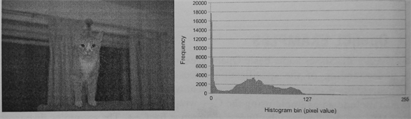

#4.2 直方图

直方图是用来计数或可视化离散数据的频度(比如，出现次数)，直方图多用于图像处理。例如本节的例子，我们将创建一个直方图，其统计像素值不超过256-bit的图像。图4.1中，左边的图为输入，右边的图为产生好的直方图。例子中我们将使用局部内存，以及在OpenCL内核中使用局部和全局原子操作。



图4.1 从一副256-bit图产生的直方图。直方图中显示了相关像素的频度。

理论上，直方图算法本身很简单。例子中，每个值都由自己对应的位置，直方图的实现如下：


int histogtam[HIST_BINS]

main(){
  for (each input value){
    histogtam[value]++;
  }
}


与第3章的向量相加不同，直方图不那么容易并行，在多线程的状态下期中的自加操作将会导致竞争。不过，虽然效率有些低，但也可以使用原子加操作来完成直方图中的数据的自加操作。下面的伪代码，就完全能用多线程完成直方图的计算。


int histogtam[HIST_BINS]

createHistogram(){
  for (each of my value){
    atomic_add(histogtam[value], 1);
  }
}

main(){
  for (number of threads){
    spawn_thread(createHistogram);
  }
}


这个实现并不高效，因为其对每个像素都进行了原子操作。更高效的一种方式是使用局部直方图，其只统计该区域内的像素。当一个线程计算完成自己的局部直方图后，就会自动的加到全局直方图中。


int histogram[HIST_BINS]

createHistogram(){

  int localHistorgram[HIST_BINS];

  for (each of my value){
    localHistorgram[value]++;
  }
  
  for (each bin){
    atomic_add(histogram[bin], localHistorgram[bin]);
  }
}

main(){
  for (number of threads){
    spawn_thread(createHistogram);
  }
}


很多情况下，OpenCL的多线程和CPU多线程在原理上是一样的——不过二者的线程粒度有些不同。如将第一种多线程的方式换成OpenCL中的工作项来做，因为每个工作项都要对共享的全局内存使用原子操作，其执行效率也很低。第8章中，我们将了解到，全局变量的访问延迟要远高于寄存器和局部内存。如多线程的实现，如果有太多的线程访问同一个位置，那么这个程序的效率将会大大降低。

不过，我们也不想在每个工作项中备份直方图。GPU工作项将私有数据存储到寄存器，当寄存器被占满，多于的私有变量会存储在全局内存中，这对于性能来说有弊无益。

最好的办法就是在每个工作组中创建一份局部积分图。局部内存中的数据，每个工作组中的所有工作项都可以共享访问。局部内存一般会分布在GPU的片上内存中，其访问速度要比访问全局内存快的多。如同第二种CPU多线程算法，当工作组完成局部积分图时，其会传递给全局内存，并使用原子加操作将对应位置上的数据原子加到全局内存中。不过，这种实现方式也有问题：对局部内存的访问上存在条件竞争。这里需要你对目标设备的架构有所了解。对于很多GPU来说，原子操作访问局部内存的效率很高。在AMD Radeon GPU上，原子单元位于片上暂存式存储器中。因此，局部内存上的原子操作的效率要比全局原子操作的效率高很多。下面的例子中，我们将使用到局部原子操作来生成局部直方图。

OpenCL内核的参考代码如下：

#define HIST_BINS 256

__kernel
void histogram(__global int *data,
			            int  numData,
			   __global int *histogram){
			   
  __local int localHistorgram[HIST_BINS];
  
  int lid = get_local_id(0);
  int gid = get_glaobal_id(0);
  
  /* Initialize local histogram to zero */
  for (int i = lid; i < HIST_BINS; i += get_local_size(0)){
    localHistorgram[i] = 0;
  }
  
  /* Wait nutil all work-items within
   * the work-group have completed their stores */
  barrier(CLK_LOCAL_MEM_FENCE);
  
  /* Compute local histogram */
  for (int i = gid; i < numData; i += get_glaobal_size(0)){
    atomic_add(&localHistorgram[data[i]], 1);
  }
  
  /* Wait nutil all work-items within
   * the work-group have completed their stores */
  barrier(CLK_LOCAL_MEM_FENCE);
  
  /* Write the local histogram out to
   * the global histogram */
  for (int i = lid; i < HIST_BINS; i += get_glaobal_size(0)){
    atomic_add(&histogram[i], localHistorgram[i]);
  }
}


代码清单4.1 计算直方图的OpenCL内核代码

代码清单4.1的实现中包含如下5步：

1. 初始化局部直方图内的值为0 (第14行)

2. 同步工作项，确保相应的数据全部更新完毕 (第23行)

3. 计算局部直方图 (第26行)

4. 再次同步工作项，确保相应的数据全部更新完毕 (第35行)

5. 将局部直方图写入到全局内存中 (第39行)

1,3,5展示了如何在OpenCL中对内存共享区域(全局或局部内存)进行读写。当我们需要工作项需要访问不同的内存位置时，我们可以以工作项的唯一标识ID为基准，然后加上所有工作项的数量作为跨度(例如，工作组内以工作组中工作项的数量，计算对应工作项所要访问的局部内存位置。或以NDRange中的尺寸，访问全局内存)。第1步中，我们以工作组的尺寸为跨距，用来将局部直方图初始化为0。这就允许我们更加灵活的对工作组尺寸进行设置及配置，并且能保证现有模块功能的正确性。第3步中使用同样的方式读取全局内存中的数据，以及第5步中也以相同的方式将局部内存中的数据写出。

第2和第4步使用栅栏对两步间的操作进行同步，其指定的内存栅栏，将同步工作组中的所有工作项。栅栏和内存栅栏将在第7章详细讨论。现在就能确保工作组中的所有工作项都要到达该栅栏处，只要有线程没有达到，已达到的线程就不能执行下面的操作。局部内存栅栏就是用来保证所有工作项都到达栅栏处，以代表局部直方图更新完毕。

为了让全局直方图得到正确的结果，我们也需要对全局积分图进行初始化。可以在数组创建之后，直接使用主机端API `clEnqueueFillBuffer()`对数据进行初始化。`clEnqueueFillBuffer()`的参数列表如下:

```c++
cl_int
clEnqueueFillBuffer(
  cl_command_queue command_queue,
  cl_mem buffer,
  const void *pattern,
  size_t offset,
  size_t size,
  cl_uint num_events_in_wait_list,
  const cl_event *event_wait_list,
  cl_event *event)
```

该API类似于C中的`memset()`函数。buffer参数就是要初始化的数组对象，具体的值由pattern指定。与`memset()`不同，pattern可以指定为任意的OpenCL支持类型，比如：标量、整型向量或浮点类型。pattern_size用来指定pattern所占空间。size参数用来指定数组内初始化的字节数，其值必须是pattern_size的整数倍。offset参数用来指定数组起始初始化的位置或偏移。

除了初始化直方图数组部分，主机端代码与第3章向量相加的代码很类似。代码清单4.2提供了直方图统计主机端的完整代码。内核代码在代码清单4.1中，将其存成名为histogram.cl以供4.2中的代码使用。代码中有些工具函数在4.6节中会详细介绍。这些函数用于读写BMP文件，这里提供其源码的在线地址(http://booksite.elsevier.com/9780128014141)


/* System includes */
#include <stdio.h>
#include <stdlib.h>
#include <sting.h>

/* OpenCL includes */
#include <CL/cl.h>

/* Utility functions */
#include "utils.h"
#include "bmp_utils.h"

static const int HIST_BINS = 256;

int main(int argc, char *argv[]){

  /* Host data */
  int *hInputImage = NULL;
  int *hOutputHistogram = NULL;
  
  /* Allocate space for the input image and read the
   * data from disk */
  int imageRows;
  int imageCols;
  hInputImage = readBmp("../../Images/cat.bmp", &imageRows, &imageCols);
  const int imageElements = imageRows * imageCols;
  const size_t imageSize = imageElements * sizeof(int);
  
  /* Allocate space for the histogram on the host */
  const int histogramSize = HIST_BINS * sizeof(int);
  hOutputHistogram = (int *)malloc(histogramSize);
  if (!hOutputHistogram){ exit(-1); }
  
  /* Use this check the output of each API call */
  cl_int status;
  
  /* Get the first platform */
  cl_platform_id platform;
  status = clGetPlatformIDs(1, &platform, NULL);
  check(status);
  
  /* Get the first device */
  cl_device_id device;
  status = clGetDeviceIDs(platform, CL_DEVICE_TYPE_GPU, 1, &device, NULL);
  check(status);
  
  /* Create a command-queue and associate it with the device */
  cl_command_queue cmdQueue;
  context = clCreateContext(NULL, 1, &device, NULL, NULL, &status);
  check(status);
  
  /* Create a buffer object for the output histogram */
  cl_mem bufOutputHistogram;
  bufOutputHistogram = clCreateBuffer(context, CL_MEM_WRITE_ONLY, histogramSize, NULL, &status);
  check(status);
  
  /* Write the input image to the device */
  status = clEnqueueWriteBuffer(cmdQueue, bufInputImage, CL_TRUE, 0, imageSize, hInputImage, 0, NULL, NULL);
  check(status);
  
  /* Initialize the output histogram with zero */
  int zero = 0;
  status = clEnqueueFillBuffer(cmdQueue, bufOutputHistogram, &zero, sizeof(int), 0, histogramSize, 0, NULL, NULL);
  check(status);
  
  /* Create a program with source code */
  char *programSource = readFile("histogram.cl");
  size_t prograSourceLen = strlen(programSource);
  cl_program program = clCreateProgramWithSouce(context, 1, (const char **)&programSource, &prograSourceLen, &status);
  check(status);
  
  /* Build (compile) the program for the device */
  status = clBuildProgram(program, 1, &device, NULL, NULL, NULL);
  if (status != CL_SUCCESS){
    printCompilerError(program, device);
	exit(-1);
  }
  
  /* Create the kernel */
  cl_kernel kernel;
  kernel = clCreateKernel(program, "histogram", &status);
  check(status);
  
  /* Set the kernel arguments */
  status = clSetKernelArg(kernel, 0, sizeof(cl_mem), &bufInputImage);
  status |= clSetKernelArg(kernel, 1, sizeof(int), &imageElements);
  status |= clSetKernelArg(kernel, 2, sizeof(cl_mem), &bufOutputHistogram);
  
  /* Define the index space and work-group size */
  size_t globalWorkSize[1];
  globalWorkSize[0] = 1024;
  
  size_t localWorkSize[1];
  localWorkSize[0] = 64;
  
  /* Enqueue the kernel for execution */
  status = clEnqueueNDRangeKernel(cmdQueue, kernel, 1, NULL, globalWorkSize, localWorkSize, 0, NULL, NULL);
  check(status);
  
  /* Read the output histogram buffer to the host */
  status = clEnqueuReadBuffer(cmdQueue, bufOutputHistogram, CL_TRUE, 0, histogramSize, hOutputHistogram, 0, NULL, NULL);
  check(status);
  
  /* Free OpenCL resources */
  clReleaseKernel(kernel);
  clReleaseProgram(program);
  clReleaseCommandQueue(cmdQueue);
  clReleaseMemObject(bufInputImage);
  clReleaseMemObject(bufOutputHistogram);
  clReleaseContext(context);
  
  /* Free host resource */
  free(hInputImage);
  free(hOutputHistogram);
  free(programSource);
  
  return 0;
}


代码清单4.2 直方图统计的主机端代码。注意，check(cl_int status)是用来检查之前执行命令的状态是否为CL_SUCCESS。