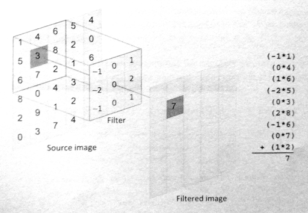
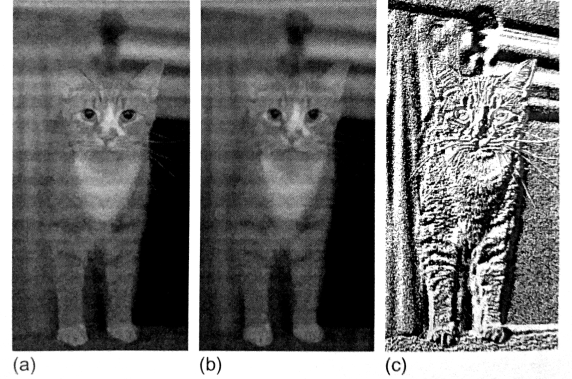

#4.4 图像卷积

卷积在图像处理中经常用到，其会根据每个像素周围的像素点修改当前像素点的值。卷积核就是用来描述每个像素点如何被附近的像素点所影响。例如，模糊滤波中，使用平均的权重方式来进行计算，这样差异比较大的像素点会减少差异。对于相同的图像，如果想要做不同的操作，我们只需要变化滤波器即可，这样就能做锐化、模糊、边缘增强和图像压花。

卷积算法会遍历原始图像中的每一个像素点。对于每个原始像素点，滤波器中心点会为于像素点的上方，然后将中心点以及周围点的像素点与滤波器中对应的权重值相乘。然后将乘积的结果值相加后，产生出新的值作为输出。图4.3中就展示了该算法的具体过程。



图4.3 卷积滤波如何对原图像进行处理。

图4.4a是原始图，图4.4b中展示了原图经过模糊滤波后的结果，图4.4c展示了经过一个压花滤波器处理后的结果。



图4.4 不同卷积核对同一张图像进行处理：a)为原图；b)为模糊处理；c)为压花处理。

程序清单4.6中使用`C/C++`实现了一个串行的卷积操作。两层外部循环以遍历原始图像中所有的像素点。每一次滤波操作，每个原始点和其附近的点都要参与计算。需要注意的是，滤波器有可能访问到原始图像之外的区域。为了解决这个问题，我们在最内层循环中添加了四个显式的检查，当滤波器对应的坐标点位于原始图像之外，我们将使用与其最近的原始图像的边界值。


/* Iterate over the rows of the source image */
for (int i = 0; i < rows; i++)
{
  /* Iterate over the columns of the source image */
  for (int j = 0; j < cols; j++)
  {
    /* Reset sum for new source pixel */
    int sum = 0;
    
    /* Apply the filter to the neighborhood */
    for (int k = -halfFilterWidth; k <= halfFilterWidth; k++)
    {
      for (int l = -halfFilterWidth; l <= halfFilterWidth; l++)
      {
        /* Indices used to access the image */
        int r = i+k;
        int c = j+l;
        
        /* Handle out-of-bounds locations by clamping to  
         * the border pixel*/
        r = (r < 0)? 0 : r;
        c = (c < 0)? 0 : c;
        r = (r >= rows)? rows - 1: r;
        c = (c >= cols)? cols - 1: c;
        
        sum += Image[r][c] *
               Filter[k+halfFilterWidth][l+halfFilterWidth];
      }
    }
    
    /* Write the new pixel value */
    outputImage[i][j] = sum;
  }
}


程序清单4.6 图像卷积的串行版本

OpenCL中，使用图像内存对象处理卷积操作要比使用数组内存对象更有优势。图像采样方式会自动对访问到图像之外的区域进行处理(类似于上节图像转换中所提到的)，并且访问缓存中二维数据在硬件上也会有所优化(将会在第7章讨论)。

OpenCL上实现卷积操作几乎没有什么难度，并且写法类似于卷积操作的C版本。OpenCL版本中，我们为每一个输出的像素点创建了一个工作项，使用并行的方式将最外层两个循环去掉。那么每个工作项的任务就是完成最里面的两个循环，这两个循环完成的就是滤波操作。前面的例子中，读取源图像数据，需要配置一个OpenCL结构体，来指定数据的类型。本节的例子中，将继续使用`read_imagef()`。完整的内核代码将在代码清单4.7中展示。


__kerenl
void convolution(
  __read_only image2d_t inputImage,
  __write_only image2d_t outputImage,
  int rows,
  int cols,
  __consetant float *filter,
  int filterWidth,
  sampler_t sampler)
{
  /* Store each work-item's unique row and column */
  int column = get_global_id(0);
  int row = get_global_id(1);
  
  /* Half the width of the filter is needed for indexing
   * memory later */
  int halfWidth = (int)(filterWidth / 2);
  
  /* All accesses to images return data as four-element vectors
   * (i.e., float4), although only the x component will contain
   * meaningful data in this code */
  float4 sum = {0.0f,0.0f,0.0f,0.0f};
  
  /* Iterator for the filter */
  int filterIdx = 0;
  
  /* Each work-item iterates around its local area on the basis of the
   * size of the filter*/
  int2 coords; // Coordinates for accessing the image
  
  /* Iterate the filter rows*/
  for (int i = -halfWidth; i <= halfWidth; i++)
  {
    coords.y = row + i;
    /* Iterate over the filter columns */
    for (int j = -halfWidth; j <= halfWidth; j++)
    {
      coords.x - column + 1;
      
      /*Read a pixel from the image. A single-channel image
       * stores the pixel in the x coordinate of the reatured
       * vector. */
      pixel = read_imagef(inputImage, sampler, coords);
      sum.x += pixel.x * filter[filterIdx++];
    
    }
  }
  
  /* Copy the data to the output image */
  coords.x = column;
  coords.y = row;
  write_imagef(outputImage, coords, sum);
}


程序清单4.7 使用OpenCL C实现的图像卷积

访问图像总会返回具有四个值的向量(每个通道一个值)。前节例子中，我们加了`.x`来表示只需要返回值的第一个元素。本节例子中，我们会申明pixel(图像访问之后返回的值)和sum(存储结果数据，以拷贝到输出图像)，其类型都为float4。当然，我们仅对x元素进行累加滤波像素值的计算(第45行)。

卷积核很适合放置到常量内存上，因为所有工作项所要用到的卷积核都是相同的。简单的添加关键字"__costant"在函数参数列表中(第7行)，用于表示卷积核存放在常量内存中。

之前的例子中，我们是直接在内核内部创建了一个采样器。本节例子中，我们将使用主机端API创建一个采样器，并将其作为内核的一个参数传入。同样，本节例子中我们将使用C++ API(C++采样器构造函数需要相同的参数)。

主机端创建采样器的API如下所示：

```c++
cl_sampler clCreateSampler(
  cl_context context,
  cl_bool normalized_coords,
  cl_addressing_mode addressing_mode,
  cl_filter_mode filter_mode,
  cl_int *errcode_ret)
```

其C++ API如下所示：
```c++
cl::Sampler::Sampler(
  const Context &context,
  cl_bool normalized_coords,
  cl_addressing_mode addressing_mode,
  cl_filter_mode filter_mode,
  cl_int *err = NULL)
```

使用C++创建采样器的方式如下所示：

```c++
cl::Sampler sampler = new cl::Sampler(context, CL_FALSE, CL_ADDRESS_CLAMP_TO_EDGE, CL_FILTER_NEAREST);
```

图像旋转例子中，采样器使用非标准化坐标。这里我们将展示不同于内部使用时的另外两个采样器参数：滤波模式将使用最近的像素点的值，而非进行差值后的值(CL_FILTER_NEAREST)，并且寻址模式将在访问到图像区域之外时，将其值置为最接近的图像边界值(CL_ADDRESS_CLAMP_TO_EDGE)。(注：这里要注意一下CL和CLK的区别。CL开头的是使用在主机端API上，CLK则直接使用在OpenCL内核代码中。)

使用C++ API，创建二维图像使用image2D类进行创建，创建这个类需要一个ImageFormat对象作为参数。C API则不需要图像描述器的传入。

Image2D和ImageFormat的构造函数如下：

```c++
cl::Image2D::Image2D(
  Context& context,
  cl_mem_flags flags,
  ImageFormat format,
  ::size_t width,
  ::size_t height,
  ::size_t row_pitch = 0,
  void *host_ptr = NULL,
  cl_int *err = NULL)
  
cl::ImageFormat::ImageFormat(
  cl_channel_order order,
  cl_channel_type type)
```

这样我们就能创建卷积所需要的输入和输出图像，其调用方式如下所示：

```c++
cl::ImageFormat imageFormat = cl::ImageFormat(CL_R, CL_FLOAT);
cl::Image2D inputImage = cl::Image2D(context, CL_MEM_READ_ONLY, imageFormat, imageCols, imageRows);
cl::Image2D outputImage = cl::Image2D(context, CL_MEM_WRITE_ONLY, imageFormat, imageCols, imageRows);
```

使用C++ API实现图像卷积的主机端代码在代码清单4.8中展示。主程序中，使用了一个5x5的高斯模糊滤波核用于卷积处理。


#define __CL_ENABLE_EXCEPTIONS

#include <CL/cl.hpp>
#include <fstream>
#include <iostream>
#include <vector>

#include "utils.h"
#include "bmp_utils.h"

static const char *inputImagePath = "../../Images/cat.bmp";

static float gaussianBlurFilter[25] = {
  1.0f / 273.0f, 4.0f / 273.0f, 7.0f / 273.0f, 4.0f / 273.0f, 1.0f / 273.0f,
  4.0f / 273.0f, 16.0f / 273.0f, 26.0f / 273.0f, 16.0f / 273.0f, 4.0f / 273.0f,
  7.0f / 273.0f, 26.0f / 273.0f, 41.0f / 273.0f, 26.0f / 273.0f, 7.0f / 273.0f,
  4.0f / 273.0f, 16.0f / 273.0f, 26.0f / 273.0f, 16.0f / 273.0f, 4.0f / 273.0f,
  1.0f / 273.0f, 4.0f / 273.0f, 7.0f / 273.0f, 4.0f / 273.0f, 1.0f / 273.0f
};
static const int gaussianBlurFilterWidth = 5;

int main()
{
  float *hInputImage;
  float *hOutpueImage;
  
  int imageRows;
  int imageCols;
  
  /* Set the filter here */
  int filterWidth = gaussianBlurFilterWidth;
  float *filter = gaussianBlurFilter;
  
  /* Read in the BMP image */
  hInputImage = readBmpFloat(inputImagePath, &imageRows, &imageCols);
  
  /* Allocate space for the output image */
  hOutputImage = new float[imageRows * imageCols];
  
  try
  {
    /* Query for platforms */
    std::vector<cl::Platform> platforms;
    cl::Platform::get(&platdorms);
    
    /* Get a list of devices on this platform */
    std::vector<cl::Device> device;
    platforms[0].getDevices(CL_DEVICE_TYPE_GPU, &devices);
    
    /* Create a context for the devices */
    cl::Context context(devices);
    
    /* Create a command-queue for the first device */
    cl::CommandQueueu queue = cl::CommandQueue(context, devices[0]);
    
    /* Create the images */
    cl::ImageFormat imageFormat = cl::ImageFormat(CL_R, CL_FLOAT);
    cl::Image2D inputImage = cl::Image2D(context, CL_MEM_READ_ONLY, 
        imageFormat, imageCols, imageRows);
    cl::Image2D outputImage = cl::Image2D(context, 
        CL_MEM_WRITE_ONLY,
        imageFormat, imageCols, imageRows);
        
    /* Create a buffer for the filter */
    cl::Buffer filterBuffer = cl::Buffer(context, CL_MEM_READ_ONLY,
    filterWidth * filterWidth * sizeof(float));
    
    /* Copy the input data to the input image */
    cl::size<3> origin;
    origin[0] = 0;
    origin[1] = 0;
    origin[2] = 0;
    cl::size<3> region;
    region[0] = 0;
    region[1] = 0;
    region[2] = 0;
    queue.enqueueWriteImage(inputImage, CL_TRUE, origin, region,
    0, 0,
    hInputImage);
    
    /* Copy the filter to the buffer*/
    queue.enqueueWriteBuffer(filterBuffer, CL_TRUE, 0,
    filterWidth * filterWidth * sizeof(float), filter);
    
    /* Create the sampler */
    cl::Sampler sampler = cl::Sampler(context, CL_FALSE,
    CL_ADDRESS_CLAMP_TO_EDGE, CL_FILTER_NEAREST);
    
    /* Read the program source */
    std::ifstream sourceFile("image-convolution.cl");
    std::string sourceCode(std::istreambuf_iterator<char>(sourceFile),
    (std::istreambuf_iterator<char>()));
    
    cl::Program::Source source(1,
      std::make_pair(sourceCode.c_str(),
      sourceCode.length() + 1));
      
    /* Make program form the source code */
    cl::Program program = cl::Program(context, source);
    
    /* Create the kernel */
    cl::Kernel kernel(program, "convolution");
    
    /* Set the kernel arguments */
    kernel.setArg(0, inputImage);
    kernel.setArg(1, ouputImage);
    kernel.setArg(2, filterBuffer);
    kernel.setArg(3, filterWIdth);
    kernel.setArg(4, sampler);
    
    /* Execute the kernel */
    cl::NDRange global(imageCols, imageRows);
    cl::NDRange local(8, 8);
    queue.enqueueNDRangeKernel(kernel, cl::NullRange, global,
    local);
    /* Copy the output data back to the host */
    queue.enqueueReadImage(outputImage, CL_TRUE, origin, region,
    0, 0,
    hOutputImage);
    
    /* Save the output BMP image */
    writeBmpFloat(hOutputImage, "cat-filtered.bmp", imageRows, imageCols, inputImagePath);
  }
  catch(cl::Error error){
    std::cout << error.what() << "(" << error.err() << ")" << std::endl;
  }
  
  free(hInputImage);
  delete hOutputImage;
  return 0;
}


程序清单4.8 图像卷积主机端完整代码

