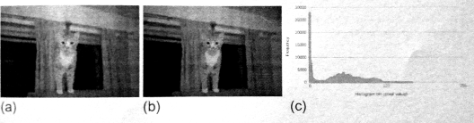

#4.4 生产者-消费者

很多OpenCL应用中，前一个内核的输出可能就会作为下一个内核的输入。换句话说，第一个内核是**生产者**，第二个内核是**消费者**。很多应用中生产者和消费者是并发工作的，生产者只将产生的数据交给消费者。OpenCL 2.0中提供管道内存对象，用来帮助生产者-消费者这样的应用。管道所提供的潜在功能性帮助，无论生产者-消费者内核是串行执行或并发执行。

本节中，我们将使用管道创建一个生产者-消费者应用，其中生产者和消费者分别用内核构成，这两个内核使用的是本章前两个例子：卷积和直方图。卷积内核将会对图像进行处理，然后使用管道将输出图像传入直方图内核中(如图4.5所示)。为了描述额外的功能，展示管道如何使用处理单元提高应用效率。本节的例子我们将使用多设备完成。卷积内核将执行在GPU设备上，直方图内核将执行在CPU设备上。多个设备上执行内核可以保证两个内核能够并发执行，其中管道就用来传输生产者需要的数据(且为消费者需要的数据)。对于管道对象的详细描述将在第6章展开。那么现在，让我们来了解一下本节例子的一些基本需求。

管道内存中的数据(称为packets)组织为先入先出(FIFO)结构。管道对象的内存在全局内存上开辟，所以可以被多个内核同时访问。这里需要注意的是，管道上存储的数据，主机端无法访问。

内核中管道属性可能是只读(__read_only)或只写(__write_only)，不过不能是读写。如果管道对象没有指定是只读或只写，那么编译器将默认其为只读。管道在内核的参数列表中，通过使用关键字`pipe`进行声明，后跟数据访问类型，和数据包的数据类型。例如，`pipe __read_only float *input`将会创建一个只读管道，该管道中包含的数据为单精度浮点类型。



图4.5 生产者内核将滤波后生成的像素点，通过管道传递给消费者内核，让消费者内核产生直方图：(a)为原始图像;(b)为滤波后图像;(c)为生成的直方图。

为了访问管道，OpenCL C提供内置函数`read_pipe()`和`write_pipe()`：

```c++
int read_pipe(pipe gentype p, gentype *ptr);
int write_pipe(pipe gentype p, const gentype *ptr);
```

当一个工作项调用`read_pipe()`(程序清单4.10，第16行)，一个包将从管道p中读取到ptr中。如果包读取正常，该函数返回0；如果管道为空，则该函数返回一个负值。`write_pipe()`(程序清单4.9，第50行)与读取类似，会将ptr上的包写入到管道p中。如果包写入正常，该函数返回0；如果管道已满，则该函数返回一个负值

程序清单4.9和4.10展示了我们应用中内核的实现。当我们指定目标消费者内核运行在CPU时，那么只有一个工作项去创建直方图。同样，当我们显式的指定一个CPU，我们需要之间将直方图的结果存放在全局内存中(第8章将对这样的权衡做更细化的讨论)。


__constant sampler_t sampler = 
  CLK_NORMALIZED_COORDS_FALSE |
  CLK_FILTER_NEAREST          |
  CLK_ADDRESS_CLAMP_TO_EDGE;
  
__kernel
void producerKernel(
  image2d_t __read_only inputImage,
  pipe __write_only float *outputPipe,
  __constant float *filter,
  int filterWidth)
{
  /* Store each work-item's unique row and column */
  int column = get_global_id(0);
  int row = get_global_id(1);
  
  /* Half the width of the filter is needed for indexing
   * memory later*/
  int halfWidth = (int)(filterWidth / 2);
  
  /* Used to hold the value of the output pixel */
  float sum = 0.0f;
  
  /* Iterator for the filter */
  int filterIdx = 0;
  
  /* Each work-item iterates around its local area on the basis of the
   * size of the filter */
  int2 coords; // Coordinates for accessing the image
  
  /* Iterate the filter rows */
  for (int i = -halfWidth; i <= halfWidth; i++)
  {
    coords.y = row + i;
    /* Iterate over the filter columns */
    for (int j = -halfWidth; j <= halfWidth; j++)
    {
      coords.x = column + j;
      
      /* Read a pixel from the image. A single channel image
       * stores the pixel in the x coordinate of the returned
       * vector. */
      float4 pixel;
      pixel = read_imagef(inputImage, sampler, coords);
      sum += pixel.x * filter[filterIdx++];
    }
  }
  
  /* Write the output pixel to the pipe */
  write_pipe(outputPipe, &sum);
}


程序清单4.9 卷积内核(生产者)


__kernel
void consumerKernel(
  pipe __read_only float *inputPipe,
  int totalPixels,
  __global int *histogram)
{
  int pixelCnt;
  float pixel;
  
  /* Loop to process all pixels from the producer kernel */
  for (pixelCnt = 0; pixelCnt < totalPixels; pixelCnt++)
  {
    /* Keep trying to read a pixel from the pipe
     * until one becomes available */
    while(read_pipe(inputPipe, &pixel));
    
    /* Add the pixel value to the histogram */
    histogram[(int)pixel]++;
  }
}


程序清单4.10 卷积内核(消费者)

虽然，存储在管道中的数据不能被主机访问，不过在主机端还是需要使用对应的API创建对应的管道对象。其创建API如下所示：

```c++
cl_pipe clCreatePipe(
  cl_context context,
  cl_mem_flags flags,
  cl_uint pipe_packet_size,
  cl_uint pipe_max_packets,
  const cl_pipe_properties *properties,
  cl_int *errcode_ret)
```

我们需要考虑两个内核不是并发的情况；因此，我们就需要创建足够大的管道对象能存放下图像元素数量个包：

```c++
cl_mem pipe = clCreatepipe(context, 0, sizeof(float), imageRows * imageCols, NULL, &status);
```

利用多个设备的话，就需要在主机端多加几步。当创建上下文对象时，需要提供两个设备(一个CPU设备，一个GPU设备)，并且每个设备都需要有自己的命令队列。另外，程序对象需要产生两个内核。加载内核是，需要分别入队其各自的命令队列：生产者(卷积)内核需要入队GPU命令队列，消费者(直方图)内核需要入队CPU命令队列。完整的代码在程序清单4.11中。


/* System includes */
#include <stdio.h>
#include <stdlib.h>
#include <string.h>

/* OpenCL includes */
#include <CL/cl.h>

/* Utility functions */
#include "utils.h"
#include "bmp-utils.h"

/* Filter for the convolution */
static float gaussianBlurFilter[25] = {
  1.0f / 273.0f, 4.0f / 273.0f, 7.0f / 273.0f, 4.0f / 273.0f, 1.0f / 273.0f,
  4.0f / 273.0f, 16.0f / 273.0f, 26.0f / 273.0f, 16.0f / 273.0f, 4.0f / 273.0f,
  7.0f / 273.0f, 26.0f / 273.0f, 41.0f / 273.0f, 26.0f / 273.0f, 7.0f / 273.0f,
  4.0f / 273.0f, 16.0f / 273.0f, 26.0f / 273.0f, 16.0f / 273.0f, 4.0f / 273.0f,
  1.0f / 273.0f, 4.0f / 273.0f, 7.0f / 273.0f, 4.0f / 273.0f, 1.0f / 273.0f
};
static const int filterWidth = 5;
static const int filterSize = 25 * sizeof(float);

/* Number of histogram bins */
static const int HIST_BINS = 256;

int main(int argc, char *argv[])
{
  /* Host data */
  float *hInputImage = NULL;
  int *hOutputHistogram = NULL;
  
  /* Allocate space for the input image and read the
   * data from dist */
  int imageRows;
  int imageCols;
  hInputImage = readBmpFloat("../../Images/cat.bmp", &imageRows, &imageCols);
  const int imageElements = imageRows * imageCols;
  const size_t imageSize = imageElements * sizeof(float);
  
  /* Allocate space for the histogram on the host */
  const int histogramSize = HIST_BINS * sizeof(int);
  hOutputHistogram = (int *)malloc(histogramSize);
  if (!hOutputHistogram){ exit(-1); }
  
  /* Use this to check the output of each API call */
  cl_int status;
  
  /* Get the first platform */
  cl_platform_id platform;
  status = clGetPlatformIDs(1, &platform, NULL);
  check(status);
  
  /* Get the devices */
  cl_device_id devices[2];
  cl_device_id gpuDevice;
  cl_device_id cpuDevice;
  status = clGetDeviceIDs(platform, CL_DEVICE_TYPE_CPU, 1, &gpuDevice, NULL);
  status = clGetDeviceIDs(platform, CL_DEVICE_TYPE_GPU, 1, &cpuDevice, NULL);
  check(status);
  devices[0] = gpuDevice;
  devices[1] = cpuDevice;
  
  /* Create a context and associate it with the devices */
  cl_context context;
  context = clCreateContext(NULL, 2, devices, NULL, NULL, &status);
  check(status);
  
  /* Create the command-queues */
  cl_command_queue gpuQueue;
  cl_command_queue cpuQueue;
  gpuQueue = clCreateCommandQueue(context, gpuDevice, 0, &status);
  check(status);
  cpuQueue = clCreateCommandQueue(context, cpuDevice, 0, &status);
  check(status);
  
  /* The image desriptor describes how the data will be stored
   * in memory. This descriptor initializes a 2D image with no pitch*/
  cl_image_desc desc;
  desc.image_type = CL_MEM_OBJECT_IMAGE2D;
  desc.image_width = imageCols;
  desc.image_height = imageRows;
  desc.image_depth = 0;
  desc.image_array_size = 0;
  desc.image_row_pitch = 0;
  desc.image_slice_pitch = 0;
  desc.num_mip_levels = 0;
  desc.num_samples = 0;
  desc.buffer = NULL;
  
  /* The image format descibes the properties of each pixel */
  cl_image_format format;
  format.image_channel_order = CL_R; // single channel
  format.image_channel_data_type = CL_FLOAT;
  
  /* Create the input image and initialize it using a
   * pointer to the image data on the host. */
  cl_mem inputImage;
  inputImage = clCreateImage(context, CL_MEM_READ_ONLY, &format, &desc, NULL, NULL);
  
  /* Create a buffer object for the ouput histogram */
  cl_mem ouputHistogram;
  outputHisrogram = clCreateBuffer(context, CL_MEM_WRITE_ONLY, &format, &desc, NULL, NULL);
  
  /* Create a buffer for the filter */
  cl_mem filter;
  filter = clCreateBuffer(context, cl_MEM_READ_ONLY, filterSize, NULL, &status);
  check(status);
  
  cl_mem pipe;
  pipe = clCreatePipe(context, 0, sizeof(float), imageRows * imageCols, NULL, &status);
  
  /* Copy the host image data to the GPU */
  size_t origin[3] = {0,0,0}; // Offset within the image to copy from
  size_t region[3] = {imageCols, imageRows, 1}; // Elements to per dimension
  status = clEnqueueWriteImage(gpuQueue, inputImage, CL_TRUE, origin, region, 0, 0, hInputImage, 0, NULL, NULL);
  check(status);
  
  /* Write the filter to the GPU */
  status = clEnqueueWriteBuffer(gpuQueue, filter, CL_TRUE, 0, filterSize, gaussianBlurFilter, 0, NULL, NULL);
  check(status);
  
  /* Initialize the output istogram with zeros */
  int zero = 0;
  status = clEnqueueFillBuffer(cpuQueue, outputHistogram, &zero, sizeof(int), 0, histogramSize, 0, NULL, NULL);
  check(status);
  
  /* Create a program with source code */
  char *programSource = readFile("producer-consumer.cl");
  size_t programSourceSize = strlen(programSource);
  cl_program program = clCreateProgramWithSource(context, 1, (const char**)&programSource, &programSourceLen, &status);
  check(status);
  
  /* Build (compile) the program for the devices */
  status = clBuildProgram(program, 2, devices, NULL, NULL, NULL);
  if (status != CL_SUCCESS)
  {
    printCompilerError(program, gpuDevice);
    exit(-1);
  }
  
  /* Create the kernel */
  cl_kernel producerKernel;
  cl_kernel consumerKernel;
  producerKernel = clCreateKernel(program, "producerKernel", &status);
  check(status);
  consumerKernel = clCreateKernel(program, "consumerKernel", &status);
  check(status);
  
  /* Set the kernel arguments */
  status = clSetKernelArg(producerKernel, 0, sizeof(cl_mem), &inputImage);
  status |= clSetKernelArg(producerKernel, 1, sizeof(cl_mem), &pipe);
  status |= clSetKernelArg(producerKernel, 2, sizeof(int), &filterWidth);
  check(status);
  
  status |= clSetKernelArg(consumerKernel, 0, sizeof(cl_mem), &pipe);
  status |= clSetKernelArg(consumerKernel, 1, sizeof(int), &imageElements);
  status |= clSetKernelArg(consumerKernel, 2, sizeof(cl_mem), &outputHistogram);
  check(status);
  
  /* Define the index space and work-group size */
  size_t producerGlobalSize[2];
  producerGlobalSize[0] = imageCols;
  producerGlobalSize[1] = imageRows;
  
  size_t producerLocalSize[2];
  producerLocalSize[0] = 8;
  producerLocalSize[1] = 8;
  
  size_t consumerGlobalSize[1];
  consumerGlobalSize[0] = 1;
  
  size_t consumerLocalSize[1];
  consumerLocalSize[0] = 1;
  
  /* Enqueue the kernels for execution */
  status  = clEnqueueNDRangeKernel(gpuQueue, producerKernel, 2, NULL, producerGlobalSize, producerLocalSize, 0, NULL, NULL);
  
  status = clEnqueueNDRangeKernel(cpuQueue, consumerKernel, 2, NULL, consumerGlobalSize, consumerLocalSize, 0, NULL, NULL);
  
  /* Read the output histogram buffer to the host */
  status = clEnqueueReadBuffer(cpuQueue, outputHistogram, CL_TRUE, 0, histogramSize, hOutputHistogram, 0, NULL, NULL);
  check(status);
  
  /* Free OpenCL resources */
  clReleaseKernel(producerKernel);
  clReleaseKernel(consumerKernel);
  clReleaseProgram(program);
  clReleaseCommandQueue(gpuQueue);
  clReleaseCommandQueue(cpuQueue);
  clReleaseMemObject(inputImage);
  clReleaseMemObject(outputHistogram);
  clReleaseMemObject(filter);
  clReleaseMemObject(pipe);
  clReleaseContext(context);
  
  /* Free host resources */
  free(hInputImage);
  free(hOutputHistogram);
  free(programSource);
  
  return 0;
}


程序清单4.11 生产者-消费者主机端完整代码