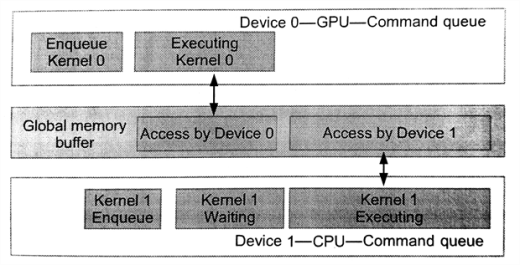
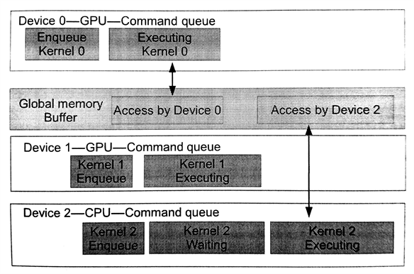

#5.2 多命令队列

如果系统里面有多个设备(比如，CPU和GPU，或多个GPU)，每一个设备都需要拥有自己的命令队列。不过，OpenCL允许将多个命令队列，通过同一个上下文对象映射到同一个设备上。这对重叠执行独立或重叠命令，以及主机和设备通讯十分有用，并且这种方式是替代乱序队列的一种策略。了解同步的能力，以及主机端和设备端的内存模型(第6章和第7章将详细讨论)对于管理多个命令队列来说是非常必要。

图5.1展示了一个OpenCL上下文中具有两个设备的情况。为不同的设备创建不同的命令队列。程序清单5.2中展示了创建两个命令队列的相关代码。这里尤其要注意的是，使用OpenCL事件对象进行同步时，只能针对同一上下文对象中的命令。如果是不同的上下文中的设备，那么事件对象的同步功能将会失效，并且要在这种情况下共享数据，就需要在两个设备之间进行显式的拷贝。

图5.1 同一上下文中创建多个不同设备的命令队列。展示两个不同的设备的执行情况，每个设备都具有自己的命令队列。


// Obtain devices of both CPU and GPU types
cl_device_id devices[2];
err_code = clGetDeviceIDs(NULL, CL_DEVICE_TYPE_CPU, 1, &devices[0], NULL);
err_code = clGetDeviceIDs(NULL, CL_DEVICE_TYPE_GPU, 1, &devices[1], NULL);

// Create a context include two devices
cl_context ctx;
ctx = clCreateContext(0, 2, devices, NULL, NULL);

// Create queues to each device
cl_command_queue queue_cpu, queue_gpu;
queue_cpu = clCreateCommandQueueWithProperties(context, devices[0], 0, NULL);
queue_gpu = clCreateCommandQueueWithProperties(context, devices[1], 0, NULL);


程序清单5.2 使用同一个上下文为两个不同设备创建命令队列

OpenCL下的多设备编程，可以总结为以下的两种情况(使用异构设备进行并行编程)：

- 流水执行：两个或多个设备以流水方式工作，这样就需要设备间互相等待结果，如图5.2所示
- 单独执行：这种方式就是每个设备各自做各自的任务，每个设备间的任务并无相关性，如图5.3所示

代码清单5.3中，等待列表执行的顺序为：CPU需要等待GPU上的内核全部执行完成，才能执行自己的内核(图5.2所示)。



cl_event event_cpu, event_gpu;

// Starts as soon as enqueued
err = clEnqueueNDRangeKernel(queue_gpu, kernel_gpu, 2, NULL, global, local, 0, NULL, &event_gpu);

// Starts after event_gpu is on CL_COMPLETE
err = clEnqueueNDRangeKernel(queue_cpu, kernel_cpu, 2, NULL, global, local, 0, NULL, &event_cpu);


程序清单5.3 使用流水方式进行多设备合作。CPU端的入队命令要等到GPU上的内核完成后才能执行。

图5.2 多个设备已流水方式工作，操作同一块内存。CPU的队列在等待GPU内核执行完成。

图5.3 多个设备已并行的方式工作。这种情况下，GPU端的两个命令队列不会对同一块内存进行操作，并单独执行。这里CPU队列需要等待GPU上的任务全部完成，才能继续进行。

代码清单5.4展示了并行执行在不同设备上的内核。图5.4展示了两个GPU设备独立执行自己的内核。CPU端的入队命令要等到GPU上的内核完成后才能执行。



cl_event events_gpu[2];

// Both of the GPU devices can execute concurrently as soon as they have
// their respective data since they have no events in their wait-lists
err = clEnqueueNDRangeKernel(queue_gpu_0, kernel_gpu, 2, NULL, global, local, 0, NULL, &event_gpu[0]);
err = clEnqueueNDRangeKernel(queue_gpu_1, kerenl_gpu, 2, NULL, global, local, 0, NULL, &event_gpu[1]);

// The CPU will wait until both GPUs have finished executing their kernels.
// This requires two events in the CPU's wait-list
err = clEnqueueNDRangeKernel(queue_cpu, kernel_cpu, 2, NULL, global, local, 2, events_gpu, NULL);


程序清单5.4 多设备并行。CPU端的入队命令要等到GPU上的内核完成后才能执行。