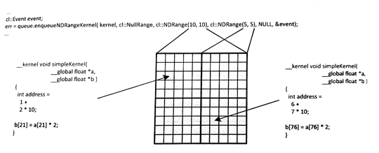
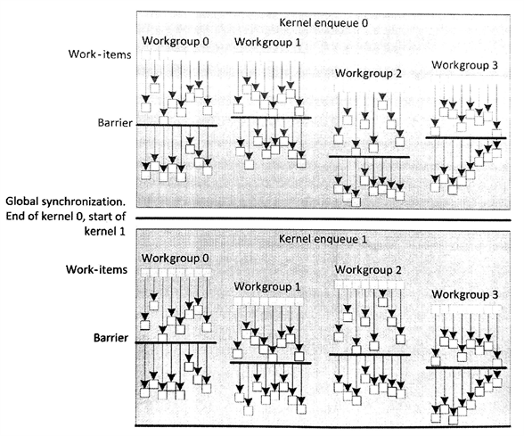

#5.3 内核执行域:工作项、工作组和NDRange

OpenCL的执行以内核为中心。内核代码用来表示一个内核线程所要做的所有事情，其代码由OpenCL C语言完成。一个内核代码第一眼看去和C函数很类似：OpenCL C语言中，内核可以看成一个C函数。OpenCL内核具有一组参数列表，还有局部变量(类似Pthread中线程的局部变量)，以及标准的控制流。OpenCL内核的并行性，使其区别于C函数。我们在第3章仅用OpenCL工作项，并行化处理了一维空间中的大量数据。本节，我们将继续延伸讨论OpenCL执行模型中，工作项、工作组，以及NDRange的层级结构。

内核的执行需要运行时提供对应的启动/调度接口，该函数就是`clEnqueueNDRangeKernel()`。内核在调度中会产生大量工作项，共同执行内核“函数体”。使用启动接口之后，就会产生一个NDRange，其包括了内核执行的维度，以及每个维度上的工作项的数量。一个NDRange可以定义为1，2和3维，用于规划处工作项的“格子图”，工作项简单和直接的结构非常适合并行执行。将OpenCL模型映射到硬件端，每个工作项都运行在一个硬件单元上，这个单元称为“执行元素”(Processing element, PE)。OpenCL内核执行时，可能有多个工作项依次工作在同一个PE上。

内核内部调度中，每一个工作项都是独立的。OpenCL中会有意限制工作项间的同步。松散的执行模型就允许OpenCL程序去扩展设备，可用于具有超级多核心的规模化设备。可扩展的设备通常都会抽象成一种层级结构——特别是内存系统——OpenCL也为其设备的执行空间提供了一种层级结构。

为了更加灵活的支持具有大量核心的设备，OpenCL将各维度上执行的工作项等分成多个工作组。每个工作组内，工作项可以进行某种程度上的交互。OpenCL标准定义了一个完整的工作项，可以并发执行在同一计算单元上。这种执行方式对于同步很重要。并发执行中的工作组内允许局部同步，不过也会对交互有所限制，以提高可扩展性。当应用中设计到需要在全局执行空间内，任务需要互相交互，那么这种OpenCL并行应用无非是低效的。使用工作组会有更高率的交互，因为一个计算单元通常映射到一个核芯上，因此工作组内交互通常都是在一块共享缓存或暂存存储器上。

通过定义更多的工作组，OpenCL内核将扩展的越来越大，并且有越来越多的线程同时在设备上执行(有更多的工作项和工作组都会在同时执行在同一设备上)。OpenCL工作项可以看做win32或POSIX线程。OpenCL层级执行模式只需要一步，因为工作项都位于工作组内，这样只需要将工作组(数量要少于工作项)映射到硬件线程的上下文中即可。这样做和单指令多数据的执行很相似，就如向量执行N操作，只使用了N个时钟周期。不过，OpenCL中子向量(工作项)可以拥有自己的程序计数器，直到到达同步点。用GPU来举个例子，64个工作项(英伟达为32个)可以同时被一个硬件线程处理(在SIMD单元上)，这种方式在AMD的架构中就是大家熟知的波阵面(wavefront)；在英伟达架构中，则称为线程束(warp)。即使每次执行的工作项数量被锁定，不过不同的工作项可以执行内核内不同的指令序列。这种情况会发生在内核中有分支语句时，因为If else语句具有不同的记过，所以不同的工作项会对条件状态进行评估后执行。不过工作项页有可能在同一波或束中，走进不同的分支中，这时硬件有责任将不该执行的分支结果舍弃。这种情况就是众所周知的分歧(divergence)，并且这也会对极大影响内核执行的效率，因为工作项执行了冗余的操作，并且这些操作的结果最后都要舍弃。

这样的执行模型，就需要所有的工作项具有自己的程序计数器，这种方式要比显式使用SIMD多媒体扩展流指令在x86的处理上简单许多。因为SIMD的执行方式，需要注意给定的设备，了解对应设备支持SSE的版本，OpenCL的工作组尺寸通常是SIMD最大向量宽度的倍数。工作组尺寸查询API为`clGetKernelWorkGroupInfo()`，需要CL_KERNEL_PREFERRED_WORK_GROUP_SIZE_MULTIPLE作为实参传入*param_name*中。

OpenCL定义了一些内置函数，可以在内核内部获取工作项在执行区域内的具体位置。这些函数通常都有一个维度参数，这里定义为uint dimension。其值可以为0、1和2，可以通过维度的设置获取NDRange参数在入队时的设置：

- uint get_work_dime():返回入队时所设定的工作维度数量
- size_t get_global_size(uint dimension):返回对应维度上的全局工作项数量
- size_t get_global_id(uint dimension):返回对应维度上对应全局工作项索引
- size_t get_local_size(uint dimension):返回对应维度上工作组的数量。如果内核所分配的工作项在工作组内数量不均匀，那么剩余工作组(之后章节中讨论)将返回与均匀工作项不同的值
- size_t get_enqueued_local_size(uint dimension):返回对应维度上均匀区域内工作项数量
- size_t get_num_groups(uint dimension):返回当前工作项索引，以该工作项所属组的起始位置为偏移
- size_t get_group_id(uint dimension):返回当前工作组的索引。也可通过获取该工作组的第一个元素的全局索引，然后除以工作组的大小得到当前工作组索引

这里展示一个简单的OpenCL内核实例(程序清单5.5)，其输入输出均为二维数组。图5.4展示了这段代码的执行过程。对应每个像素的工作项，调用`get_global_id()`都会返回不同的数值。在这个简单例子中，我们使用线性位置直接对二维数据结构进行映射。实际使用时，可能会有更加复杂的映射关系，根据输入和输出的结构，再加上算法实现，可以对数据进行处理。


__kernel void simpleKernel(
  __global float *a,
  __global float *b){
  
  int address = get_global_id(0) + get_global_id(1) * get_global_size(0);
  b[address] = a[address] * 2;
}


程序清单5.5 一个简单的内核，将输入的二维数组中的数据乘以2后，放入输出数组中



图5.4 执行程序清单5.5中的简单内核。展示NDRange中不同区域工作项的具体工作。

在之前版本的OpenCL中，会要求NDRange上所有维度上的工作项数量是工作组的整数倍。例如，一个NDRange的大小为800x600，其工作组的大小就不能为16x16，因为600无法整除16。实际编程时，为了程序执行的效率，通常会在执行时将不足的区域补足，这样的话NDRange的区域要比实际处理的数据的空间大一些。当我们要使用16x16的工作组大小，我们需要将NDRange的设置扩大到800x608。由于有些工作项并未映射到数据集上，这就需要对这些工作项进行处理(比如：检查工作项的索引，当发现该工作项没有对应到数据集上时，立即返回)。不过，当工作组在执行的时候进行栅栏同步时，就需要组内所有工作项都到达栅栏处，这样这种扩充的方式就无法正常工作了。为了缓解这一问题，OpenCL 2.0删除了“各维度上的工作项数量需要是工作组的倍数”这一限制。另外，OpenCL 2.0为NDRange定义了“剩余工作项”(*remainder work-groups*)，并且最后剩余的工作组与开发者定义的工作组大小是完全不同的。比如，800x600的NDRange和16x16的工作组大小，那剩余的工作组大小为16x8。`get_local_size()`返回工作组实际的大小，`get_enqueue_local_size()`返回剩余的工作组大小。

OpenCL 2.0也提供了计算线性索引的内置函数，开发者不需要像使用之前版本那样自己去计算线性索引值了。线性索引对于每个工作项来说是定义明确，且唯一的标识(这个线性索引与NDRange设置的维度数量或工作组大小无关)。`get_global_linear_id()`返回全局上的索引值，`get_local_linear_id()`返回局部上的索引值：

- size_t get_global_linear_id():返回工作项的全局线性索引
- size_t get_local_linear_id():返回工作项的组内线性索引

##5.3.1 同步

使用多个执行单元的时候，使用同步机制可以约束执行的顺序。通常，OpenCL会有意的限制在不同执行单元间进行同步。这种方式会影响OpenCL的扩展性，不过OpenCL的目标是支持各种各样的异构设备。例如，执行OpenCL程序的设备会自行管理线程，比如GPU；另外也有使用操作系统管理线程的设备，比如主流的x86 CPU。不使用同步，会让程序的性能提升，不过会影响程序的正确性。对于一个x86线程来说，其会尝试访问信号量，如果该信号量不可用，则该线程阻塞；操作系统会在该线程执行之后，以及当程序资源不足需要释放该线程的空间时，删除该线程。对于GPU线程，GPU也会对有问题的线程使用同样的策略，因为资源是由限的。例如，在执行阶段移除一组线程束，而不释放其使用的资源，这就会让下一个线程束进行等待，这就如同x86线程中的信号量一样，之前的线程不释放该信号量，下一个线程则无法继续进行，从而造成程序死锁。

为了避免不必要的事情发生，OpenCL定义了阻塞式同步(例如：栅栏)，且只限于工作组内的工作项。第7章中，我们将看到OpenCL 2.0也可提供"上锁-释放"内存，用来约束使用原子操作和栅栏操作的顺序。不过，其最终目的是为了能在更加广泛的算法中，使用内存的顺序约束来保证运行顺序，而不是使用同步操作来约束执行顺序。下一节中，将讨论一些在工作组中的同步方式：栅栏和命令式同步。

##5.3.2 工作组栅栏

将栅栏设置到工作组内部时，需要所有工作项都到达该栅栏才能继续下面的工作，否则任何线程都无法越过该栅栏。这是一种程序计数器级别的限制。不过，对于处于不同分支的工作项来说，其行为是未定义的：很多设备上，这将导致程序死锁，因为工作组内的有线程并未到达栅栏处，所以其他线程只能进行等待。

图5.5中展示了一个简单OpenCL同步的例子。图中，我们能看到每个工作组内都由8个工作项。OpenCL标准宽松的解释下(并未限定硬件的具体实现)，工作项在工作组内的执行并非同时。当调用`work_group_barrier()`函数时，会让提前到达的线程等待未到达对应位置的线程，直到所有线程到达该位置，则继续进行下面的操作。不同的工作组中完成等待的时间都是相互独立的。

内置函数`work_group_barrier()`的参数列表如下所示：

- void work_group_barrier(cl_mem_fence_flag flags)
- void work_group_barrier(cl_mem_fence_flag flags, memory_scope scope)



图5.5 单内核执行时，使用栅栏方式进行组内工作项同步。全局同步在内核结束时完成，并且其保证所有工作项都完成了自己的工作，并且内存内容和期望的一致。

第7章中，我们将讨论关于scope参数的更多细节(也会对flags参数做更多的讨论)。不过，当栅栏操作完成时，flags参数就已足以决定对应的内存操作是否对组内其他工作项可见。

flags可以设置成的实参：

- CLK_LOCAL_MEM_FENCE：需要对于局部内存的所有访问组内可见
- CLK_GLOBAL_MEM_FENCE：需要对全局内存的所有访问组内可见
- CLK_IMAGE_MEM_FENCE：需要对图像的所有访问组内可见

接下来的例程中，我们可以看到工作项将数据搬运到局部内存中，每个工作项从数组中搬运一个数，其需要工作项的操作对其他所有工作项可见。为了达到这个目的，我们会调用`work_group_barrier()`，并传入CLK_LOCAL_MEM_FENCE作为flags的实参。

内核间的调度，所有工作都可以保证操作完全完成，以及内存保证一致。下一个内核，以同样的语义加载。假设我们入队两个内核0和1(如图5.5)，这两个内核为同一个内核对象，内核代码和API调用在代码清单5.6中展示，代码行为和图5.5一致。

这个例子中，我们可以看到，工作项只是简单的将局部内存中相邻的两个数，进行简单的操作。不过，在操作两个相邻数之前，需要保证这些用来运算的数据时可度的。


//------------------------------
//  Relevant host program
//------------------------------

cl_mem input = clCreateBuffer(context, CL_MEM_READ_ONLY, 32 * sizeof(float), 0, 0);

cl_mem intermediate = clCreateBuffer(context, CL_MEM_READ_WRITE, 32 * sizeof(float), 0, 0);

cl_mem output = clCreateBuffer(context, CL_MEM_WRITE_ONLY, 32 * sizeof(float), 0, 0);

clEnqueueWriteBuffer(queue, input, CL_TRUE, 0, 32 * sizeof(float), (void *)hostInput, 0, NULL, NULL);

clSetKernelArg(kernel, 0, sizeof(cl_mem), (void *)&input);
clSetKernelArg(kernel, 1, sizeof(cl_mem), (void *)&intermediate);
clSetKernelArg(kernel, 2, 8 * sizeof(float), NULL);

size_t localws[1] = {8};
size_t globalws[1] = {32};

clEnqueueNDRangeKernel(queue, kernel, 1, NULL, globalws, localws, 0, NULL, NULL);

clSetKernelArg(kernel, 0, sizeof(cl_mem), (void *)&input);
clSetKernelArg(kernel, 1, sizeof(cl_mem), (void *)&intermediate);
clSetKernelArg(kernel, 2, 8 * sizeof(float), NULL);

clEnqueueNDRangeKernel(queue, kernel, 1, NULL, globalws, localws, 0, NULL, NULL);

clEnqueueReadBuffer(queue, output, CL_TRUE, 0, 32 * sizeof(float), (void *)&hostOutput, 0, NULL, NULL);

//------------------------------
//  Kernel
//------------------------------

__kernel void simpleKernel(
  __global float *a,
  __global float *b,
  __local float *localbuf){
  
  // Cache data to local memory
  localbuf[get_local_id(0)] = a[get_global_id(0)];
  
  // Wait until all work-items have read the data and
  // it becomes visible
  work_group_barrier(CLK_LOCAL_MEM_FENCE);
  
  // Perform the operation and output the data
  unsigned int otherAddress = (get_local_id(0) + 1) % get_local_size(0);
  b[get_global_id(0)] = localbuf[get_local_id(0)] + localbuf[otherAddress];
}


程序清单5.6 同一个命令队列中入队两个内核

##5.3.3 内置工作组函数

OpenCL C编程语言在实现的时候，有很多内置函数是基于工作组的。例如栅栏操作，该内置函数需要工作组内所有的工作项，都到达指定位置后才能继续运行。因此，当工作组中有条件块时，就需要同一组中的所有工作项都执行相同的分支。

工作组评估函数也支持各种OpenCL C内置的数据类型，例如：half, int, uint, long , ulong, flaot和double。我们可以看到，在OpenCL标准中这些属于都被gentype所替代，gentype用来表示在OpenCL C中所使用的通用数据。我们依据不同函数的功能将这些函数分成三类评估函数：

1. 谓词评估函数
2. 广播函数
3. 并行原语函数

##5.3.4 谓词评估函数

谓词评估函数评估工作组中的所有工作项，如果满足相关的条件则返回一个非零值。函数声明如下：

- int work_group_any(int predicate)
- int work_group_all(int predicate)

当评估的工作组中有一个工作项满足条件，则函数work_group_any()返回一个非零值。当评估的工作组中所有工作项满足条件，则函数work_group_all()返回一个非零值。程序清单5.7中，展示了一个work_group_all()函数的使用示例：


__kernel void compare_elements(int *input, int *output){
  int tid = get_global_id(0);
  int result = work_group_all((input[tid] > input[tid +1 ]));
  output[tid] = result;
}


程序清单5.7 谓词评估函数在OpenCL内核中的使用。

##5.3.5 广播函数

广播函数是将一个工作项的数据传输给工作组内其他的工作项。函数参数在维度上进行了重载：

- 一维：gentype work_group_broadcast(gentype x, size_t local_id)
- 二维：gentype work_group_broadcast(gentype x, size_t local_id_x, size_t local_id_y)
- 三维：gentype work_group_broadcast(gentype x, size_t local_id_x, size_t local_id_y, size_t local_id_z)

可以看出，函数用坐标来标定对应的工作项，然后共享该工作项的数据x。该函数将返回每个工作项上的广播值。

##5.3.6 并行原语函数

OpenCL支持两类内置并行原语函数：归约和扫描。这个函数会用在很多并行应用上，这两个函数的实现都由设备供应商使用高性能代码提供，这样对于开发者来说会省去自己去优化的风险和工作量。函数声明如下：

- gentype work_group_reduce_`<op>`(gentype x)
- gentype work_group_scan_inclusive_`<op>`(gentype x)
- gentype work_group_scan_exclusive_`<op>`(gentype x)

函数中的`<op>`可以替换为add，min或max。这样就可以使用该函数找到局部数组的最大值，就如下面的代码所示：

```c++
// float max:
max = work_group_reduce_max(local_data[get_local_id(0)]);
```

很多并行编程者对于前缀求和非常熟悉，前缀求和可以使用work_group_scan_inclusive_add()或work_group_scan_exclusive_add()实现。闭扫描和开扫描的不同在于，当前位置上的元素是否参与累加。闭扫描版本生成的数组会包含当前位置的元素。开扫描版本则不会包含当前位置的元素。每个工作项都可用该函数，且会在工作组内返回相关线性索引的值。

并行原语函数无法保证浮点数操作的顺序，所以该函数未与浮点数相关联。