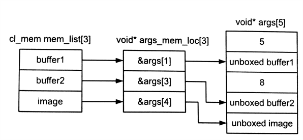

#5.4 原生和内置内核

OpenCL定义了两种不需要cl_kernel对象的入队执行机制，就是原生内核和内置内核。原生内核和内置内核是相互独立的两个概念。原生内核提供一种机制，将标准C函数(异构设备上)入队执行。内置内核需要指定的设备，并且提供对应机制允许应用开发者启动"特殊"的硬件加速模块(有可能就是指定的设备)。

##5.4.1 原生内核

原生内核是一种回调的机制，其能更简洁的集成进OpenCL的执行模型中。原生内核允许使用传统编译器去编译C标准函数(与OpenCL不同)，并将编译好的C函数在放入OpenCL的任务执行图中，由事件来触发下一个事件。原生内核可以在一个设备上入队执行，并且与OpenCL内核共享内存对象。

原生内核与OpenCL内核的区别在于设置参数方面。原生内核使用对应的API进行入队(clEnqueueNativeKernel())，将标准C函数通过指针的方式进行传入。参数列表需要连同其大小，打包传入设备。

```c++
cl_int
clEnqueueNativeKernel(
  cl_command_queue command_queue,
  void (CL_CALLBACK *user_func)(void *),
  void *args,
  size_t cb_args,
  cl_uint num_mem_objects,
  const cl_mem *mem_list,
  const void **args_mem_loc,
  cl_uint num_events_in_wait_list,
  const cl_event *event_wait_list,
  cl_event *event)
```

常规OpenCL内核可以将数组和图像作为参数传入，原生内核同样可以使用对应的数组和图像作为输入。OpenCL中向原生内核传递参数完成后，会通过一种方式进行解包。可以通过设置mem_list的实参，向原生内核传入一个内存对象链表；args_mem_loc参数存储一个指针链表，用于存储解包之后的内存对象。

为了更加形象的表达，代码清单5.8中，我们使用了一个原生函数foo()，其参数链表中包含5个值，其中第0个参数存储是5，第2个存储是8；1,3参数是两个数组对象；4参数是一个图像对象(如图5.6所示)。



// Native function that will be enqueued to device
void foo(void *args){

  ...
}

cl_command_queueu queue = clCreateCommandQueue(...);
cl_mem buffer1 = clCreateBuffer(...);
cl_mem buffer2 = clCreateBuffer(...);
cl_mem image = clCreateImage2D(...);

void *args[5] = {(void *)5, NULL, (void *)8, NULL, NULL, NULL};

num_mem_objects = 3;
cl_mem mem_list[3] = {buffer1, buffer2, image};
void *args_mem_loc[3] = {&args[1], &args[3], &args[4]};

clEnqueueNativeKernel(queue, foo, args, sizeof(args), num_mem_objects, mem_list, args_mem_loc, 0, NULL, NULL);


程序清单5.8 将原生foo()入队



图5.6 程序清单5.8中，使用clEnqueueNativeKernel()实例，展示内存对象和参数的对应关系

##5.4.2 内置内核

内置内核与设备是捆绑关系，其也不会在运行时由源码进行构建。通常的内置内核会展示硬件对固定函数的加速能力，这个硬件可能是一种支持OpenCL的特殊嵌入式设备，或是自定义设备。内置内核属于OpenCL定义之外的内容，因此内置内核实现的最总解释权还在硬件供应商那里。

作为OpenCL的扩展，Intel实现了运动估计的内置内核。该扩展利用了OpenCL扩展架构，对指定领域的功能进行加速，Intel所有支持OpenCL的设备都支持该功能(进行运动估计)。