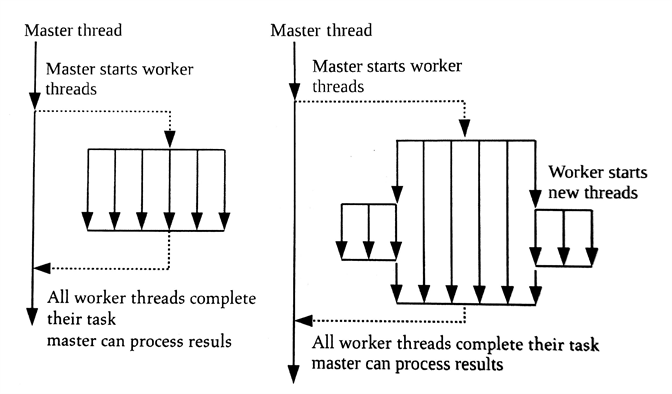

#5.5 设备端排队

OpenCL 2.x版本之前的标准，只允许命令从主机端入队。OpenCL 2.0去除了这个限制，并定义了设备端的命令队列，其允许父内核直接将子内核入队。

设备端任务队列的好处是启用了嵌套并行机制(*nested parallelism*)——一个并行程序中的某个线程，再去开启多个线程[1]。嵌套并行机制常用于，不确定内部某个算法要使用多少个线程的应用中。与单独使用"分叉-连接"(*fork-join*)机制相比，嵌套并行机制中产生的线程，会在其任务完成后销毁。这两种机制的区别如图5.7所示：



图5.7 单独的"分叉-链接"的结果与嵌套并行机制的线程分布对比

单独调用的方式，执行完任务后，线程的生命周期就结束了；嵌套并行将会在任务执行中间产生更多的线程，并在某个子任务完成后，结束线程生命周期。

嵌套循环适用于不规则或数据驱动的循环结构。数据驱动型算法有很多，这里用一个比较常见的算法作为例子：广度优先搜索算法(BFS)。广度优先搜索算法从图中的根节点开始访问其相邻的节点。之后，访问到的节点，继续访问其附近的节点，直到所有节点都访问到。当BFS算法并行时，被访问的新顶点不知道应用何时开启。设备端入队允许开发者使用OpenCL内核实现嵌套并行，这样的方式要比在主机端入队合适的多。

总结一下设备端入队的好处：

- 内核可以在设备端直接入队。这样就不需要同步，或与主机的交互，并且会隐式的减少数据传输
- 更加自然的表达算法。当算法包括递归，不规则循环结构，或其他单层并行是固定不均匀的，现在都可以在OpenCL中完美的实现
- 更细粒度的并行调度，以及动态负载平衡。设备能更好的相应数据驱动决策，以及适应动态负载

为了让子内核入队，内核对象需要调用一个OpenCL C内置函数`enqueue_kernel()`。这里需要注意的是，每个调用该内置函数的工作项都会入队一个子内核。该内置函数的声明如下：

```c++
int
enqueue_kernel(
  queue_t queue,
  kernel_enqueue_flags_t flags,
  const ndrange_t ndrange,
  void (^block)(void))
```

我们能看到，和主机端的API一样，其也需要传递一个命令队列。flags参数用来执行子内核何时开始执行。该参数有三个语义可以选择：

- CLK_ENQUEUE_FLAGS_NO_WAIT:子内核立刻执行
- CLK_ENQUEUE_FLAGS_WAIT_KERNEL:子内核需要等到父内核到到ENDED点时执行。这就意味着子内核在设备上运行时，父内核已经执行完成
- CLK_ENQUEUE_FLAGS_WAIT_WORK_GROUP:子内核必须要等到入队的工作组执行完成后，才能执行。

这里需要注意的是，父内核可能不会等到子内核执行结束。一个父内核的执行状态为"完成"时，意味着其本身和其子内核都完成。如果父子内核正确无误的执行完成，那么父内核会置为CL_COMPLETE。如果有子内核的程序计数器错误，或非正常终止，父内核的状态会置为一个错误值(一个给定的负值)。

与clEnqueueNDRangeKernel()类似，`enqueue_kernel()`也需要使用NDRange来指定维度信息(传递给ndrange参数)。与主机端调用一样，全局偏移和工作组数量是可选的。这时需要在内核上创建ndrange_t类型的对象来执行执行单元的配置，这里使用到了一组内置函数：

```c++
ndrange_t ndrange_<N>D(const size_t global_work_size[<N>])

ndrange_t ndrange_<N>D(const size_t global_work_size[<N>], const size_t global_work_size[<N>])

ndrange_t ndrange_<N>D(const size_t global_work_size[<N>], const size_t global_work_size[<N>], const size_t local_work_size_[<N>])
```

其中`<N>`可为1,2和3。例如，创建一个二维的800x600的NDRange可以使用如下方式：

```c++
size_t globalSize[2] = {800, 600};
ndrange_t myNdrange = ndrange_2D(globalSize);
```

最终，enqueue_kernel()的最后一个参数block，其为指定入队的内核。这里指定内核的方式称为“Clang块”。下面两节中将会更加详细的对“如何利用设备入队”进行讨论，以及如何使用块语法指定一个嵌套内核。

如主机端API一样，enqueue_kernel()会返回一个整数，代表其执行是否成功。返回CLK_SUCCESS为成功，返回CLK_ENQUEUE_FAILURE则为失败。编程者想要了解失败入队的更多原因的话，需要在clBuildProgram()传入"-g"参数，或是clCompileProgram()调用会启用细粒度错误报告，会有更加具体的错误码返回，例如：CLK_INVALID_NDRANGE或CLK_DEVICE_QUEUE_FULL。

##5.5.1 创建一个设备端队列

设备端队列也需要使用clCreateCommandQueueWithProperties()在主机端进行创建。为了表明是为了设备端创建的命令队列，properties中需要传入CL_QUEUE_ON_DEVICE。另外，当一个设备端队列创建之后，标准要求CL_QUEUE_OUT_OF_ORDER_EXEC_MODE_ENABEL也要传入(使用乱序方式)，OpenCL 2.0中设备端队列被定义为乱序队列。这时命令队列可以通过内核的参数传入内核内，其对应的就是内核中的queue_t类型。代码清单5.9中，展示了一个带有队列参数的内核。


// -----------------------------
// Relevant host program
// -----------------------------

// Specify the queue properties
cl_command_queue_properties properties = 
  CL_QUEUE_ON_DEVICE |
  CL_QUEUE_OUT_OF_ORDER_EXEC_MODE_ENABLE;
  
// Create the device-side command-queue
cl_command_queue device_queue;
device_queue = clCreateCommandQueueWithProperties(
  context,
  device,
  &proerties,
  NULL);
  
...

clSetKernelArg(kernel, 0, sizeof(cl_command)，&device_queue);

...

// -----------------------------
// Kernel
// -----------------------------

__kernel
void foo(queue_t myQueue, ...){
  ...
}


程序清单5.9 将设备端队列作为参数设置到内核中

有另外一个可选的配置，CL_QUEUE_ON_DEVICE_DEFAULT可传入clCreateCommandQueueWithProperties中，这样产生的队列默认为设备端可用队列。对于编程者来说，这样简化了许多工作，因为默认队列就可以在相关的内核使用内置函数，所以就不需要再将命令队列作为参数传入内核中了(可以通过内置函数get_default_queue()获取队列对象)。

##5.5.2 入队设备端内核

**动态局部内存**

**使用事件强制依赖**

------

[1] J.Reinders. Intel Threading Building Blocks: Outfiting C++ for Multi-Core Processor Parallelism. O'Reilly Media, Inc., Sebastopol. 2007.