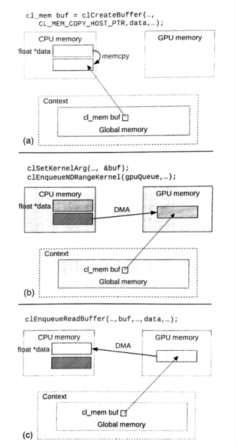
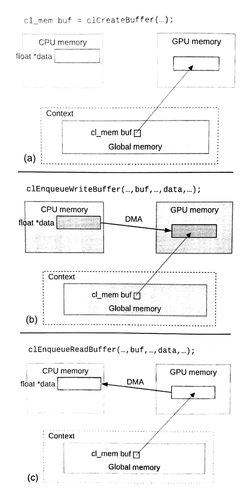
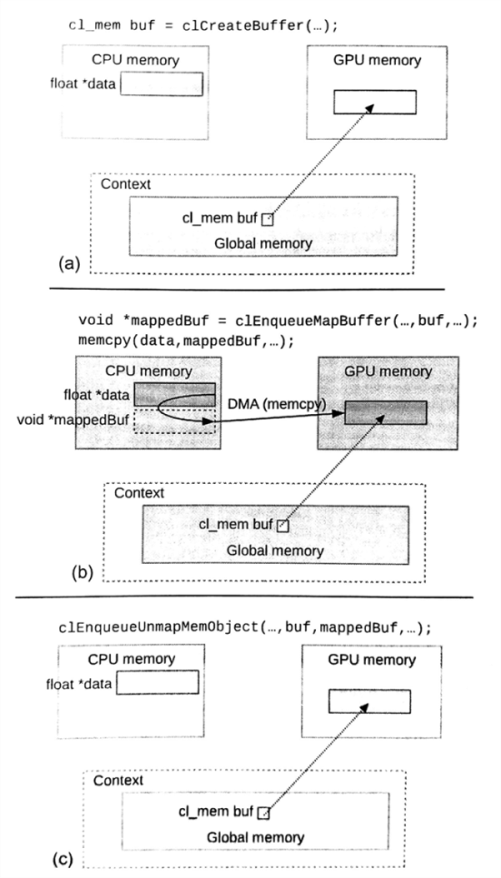

#6.2 内存管理

当使用OpenCL主机端API创建内存对象，这些内存对象都在全局空间内分配，可以被上下文上所有的设备使用。虽然，OpenCL中只设置了一块全局内存，不过实际使用的很多异构系统具有很多设备，这些设备对共享地址空间有严格的要求，并且可能不同设备的内存在物理设备上是分开的——比如CPU的内存和离散GPU的内存。这样的话，在内核运行前，运行时可能就要将数据在各种设备的内存间进行拷贝。即使在共享内存系统中，数据不需要重复拷贝，不过内核所需要的数据还是要拷贝到设备的层级缓存中。当存在数据拷贝，那么拷贝阶段某一设备上的内存可能是不一致的，这种状态的内存数据对于上下文中的其他设备是可见的。存在有潜在的拷贝和不一致状态，那么如何保证最后一次复制的数据就是我们期望的数据呢？

后面的章节中，我们将讨论使用细粒度*共享虚拟内存*(SVM)的内存序和可见性。现在我们假设我们使用的内存对象是默认内存对象，即*非共享虚拟内存*(non-SVM)。当使用默认内存对象时，OpenCL松散的一致性模型不会让多个内核对在同一时间，对同一个内存对象进行操作。没有其他内核进行数据的修改，就保证了直到该内核执行完成，其他内核才能可见已经修改的内存。如果没有这种机制，那么运行时为一个内存对象创建了多个副本，两个内核对里面的内容进行修改，也就等同于对同一内存进行修改，那么最后得到结果必然是其中一个内核的结果覆盖另一个的结果；如果我们在让另外一个内核再去修改这块内存，那么这种修改就是会导致未定义的行为。除了需要编程者对自己的程序负责，运行时也要保证正确的数据在正确的时间，出现在正确的位置。将松散的内存模型和运行时对内存管理的责任结合在一起，就能让执行更加可移植，并且将对编程者的影响降到最低。

另外，OpenCL标准的设计者也知道在实际中，数据传输是低效的，并且数据搬运会降低应用的性能。因此，OpenCL提供了一些命令，允许编程者设置“如何”，以及“在哪里”开辟这段内存；以及“在哪里”和“在何时”进行数据搬运。根据运行OpenCL系统的差别，不同方式分配方式和搬运方式对于应用的性能有很大的影响。下面两节中，就来聊聊怎么分配内存对象，以及转移内存对象上的数据——基于数组对象(虽然我们使用数组对象来做例子，不过也可以对图像对象进行相同的操作)。管道对象和数组与图像对象不同，其数据不能在主机端进行直接访问，所以就不存在搬运的问题。

##6.2.1 管理普通内存对象

回到内存对象的穿件，我们使用`clCreateBuffer()`，并传入一系列flags，以及host_ptr。这里在展示一些`clCreateBuffer()`的声明：

```c++
cl_mem
clCreateBuffer(
  cl_context context,
  cl_mem_flags flags,
  size_t size,
  void *host_ptr,
  cl_int *errcode_ret)
```

通过flags传入一些选项，就能告诉运行时应该“怎么”和“在哪里”分配该数组空间，并且host_ptr用来初始化数组对象，或将主机端的数据拷贝到内存对象中。本节将了解当没有与分配相关的选项传入flags时，内存对象时如何工作的。下节中将了解，编程者在设置这些分配选项时，内存如何在硬件上进行分配。

通常，OpenCL不会指定在某个物理存储空间内分配内存对象——其将默认内存都看做"全局内存"。例如，运行时会决定是在CPU主存上分配内存，或是在离散GPU的内存上分配内存。这很像为数据创建多个空间，并且根据需要进行转移最后的数据副本。

当创建一个对象时，可以让主机端提供一个合法指针host_ptr用来初始化创建的内存对象，并且将CL_MEM_COPY_HOST_PTR作为实参传入flags，这就指定了内存对象中的数据是从主机端进行拷贝得到。创建内存对象的过程不会产生对应的事件对象，我们可以假设内存对象是在拷贝完host_ptr上的数据后才返回的。图6.1中展示运行时如何在数组对象创建和初始化、传递内核参数，以及从内存对象中读回数据中，数据转移的过程。



图6.1 注意，运行时也直接在创建和初始化了设备端的内存对象(a)使用主机内存创建和初始化一个数组对象。(b)内核之前，隐式的将主机端的数据搬运到设备端。(c)显式的将设备内存中的数据搬回主机端。

一般来说，从一个设备到另一个设备的转移数据的效率很低——第8章中，我们将讨论基于现代CPU和GPU，比较不同数据互传方式的内存带宽。为了让编程者更高效的转移数据，OpenCL提供了一些API(使用不同方式)专门用来进行数据搬移。其中最佳的选择要依赖于所实现的算法，以及目标系统的特点。

第一组命令就是显式的从主机端或设备端，将数据拷贝到设备端或主机端，其运行方式如图6.2所示。这两个命令为`clEnqueueWriteBuffer()`和`clEnqueueReadBuffer()`。`clEnqueueWriteBuffer()`的声明如下：

```c++
cl_int
clEnqueueWriteBuffer(
  cl_command_queue command_queue,
  cl_mem buffer,
  cl_bool blocking_write,
  size_t offset,
  size_t size,
  const void *ptr,
  cl_uint num_events_in_wait_list,
  const cl_event *event_wait_list,
  cl_event *event)
```



图6.2 数据搬运：显式读写命令。(a)创建一个为初始化的内存对象。(b)内核执行之前，将主机端数据传入设备端。(c)内核执行之后，将设备端数据传回主机端。

`clEnqueueWriteBuffer()`和`clEnqueueReadBuffer()`的声明很类似，除了使用blocking_write和blocking_read。声明中可以看出，数据是在buffer和ptr之间进行传输。其中写命令就将主机端的数据在设备端进行拷贝(在全局内存中进行备份)，并且读命令就将设备端的数据在主机端进行拷贝。注意这里需要有命令队列参与。这样就需要指定设备，对其内存副本进行初始化。当然，对于大多数应用的编程者，他们是知道数据要拷贝到什么设备上去的，并且指定对应的命令让运行时知道应该向哪个设备进行数据拷贝，从而就能避免多余的拷贝过程。这种设计也让运行时能更快的将相应的数据传递到对应的设备，以便在内核执行时供内核使用。

编程者可以通过设置offset和size，来决定从哪里拷贝多少byte个数据。注意ptr是作为主机端读或写的起始地址，offset用来决定数组对象的起始地址，而ptr的初始地址则由编程者决定。

这种数据传输是可以是异步的。当使用异步方式调用`clEnqueueReadBuffer()`时，函数返回时我们无法知晓拷贝过程是否完成，直到我们通过同步机制——通过事件机制，或调用`clFinish()`。如果我们想在函数返回时就完成拷贝，则需要将CL_TRUE作为实参传入blocking_write或blocking_read中。这样，下面的代码中A和B打印出来的将是两个不同的结果(即使outputBuffer最终应该是这个结果)。对于C的打印是能确定从outputBuffer拷贝出来的结果。


int returnedArray[16];
cl_mem outputBuffer;
cl_event readEvent;

// Some code that fills the returned array with 0s and invokes kernels
// that generates a result in outputBuffer
printf("A: %d\n", returnedArray[3]);

clEnqueueReadBuffer(
  commandQueue,
  outputBuffer, /* buffer */
  CL_FALSE, /* nonblocking read*/
  0,
  sizeof(int) * 16,
  returnedArray, /* host ptr */
  0,
  0,
  &readEvent);
  
printf("B: %d\n", returnedArray[3]);
clWaitForEvents(1, &readEvnet);
printf("C: %d\n", returnedArray[3]);


同步对于OpenCL内存模型尤为重要。修改中的内存不保证可见，且不保证内存状态的一致性，直到用一个事件来表明该命令结束(我们将在后面章节中讨论SVM内存的不同)。主机指针和设备内存间的数据互传，我们不能在拷贝的同时，对内存数据进行其他的操作，直到我们确定互传完成。仔细阅读过OpenCL标准文档的同学可能会发现，与设备内存相关的是上下文对象，而非设备对象。通过`clEnqueueWriteBuffer()`入队一个命令，直到其完成，过程中不能确定数据是否已经完全搬运到设备上，而能确定的是，主机端的数据已经开始进行转移。

与其他API不同，数据互传命令也可以指定为是同步的。我们只需要简单的将之前的调用进行修改即可：

```c++
clEnqueueReadBuffer(
  commandQueue,
  outputBuffer,
  CL_TRUE, // blocking read
  0,
  sizeof(int) * 16，
  returnedArray,
  0,
  0,
  &readEvent);
```

这样的调用，API需要保证设备端的数据完全传回主机端后才进行返回，并且在返回之后，主机端才能对读回的数据进行操作。

OpenCL提供了另一种命令进行主机和设备间的数据转换——`clEnqueueMigrateMemObjects()`，用来从当前地址(无论主机还是设备)转移到指定设备上。例如，如果一个数组创建和初始化使用的是CL_MEM_COPY_HOST_PTR时，可以调用`clEnqueueMigrateMemObjects()`显式的将数据转移到对应设备上。如果一个系统中有多个异构设备，那么该API也能用来进行不同设备间的数据数据交互。注意设备间数据交互不是使用`clEnqueueReadBuffer()`和`clEnqueueWriteBuffer()`，只有设备和主机端的数据进行交互时，才会使用这两个API。`clEnqueueMigrateMemObjects()`的声明如下：

```c++
cl_int
clEnqueueMigrateMemObjects(
  cl_command_queue command_queue,
  cl_uint num_mem_objects,
  const cl_mem *mem_objects,
  cl_mem_migrationg_flags flags,
  cl_uint num_events_in_wait_list,
  const cl_event *event_wiat_list,
  cl_event *event)
```

与之前的数据传输命令不同，`clEnqueueMigrateMemObjects()`需要使用内存对象数组作为实参传入，其可以通过一条命令转移多个内存对象。如同所有`clEnqueue*`开头的函数一样，该函数也能产生事件对象，指定依赖关系。当事件对象的状态设置为CL_COMPLETE时，代表着相对应的设备端内存，已经传递到参数中的command_queue命令队列上了。

除了显式告诉运行时进行数据转移，该命令也可以进行更高效的隐式转移。当编程者入队该命令后，恰好设备端在执行的任务与该数据转移命令没有任何关系(例如，内核执行时不包括该数据转移的内存)，数据转移会在任务执行时进行，从而隐藏了传输的延迟。这种隐式传递的方式`clEnqueueReadBuffer()`和`clEnqueueWriteBuffer()`也适用。

对于转移的内存对象，标准提供了一个标识：CL_MIGRATE_MEM_OBJECT_HOST。这个标识以为这告诉运行时，数据需要传输到主机端。如果设置该标识，那么传入的命令队列对象，将被API忽略。

##6.2.2 管理带有分配选项的内存对象

之前的章节中，我们讨论的都是主机和设备端的数据互相进行拷贝，或转移设备端的内存。那么本章，我们将来讨论一下，如何在主机端和设备端直接访问物理上分离的内存区域。

OpenCL为程序员提供两种直接访问物理上分离的内存地址的方式，这两种方式会在主机端产生映射，可供主机端直接使用。创建设备端内存时，将CL_MEM_ALLOCL_HOST_PTR作为实参传入，运行时就会为主机端分配一个映射指针，供主机端代码进行操作。而CL_MEM_USE_HOST_PTR则告诉运行时，直接使用host_ptr作为设备对象的空间。两个选项代表着两种不同的分配方式，而这两个选项则是互斥的，不可用于同一个内存对象。注意这里的CL_MEM_ALLOCL_HOST_PTR分配“可供主机端访问的映射内存”，这个概念其实是模糊的，其可能是通过主存链接主处理器，也有可能是真的能将设备上的一段内存映射到主机端。

在分配内存对象时，CL_MEM_COPY_HOST_PTR可以和CL_MEM_ALLOC_HOST_PTR一起使用，这样能创建映射到主机端的内存的同时，也能用主机端内存对内存对象进行初始化。不过，CL_MEM_COPY_HOST_PTR和CL_MEM_USE_HOST_PTR是不能同时使用的，因为在传入host_ptr时，host_ptr是已经分配好的一段内存，CL_MEM_USE_HOST_PTR代表使用host_ptr作为设备端内存空间，其无法对自己进行初始化。

那么有没有一种选项组合，能完成内存数据在CPU端分配，并且设备可以直接对主机端数据进行访问。答案是肯定的，“确实有”。实际上这种方式的访存存在于一些系统中。一个系统中具有一个CPU和一个离散GPU，这种情况下GPU就需要通过PCIe总线对主存数据进行访问。当设备能用这种方式直接访问主机端内存，那么这种数据通常被称为*零拷贝*(zero-copy)数据。

虽然使用CL_MEM_USE_HOST_PTR或CL_MEM_ALLOC_HOST_PTR将在主机端创建零拷贝数据(但这并不是OpenCL标准显式要求的)。当然，将CPU端的数据拷贝到设备端，供内核执行使用是最保险的。不过，这里GPU访问主机端内存，就像其访问自己所属的内存一样。实际上，如果使用CL_MEM_ALLOC_HOST_PTR，在主机端上分配出的指针，仅为设备端内存的映射。OpenCL中对于CL_MEM_ALLOC_HOST_PTR的描述，是能创建可供主机端访问的内存，并不是在主机端又分配了一段内存出来。

贡献内存的系统，或是单CPU环境中，使用CL_USE_HOST_PTR可能就没有那些无谓的初始化拷贝，从而为应该用带来更好的性能。例如，设想将CPU作为设备，在CPU上执行内核：如果不指定CL_MEM_USE_HOST_PTR，应用将会另外开辟一段空间用来存放数据的副本。同样的情况也会出现在共享内存处理器上，比如加速处理单元(APU)。如果CPU和GPU共享同一块内存，那么在APU上是不是也要使用CL_MEM_USE_HOST_PTR呢？这个问题很难回答，因为这设计到相关内容的优化，这里只能说具体问题具体分析了。

APU的例子中，OpenCL运行时或设备端驱动，使用指定的分配标志，可能会对实际设备进行访存优化(例如：缓存与非缓存)；或是有另外的性能考量，例如*非一致内存访问*(UNMA, nonuniform memory access)。APU上使用OpenCL时，CL_MEM_USE_HOST_PTR可能会将内存分配在高速缓存上，并且完全连续。这将导致GPU访存效率降低，因为GPU先要确定CPU缓存访问的优先级。APU上进行编程时，编程者需要了解不同的选项所创建出来的内存有何不同。

CL_MEM_USE_HOST_PTR和CL_MEM_ALLOC_HOST_PTR都能创建出主机端能够访问的数据，OpenCL也提供了一种映射机制，能够直接操作主机端或设备端数据，而无需显式使用API进行读取和写入。与`clEnqueueReadBuffer()`拷贝数据的方式不同，这里的映射实现并非意味着进行了拷贝。有了这种机制，零拷贝内存才算完美实现。设备端在修改零拷贝内存的过程，需要对主机不可见，直到其完成修改才再对主机可见。

调用`clEnqueueMapBuffer()`即可对一个内存对象进行设备端的映射：

```c++
void *
clEnqueueMapBuffer(
  cl_command_queue command_queue,
  cl_mem buffer,
  cl_bool blocking_map,
  cl_map_flags map_flags,
  size_t offset,
  size_t size,
  cl_uint num_events_in_wait_list,
  const cl_event *event_wait_list,
  cl_event *event,
  cl_int *errcode_ret)
```

调用`clEnqueueMapBuffer()`时，其会返回一个可供主机端访问内存的指针。当`clEnqueueMapBuffer()`产生的事件对象的状态为CL_COMPLETE时，意味着主机端可以安全使用返回指针，进行数据访问。与`clEnqueueWriteBuffer()`和`clEnqueueReadBuffer()`相同，`clEnqueueMapBuffer()`也可以设置同步方式，将CL_TRUE作为实参传入blocking_map时，函数将在主机端可以安全使用访存指针时，将产生的指针返回。

`clEnqueueMapBuffer()`还有一个map_flags，这个标识可以设置的实参有：CL_MAP_READ，CL_MAP_WRITE和CL_MAP_WRITE_INVALIDATE_REGION。CL_MAP_READ，主机只能对这块映射内存进行读取；CL_MAP_WRITE和CL_MAP_WRITE_INVALIDATE_REGION都表示主机端只能对该指针内容进行修改。CL_MAP_WRITE_INVALIDATE_REGION是带有优化的选项，其会指定整个区域将会被修改或者忽略，并且运行时在其修改完之前不会对中间值进行映射。这种方式就无法保证数据的一致性状态，而运行时对于内存区域的潜在访问要快于CL_MAP_WRITE。

当主机端对映射数据修改完毕，其需要进行反映射API的调用。在反映射时，需要将制定内存对象和映射出的指针传入该API。`clEnqueueUnmapMemObject()`的声明如下：

```c++
cl_int
clEnqueueUnmapMemObject(
  cl_command_queue command_queue,
  cl_mem memobj,
  void *mapped_ptr,
  cl_uint num_events_in_wait_list,
  const cl_event *event_wait_list,
  cl_event *event)
```


