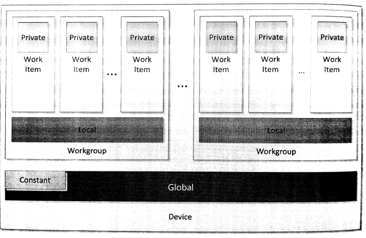

#第7章 OpenCL设备端内存模型

设备端内存模型定义了OpenCL应用中工作项的内存空间，这部分空间供内核执行使用。内存模型也定了一致性内存，可供工作项使用。本章会对每种内存空间进行详细的讨论，聊一下各个内存对象所对应的内存空间，也顺便介绍一下同步和内存序。

OpenCL设备上，内存空间被分成四种类型：

1. 全局内存
2. 局部内存
3. 常量内存
4. 私有内存

OpenCL内存空间分布如图7.1所示。第2章我们讨论过，OpenCL是为了更加广阔的结构进行设计。对内存模型的分级，使得OpenCL程序对架构的利用率更高。每种内存内存空间在实际硬件上的映射，非常影响程序执行效率。不管在硬件上是如何进行映射，对于编程者来说，内存空间都是分开的。此外，如图7.1所示，本地内存和私有内存用来区分工作项和工作组。当使用这种方式对“可编程的松散内存一致模型”进行分层时，使用便签式内存可使得程序更加高效。如我们看到的大多GPU设备一样，都有和x86架构一样的内存一致性系统。

图7.1 OpenCL设备端的内存空间分布

内核函数中的函数参数和局部变量默认都在私有内存中存储。指针参数放置的位置就没有那么固定了，其取决于数据从哪来，或哪里是用到这些数据。指针本身的地址则毫无疑问的存储在私有内存中。如果通过指针指定数据，那么内存地址将严格分离。将一个地址空间的数据强制转换成另一地址的数据，这样做是非法的，因为这样做的话必然会在全局可访问的地址上创建一个内存副本，或是使用编译器在某块地址空间内创建一份数据副本，这在实际中是无法完成的。不过，本章我们将介绍OpenCL 2.0新添加的统一地址空间，其能在某些条件下推断出可访问的地址空间。图像也可以使用统一地址空间，所以我们也会在讨论统一地址空间时讨论图像。

详细讨论这些内存之前，后续几节将大致描述一下工作项同步和通讯的能力。了解了这些能力，对于我们讨论各个内存空间的特性很有帮助。

