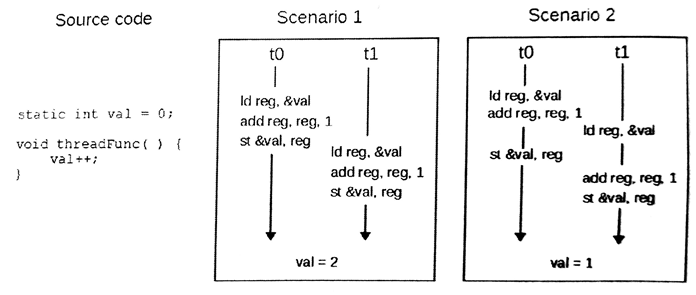

#7.1 同步和交互

介绍主机端内存模型时，我们提到过，当内核在对内存进行修改时，不能保证主机端可见的数据是何种状态。同样的，当一个工作项对地址中的数据进行修改时，其他工作项可见的数据状态是不确定的。不过，OpenCL C(结合内存模型)提供一些同步操作以保证内存的一致性，例如：执行栅栏、内存栅栏和原子操作。层级的一致性描述如下：

- 工作项内部，内存操作的顺序可预测：对于同一地址的两次读写将会被硬件或编译器重新排序。特别是对于图像对象的访问，即使被同一工作项操作，同步时也需要遵循“读后写”的顺序。
- 原子操作、内存栅栏或执行栅栏操作能保证同一工作组中的两个工作项，看到的数据一致。
- 原子操作、内存栅栏或执行栅栏操作能保证工作组的数据一致。不同工作组的工作项无法使用栅栏进行同步。

##7.1.1 栅栏

工作组中，编程者需要使用栅栏对工作组中的所有工作项进行同步，要使用的内置函数为work_group_barrier()。其有两个重载版本：

```c++
void
work_group_barrier(
  cl_mem_fence_flags flags)
  
void
work_group_barrier(
  cl_mme_fence_flags flags,
  memory_scope scope)
```

栅栏要求工作组中的所有工作项都要达到指定位置，才能继续下面的工作。这样的操作能保证工作组内的数据保持一致(比如：将全局内存上的一个子集数据传输到局部内存中)。其中flags用来指定需要使用栅栏来同步的内存类型。其有三个选项：CLK_LOCAL_MEM_FENCE、CLK_GLOBAL_MEM_FENCE和CLK_IMAGE_MEM_FENCE，这三个选项分别对应能被整个工作组访问到的三种不同内存类型：局部内存、全局内存和图像内存。

第二版work_group_barrier()也可以指定内存范围。其结合flags可以进行更加细粒度的数据管理。scope有两个有效参数：memory_scope_work_group和memory_scope_device。当将memory_scope_work_group和CLK_GLOBAL_MEM_FENCE一起使用时，栅栏则能保证所有工作组中每个工作项在到达同步点时，可以看到其他所有工作项完成的数据。当将memory_scope_device和CLK_GLOBAL_MEM_FENCE一起使用时，栅栏则能保证内存可被整个设备进行访问。CLK_LOCAL_MEM_FENCE只能和memory_scope_work_group一起使用，其只能保证工作组内的数据一致，无法对该工作组之外的工作项做任何保证。

##7.1.2 原子操作

基于C\C++11标准，OpenCL 2.0也推出了原子操作。并且新加入的操作，不仅可以进行原子操作，还可以用来做同步。原子性能保证一系列内存操作(比如：读改写)，且不需要其他工作项和主机的参与，就能直接修改某个内存的数据。当原子操作用来做同步，那么就需要对特定的变量进行访问(称为同步变量)，这个变量就属于内存一致性模型的执行部分。原子操作也有多种方式，包括原子“读改写”，原子加载和原子存储。

我们之前提到过，原子操作可以保证内存的某些不一致状态不对其他线程可见——不过，这给共享内存和并发编程就是带来了一些问题。试想，当有两个线程尝试对同一个变量进行加法操作。线程0需要读取内存中的数据，然后对数值进行加法操作，最后写回原始内存中。线程1执行加法计算的过程也是一样的。图7.2就展示了同样是两个线程对同一变量进行加法操作，最后会得到不同的结果。这中问题就称为*数据竞争*(data race)。即使在单核机器上，也会有数据竞争的存在，比如线程0打断或抢占了正在执行操作的时间片。



图7.2 对同一变量的进行加法操作，所导致的数据竞争。最终数据的结果依赖于不同线程执行的顺序。

因此，就需要原子加载和原子存储操作，来为数据竞争做一决断。C/C++11标准与OpenCL标准很像，不会保证任何加载和存储操作是绝对原子的。试想这样一种情形，将存储64bit的操作分成两个指令执行。当第一个指令完成时，第二个指令还没有执行，在某些情况下是没有问题的。如果这时出现了另外一个线程，该线程执行一个加载操作，如果第二个存储指令还未完成，那么该线程所读取到高或第32bit就不是最新的值。这样的读取方式显然是荒谬的，并且会得到与期望不符的结果。实际上，大多数结构中都会提供不同粒度的原子操作，来保证加载和存储数据的一致性(通常需要内存对齐在同一缓存行上)。不过，对于可移植代码来说，共享内存上的任何操作都不能认为是原子的。

原子操作在OpenCL 2.0标准做了相当多的修改。OpenCL C语言定义了与基本类型相关的原子类型，其支持整型和单精度浮点类型：

```
atomic_int
atomic_uint
atomic_float [1]
```

如果设备支持64bit原子扩展，那么就需要添加一些原子类型：

```
atomic_long
atomic_ulong
atomic_double
atomic_size_t
atomic_intptr_t
atomic_uintptr_t
atomic_ptrdiff_t
```

64bit原子指针类型只针对能够使用64bit地址空间的计算设备。

OpenCL C语言定义了很多的原子操作。浮点操作只支持“比较后交换”类型的原子操作(比如，atomic_exchange())。算法中的一些操作，以及一些位运算中，需要调用“同步后修改”原子函数。其声明类型如下所示：

```c++
C atomic_fetch_<key>(volatile A *object, M operand)
```

其中key可以替换成add, sub, or, xor, and, min和max。object传入的是原子类型的指针，operand传入的是要进行操作的数值。返回值C是非原子版的A，其值是在对M操作之前A内存中的具体数值。这里来举个原子操作的例子，当要在一个共享项中比较最小值时，我们先定义一个最小值atomic_int curMin，和一个新的值int myMin。那么就可以写成如下形式：

```c++
int oldMin = atomic_fetch_min(&curMin, myMin);
```

执行完成后，新的最小值将存在curMin中。是否指定变量去接受返回值是可选的，不指定变量去接受返回值会有潜在的性能提升。一些GPU架构中，例如：原子操作执行在内存系统中的硬件单元上。因此，在这种分层内存上原子操作很快就能执行完成。不过，如果需要使用返回值的话，通常需要将原始值从内存中读取出来，这就需要增加成千上万个时钟延迟。

在内存模型的章节中对原子操作进行讨论，是因为其能进行内存同步，保证内存的一致性。不管原子操作什么时候执行，编程者都由能力指定该原子操作是否附带有同步功能，作为获取操作或释放操作，或者二者都是。使用这种方式允许工作项能够控制可见数据访问，这样就能做到工作项间通讯，而2.0之前的OpenCL标准是无法完成这项操作的。

-------

[1] atomic_float 类型只支“比较后交换”类型的原子操作，不支持“同步后修改”类型操作(详见7.7.1节)