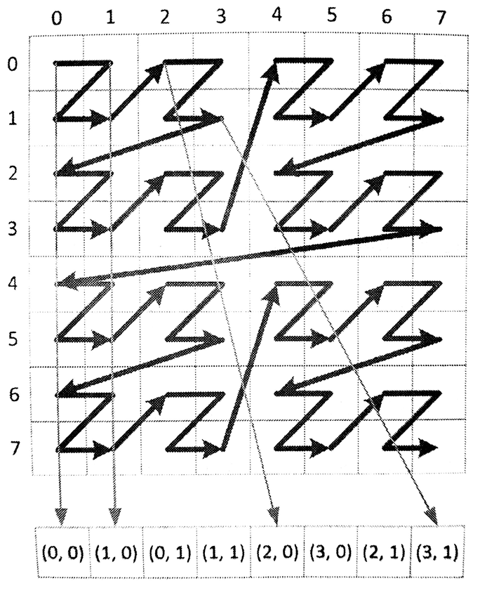

#7.2 全局内存

OpenCL C中使用类型修饰符__global(或global)描述的指针就是全局内存。全局内存的数据可以被执行内核中的所有工作项(比如：设备中的计算单元)所访问到。不同类型的内存对象的作用域是不同的。下面的小节中，将详细讨论每种全局内存对象。

##7.2.1 数组

__global可以用来描述一个全局数组。数组中可以存放任意类型的数据：标量、矢量或自定义类型。无论数组中存放着什么类型的数据，其是通过指针以顺序的方式进行访问，并且执行内核可以对数组进行读写，也可以设置成针对内核只读或只写的数组。

数组数据和C语言的数组几乎没有任何区别，在C语言怎么使用的，就可以在OpenCL内核代码中怎么使用：

```c++
float a[10], b[10];
for (int i = 0; i < 10; ++i){
  *(a + 1) = b[i];
}
```

上面的例子中，通过数组a和b的指针对其内容进行访问。其中尤其重要的是，其中内存以连续的方式顺序开辟，a数组中第i个元素可以表示为a[i]，其指针地址为a+i。我们可以使用sizeof()操作来计算数组中元素的大小，然后计算对应指针的偏移，以便将指针从一种类型转换成另一种类型。底层代码中，指针转换是相当有用的方式，对于OpenCL这种以C语言驱动的标准来说，也自然会支持这种方式。

下面的例子展示了如何在OpenCL内核代码中,使用数组对象支持自定义类型：

```c++
typedef struct AStructure{
  float a;
  float b;
}AStructure;

__kernel void aFunction(
  __global AStructure *inputOutputBuffer){

  __global AStructure *inputLocation =
    inputOutputBuffer + get_global_id(0);
  __global AStructure *outputLoacation =
    inputOutputBuffer + get_global_size(0) + get_global_id(0);

  outputLoacation->a = inputLocation->a * -1;
  outputLoacation->b = (*inputLocation).b + 3.f;
}
```


##7.2.2 图像

图像对象也会在全局内存上开辟，其与数组不同，其不能映射成一个指针。图像对象维度有一维、维和三维，其分别对应图像类型image1d_t、image2d_t和image3d_t。OpenCL 2.0之前的标准，只允许图像对象只读或只写，无法在内核中同时进行图像的读和写的操作。这样的设计是因为GPU硬件支持高速缓存和高速滤波器。从2.0标准开始，支持对对同一图像对象的读和写。

图像对象是不透明的对象。虽然我们可以根据坐标对数据进行访问，但是我们无法知道其在内存上的相对位置。在实际内存上，看上去在图像上相邻的两个点，可能在内存地址上距离很远。这样的特性，使得图像对象更适合进行参数化的读取，而非直接通过指针获取对应位置的数据，因此OpenCL中提供了一些内置函数，用来获取图像数据。对于读取图像的内置函数有：read_imagef()、read_imagei()和read_imageui()，分别可读取单浮点、整型和无符号整型数据。每个图像读取函数都具有三个参数：图像对象、图像采样器和坐标位置。

可以传入整型和浮点型坐标值。返回值通常是具有四个元素的矢量。例如，下面读取二维浮点数据的函数声明：

```c++
float4
read_imagef(
  image2d_t image,
  sampler_t samper,
  int2 coord)

float4
read_imagef(
  image2d_t image,
  sampler_t samper,
  float2 coord)
```

注意这里传入的坐标使用的是int2和float2类型。这是因为指定的二维图像类型，image2d_t。对于一维图像类型，传入int和float类型的坐标即可。对于三维图像类型，需要传入int4和float4类型的数据，其中最后一个分量不会是用到(译者注：在OpenCL中type3类型其实均是由type4类型表示)。

如果图像数据不足四个通道，那么大多数图像类型将返回0，用来表示未使用的颜色通道，返回1代表着alpha(透明度)通道。例如，读取单通道图像(CL_R)，那么返回的float4类型中就会是这样(r, 0.0, 0.0, 1.0)。

读取函数的第二个参数是采样器。其表示硬件或运行时系统如何看待图像对象。创建采样器对象可以在内核端创建sampler_t类型对象，也可以在主机端使用`clCreateSampler()`API进行创建。下面就是使用常量声明的采样器：

```c++
__constant sampler_t sampler =
  CLK_NORMALIZED_COORDS_FALSE |
  CLK_FILTER_NEAREST          |
  CLK_ADDRESS_CLAMP;

__kernel void samplerUser(
  __read_only image2d_t sourceImage,
  __global float *outputBufffer){

  float4 a = read_imagef(
    sourceImage,
    sampler,
    (float2)(
      (float)(get_global_id(0)),
      (float)(get_global_id(1))));

  outputBuffer[get_global_id(1) * get_global_size(0) + get_global_id(0)] = a.x + a.y + a.z + a.w;
}
```

采样器对象决定了如何对图像对象进行寻址，以及相应的滤波模式，并且决定了传入的坐标是否进行归一化。

指定归一化坐标(CLK_NORMALIZED_COORDS_TRUE)就是告诉采样器在对应维度的[0,1]之间对图像进行寻址。使用非归一化(CLK_NORMALIZED_COORDS_FALSE)则直接使用传入的坐标在对应维度上进行寻址。

寻址模式用来解决当采样器采样到图像之外的范围时，应该返回何值。这对于一些不想进行边缘判断编程者来说，使用标志指定如何处理这种“越界访问”会很方便(比如:在进行卷积操作时，就会访问到图像之外的区域)。CLK_ADDRESS_CLAMP[1]会将超出部分截断，将返回一个边界值；CLK_ADDRESS_REPEAT[2]超出部分会返回一个在有效范围内的值。

滤波模式有两个选项：返回离给定坐标最近的图像元素值(CLK_FILTER_NEAREST)，或使用坐标周围图像点进行线性差值(CLK_FILTER_LINEAR)。如果对于二维图像就要使用周围2x2个点进行差值了。如果是三维图那么就要周围2x2x2个点进行差值了。

为了让使用图像对象更加简单，OpenCL C语言也支持不用采样器的读取方式：

```c++
float4
read_imagef(
  image2d_t image,
  int2 coord)
```

这种简单的方式会预定义一个采样器，这个默认采样器的坐标是非标准化的，且不会进行任何方式的滤波，还有就是访问到图像之外的区域所产生的行为是未定义的。使用这种简单的方式对图像进行访问，有点类似于在C中使用一维或者二维数组。不过，这种不透明的访存方式底层，会使用硬件对访存进行加速。

与读不同，写入函数就不需要传递采样器对象。取代采样器的是要写入图像的具体数值：(在写入图像时，所提供的坐标必须是非归一化的。)

```c++
void
write_imagef(
  image2d_t image,
  int2 coord,
  float4 color)
```

之前有谈及，图像实现成非透明的类型是因为其能使用硬件或运行时系统对其进行加速，而对于数组对象则没有这样的优待。举一个优化方面的例子。任意给定一个多维数据结构，都必须映射到一维空间上，然后通过指针进行访问。很多编程语言中，对待多维数组都是这样做的，有些语言使用的是行优先，有些是列优先而已。如果数据以行优先的方式存储，(x, y)的内存为就在(x + 1, y)之前，以此类推。行优先的存储方式使得(x, y)和(x, y + 1)就离的很远了。因为y的地址在内存中不是连续的，所以跨列访问在行优先存储方式中的访存延迟是十分高的，从而访问效率是比较低的。因为(x, y)和(x + 1, y)的访问效率很高，所以后面会提出内存合并访问的概念。

Z序或莫尔顿序中，使用一种映射的方式来保存空间中的数据。图7.3中数据保存的顺序为(0, 0),(0, 1),(1, 1)和(2, 0)，以此类推。当使用Z序排布内存时，列上的数据都在同一缓存行上，优化了访问列上元素的时间开销。如果我们正在使用二维图像进行计算，那么这种内存存放方式无疑会对我们有很大的帮助。这种排布优化可能是透明的(因此不同的优化方式可以执行在不同的架构下)，需要编程者做的只是需要保证内存的相对位置正确即可。



图7.3 应用Z序对二维图像进行映射

对于这个话题，我们可以在讨论的深一些。当我们所执行的架构中没有向量寄存器时，就无法执行向量读取操作。这时我们就希望编译器将`float4 a = read_imagef(sourceImage, imageSampler, location)`翻译成4个标量，从而替代原始的单个向量读取。这种情况下，更加高效的方式是将原始图像根据位移拆成4个数组，同时对这4个数组进行访存操作。而不是通过4次读取一个数组的方式，获取到4个对应的值。

##7.2.3 管道

ds

-----

[1] CLK_ADDRESS_CLAMP - out-of-range image coordinates will return a border color. This is similar to the GL_ADDRESS_CLAMP_TO_BORDER addressing mode.

[2] CLK_ADDRESS_REPEAT - out-of-range image coordinates are wrapped to the valid range. This address mode can only be used with normalized coordinates. If normalized coordinates are not used, this addressing mode may generate image coordinates that are undefined.
