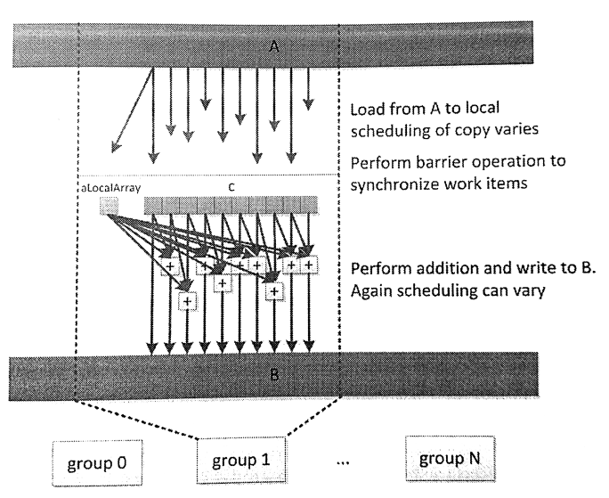

#7.4 局部内存

OpenCL也支持一些架构的子集，包括多GPU和Cell带宽引擎，用于处理小暂存式缓存数组在主DRAM和基础缓存上的分布。局部内存与全局内存没有交集，访问两种内存所使用的是不同的操作。基于这种架构，不同内存之间就需要进行数据传输(使用async_work_group_copy()进行拷贝会更高效)，或者直接内存间的拷贝。局部内存也同样支持CPU实现，不过在CPU端局部内存就存放在标准可缓存内存中。所以在CPU端局部内存依旧具有较低的访存延迟。

局部内存非常有用，因为其能提供工作组中的工作项有更高的交互方式。任何分配出来的局部内存都能让整个工作组的工作项访问，因此如果对局部内存进行修改，对组内其他工作也是可见的。局部内存使用__local标识符修饰，其可以在内核内部进行分配，也可以通过内核参数传入。两种方式的代码如下所示：

```c++
__kernel
void localAccess(
  __global float *A,
  __global float *B,
  __local float *C){

  __local float aLocalArray[1];
  if (get_local_id(0) == 0){
    aLocalArray[0] = A[0];
  }
  
  C[get_local_id(0)] = A[get_global_id(0)];
  
  work_group_barrier(CLK_LOCAL_MEM_FENCE);
  
  float neighborSum = C[get_local_id(0)] + aLocalArray[0];
  
  if (get_local_id(0) > 0){
    neighborSum = neighborSum + C[get_local_id[0] - 1];
  }
  
  B[get_global_id(0)] = neighborSum
}
```

图7.4展示了上述代码的数据流。



图7.4 localAccess内核在执行时的数据流

注意，这里将数据从全局内存中读出，然后(以不可预知的时序)写入两个局部内存数组C和aLocalArray中。不过，在实际硬件上是可以进行预测的，因为可以将对应的模型映射到实际的硬件上。例如，AMD GPU上经常会处理SIMD向量数据，对整个向量的读写操作实际上都会由一个工作项进行。不过，这种特性并非适用各种情况。通常，我们都会插入一个栅栏操作：只有所有工作项到达栅栏时，才能保证所有的数据都从全局内存搬运过来，或是搬运到全局内存上，之后组内所有工作项看到的局部数据就是一致的。越过栅栏之后，如图下半部分所示，数据就能被组内所有工作项使用。

内核代码从词法角度看，aLocalArray只能被当前函数使用，而非整个工作组。这是因为aLocalArray内存空间是在局部内存上开辟，局部内存上的内存就属于整个工作组可见，所以整个工作组所访问到的aLocalArray实际上是同一地址中的数据。因为在到达栅栏之前，只要工作项0对aLocalArray进行了写入，在越过栅栏之后，所有工作项就能直接使用aLocalArray了。

代码中C数组就是通过主机端创建的局部内存。这种方式需要调用运行时API。为了分配内存使用clSetKernelArg()传递局部内存的大小到内核中。通常clSetKernelArg都是传递一个全局内存到内核端，现在这个内存参数需要置为NULL。这种方式意味着不需要全局变量的返回，所以其就为局部内存了。式例如下：

```c++
ciErrNum = clSetKernelArg(
  kernel object,
  parameter index,
  size in bytes,
  NULL)
```

