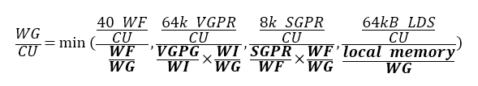

#8.2 AMD RADEON R9 290X GPU

本节我们将讨论一下AMD GPU中的“波面阵”(在NVIDIA显卡中称为“线程块”)。这个概念是有助于我们区分OpenCL工作项和CUDA线程。不过，有时会无可避免的使用“线程”这个词来对GPU的工作方式进行描述。本书中我们将会使用“线程”来描述硬件线程。虽然，本节指定的设备为AMD Radeon R9 290X GPU，但是硬件线程与工作项映射的关系、线程调度和抢占的考量，以及内存系统的布局，不同厂商的同类产品其实很相似。

GPU上OpenCL的目标代码与CPU上的差别很大。读者应该还记得，图像处理器主要用来对3D图像进行渲染。这种设计让使得资源的优先级有所不同，与CPU架构也有很大的区别。目前GPU市场上，GPU的一些主要特性的差距越来越小，这些特性我们在第2章讨论过：

1. 执行宽SIMD：大量执行单元对不同的数据，执行相同的指令。
2. 大量多线程：GPU计算核支持并发大量线程。
3. 硬件暂存式内存：物理内存可由编程者控制。

下面罗列出来的区别则更加微妙，不过其根据工作分配和交互对应用性能进行提高：

- 支持硬件同步：并发线程间支持细粒度交互。
- 硬件管理任务分配：工作队列管理与负载均和由硬件控制。

硬件同步能为计算单元中的多个波面阵减少同步开销，并且细粒度交互的开销非常低。

GPU为任务分发提供广阔的硬件空间，因为图像处理器支持三维图像。游戏任务在显卡的流水线上交错排布，让图形任务的管理变得更加复杂。图8.5中展示了OpenCL模型在AMD Radeon R9 290X GPU映射关系，其架构包含一个命令处理器和工作组生成器(生成工作组供硬件调度)。调度器会将计算任务分配到设备的44个核上。有关计算单元的内容将在8.2.2中详细讨论。


图8.5 OpenCL执行模型和内存模型在Radeon R9 290X上的映射

为了使用GPU获得高性能加速，调度需要十分高效。对于图像处理器，波面阵调度的开销必须很低，因为工作块可能很小(例如，一个像素只包含三个元素)。因此，当我们需要使用GPU获取较高的性能时，我们需要：

- 提供大量的内核任务供硬件分发
- 如果内核过小，考虑将内核进行合并

为每个内核提供足够工作，这样就能持续的占用工作组的流水线，所以调度器总能收到很多的任务，并且调度器通常会将给多的任务推到SIMD单元上。所以我们希望，设备每一次的吞吐可以创建大量的波面阵发送给GPU。

第二点是因为OpenCL设备支持队列模式。当OpenCL运行时选择执行相关设备上任务队列中的任务时，运行时会扫描队列中的任务，并选择合适大小的任务进行执行。这种任务由一个GPU工作命令缓存构成，其命令的执行放置在GPU的前端流水线上。其执行内容包括(1)构建一个队列，(2)将该队列放置在内存的某个位置上，(3)告诉设备这个队列在哪里，(4)要求设备执行这个队列。因为操作阶段这几个步骤是串行的关系，所以对于单个工作块来说，就会导致较高的延迟。另外，GPU在驱动层之下执行内核的过程中，为了能让GPU正常工作，需要在大量执行内核的上下文中进行切换。CPU端如果涉及到线程上下文切换，那应用的性能肯定不会太好。所以，如果任务量太小，就会出现多个上下文切换的情况，从而导致应用性能的下降。不过，这里有个开销常量，也就是对于单个工作队列的分配，以及之后对队列上任务执行的开销。通过传递大内核的方式(或较长的内核序列)，可以避免这种开销的累积。这样做的目的，就是为了增加每个队列中所要处理的任务量。

##8.2.1 线程和内存系统

CPU缓存层级结构的设计就是为了减少内存访问流的延迟，一旦内存访问流出现了重大的延迟，那么会对性能造成很大的影响。另外，因为GPU核使用线程和宽SIMD单元，所以其能在和标量相同的延迟开销下，将数据吞吐量最大化。图8.6展示了一个包含FX-8350 CPU和Radeon R9 290X GPU系统的内存层级结构。

这种内存系统中，GPU具有如下特征：

- 大量的寄存器
- 用于管理软件的便签式内存，在AMD硬件中称为*共享本地数据*(LDS, local data shares)
- 高级别的片上多线程
- 单个L2缓存
- 高带宽内存


图8.6 分布式系统中的内存带宽

如之前所提到的，图像任务与计算任务有很大的区别，这就导致GPU需要有自己的执行和内存模型。实际上，GPU比CPU更加少的依赖数据重用，并且GPU的缓存大小要比CPU的小很多。即使在x86核和Radeon R9 290X计算单元上的L1缓存数据大小相同，GPU一次执行40个波面阵的话，每个波面阵所分配到的缓存更加的有限。GPU对于缓存的弱依赖是由一系列原因的，其中包括时域图像数据不可复用和由于数据集过大和大量的线程，无法保证为每个工作集提供足够的缓存空间。当数据复用发生时，多线程和高带宽内存将有助于克服缓存空间有限的情况。

GPU内存系统中，每个计算单元中有一个L2缓存。计算单元中的单L2缓存是为了保证GPU中L1缓存和外部缓存数据一致性而设计。如果向L2写入数据从而导致寄存器数据溢出，那么后续的每次访问则会有很高的的延迟，并且访存操作会阻塞在L2缓存处。

为了避免溢出，GPU提供了大量的寄存器。例如，x86架构下通用寄存器的数量是固定的(每个线程上下文中有16个通用寄存器)，Radeon R9 290X显卡单个波面阵可用的寄存器数量为16384个！波面阵尝试只使用寄存器进行计算，并且也会使用到LDS，也会尽可能避免访存冲突。

LDS允许高带宽低延迟(编程可控)的读写访问。这种可编程模式的数据复用要比硬件控制更加高效。减少垃圾数据(加载到缓存而从不使用的数据)访问，可以认为LDS的容量要比同级的缓存小得多。另外，减少控制逻辑和结构体标记就可以节省出很多LDS空间。

GPU核中允许硬件控制多线程，可以很好的掩盖内存访问延迟。为了让性能和利用率达到最高，就要有足够多的波面阵执行起来。每个SIMD单元上能运行4个以上(包括4个)波面阵，或是很多应用需要每个计算单元上能运行16个波面阵。如果每个SIMD单元可以运行10个波面阵，那么就有显卡中就会同时有40个活动的波面阵。为了能更加快速的进行切换，波面阵的状态则保存在寄存器中，而非缓存中。虽然大量的波面阵可以掩盖内存访问延迟，但每个波面阵也都是需要资源支持的，这里必须要进行权衡。

为了减少每个波面阵产生的请求，系统中的缓存会通过一种过滤机制进行合并读取操作，将写入操作合并，尽可能一次性写入更多的内容——这种机制被称为*合并访问*(coalesing)。向量从规划好的内存(基于DRAM)中读取数据会更加的高效。

图8.6中CPU和GPU是通过PCIe总线连接在一起，两设备间的数据传输则由该总线完成。应为PCIe总线的带宽要比DRAM低很多，和片上内存的带宽没法进行比较。CPU和GPU交互比较多的应用中，带宽会成为应用的性能瓶颈。OpenCL应用中必须最小化与执行相关的数据拷贝。使用离散GPU时，如果应用总要将GPU执行的数据通过PCIe进行拷贝，那么应用就不可能达到最佳的性能。

##8.2.2 指令集和执行单元

图8.7展示了基于AMD下一代核芯显示架构Radeon R9 290X中的计算单元。计算单元在该显卡中具有四个SIMD单元。当创建一个波面阵，其就会被指定到计算单元中的一个SIMD单元上(分配寄存器)，并且在LDS上分配对应尺寸的内存。当波面阵有64个工作项，SIMD单元具有16个通道，那么SIMD单元上执行一个波面阵至少需要4个周期。这几个周期都需要一个SIMD单元上完成。这样的话，四个周期之后才能执行新的指令，确切的时间要从前一个指令完全提交到流水线上开始算起。


图8.7 Radeon R9 290X计算单元的微架构

回到计算单元，Radeon R9 290X除了SIMD单元，还有一定数量的执行单元。为了能够进行指令级别的并行，Radeon R9 290X计算单元不仅会将波面阵分配给SIMD单元，还会将对应的指令发送给其他硬件设备。调度器可能会将5个指令的每个周期放在不同单元上完成，这些单元包括SIMD单元、标量单元、内存单元、LDS或其他指定的功能硬件设备[2]。其他单元的调度与SIMD单元有些不同。比如，标量单元可以完成波面阵中的一条指令，其设计在每个周期可获得一个新指令。

之前提到的设备，比如第2章提到的Radeon HD 6970，其控制流就由分支单元全权管理。这种比较特殊的执行方式和市面上其他的向量结构有些不同。Radeon R9 290X的设计集成了标量和矢量，就像x86架构的CPU兼容SSE或AVX操作一样。

再回到有64个工作组的波面阵中，每个波面阵都具有一个指令流(64个工作项共用一个程序计数器)，并且所有分支都以波面阵为粒度进行执行。为了在Radeon R9 290X上支持分支控制流，架构提供给了执行掩码，用以表示哪些部分写入或不写入结果。因此，波面阵中工作项间的任何分支，都需要使用*架构指令集*(instruction set architecture，ISA)对指令加以限制，将对应的操作的写入功能开启或关闭。这样执行单元必须指令块队列中的所有可能的分支覆盖到。这样的分支执行会让向量单元执行的效率大大下降。不过，这样的问题完全可以在编程阶段避免，编程者可以通过手动的方式向量化代码。相同的问题也会出现在其他具有计算能力的架构中，比如NVIDIA的GeForce GTX 780，其软件产品支持宽向量架构，同样也会遇到分支问题。应对分支问题的方式：编程者手动修改代码，编译器对代码进行调整，或是硬件向量化等。

下面的例子会运行在Radeon R9 290X的计算单元上(可见Radeon R9 290X海岛系列ISA标准[3])。下面运行一个简单的内核，在一维索引为0和不为0时所要执行的代码不同：

```c++
kernel void foo(
  const global int *in,
  global int *out){
  
  if (get_global_id(0) == 0){
    out[get_global_id(0)] = in[get_global_id(0)];
  } else {
    out[get_global_id(0)] = 0;
  }
}
```

这个简单的内核代码需要使用编译器进行编译，编译出的指令要与ISA进行映射。下面就让我们来看看，编译器是如何在Radeon R9 290X上翻译这段代码的。

```
s_buffer_load_dword s0, s[4:7], 0x04
s_buffer_load_dword s1, s[4:7], 0x18
s_waitcnt lgkmcnt(0)
s_min_u32 s0, s0, 0x0000ffff
v_mov_b32 v1, s0
v_mul_i32_i24 v1, s12, v1
v_add_i32 v0, vcc, v0, v1
v_add_i32 v0, vcc, s1, v0
s_buffer_load_dword s0, s[8:11], 0x00
s_buffer_load_dword s1, s[8:11], 0x04
v_cmp_eq_i32 s[4:5], v0, 0
s_and_saveexec_b64 s[4:5], s[4:5]
v_lshlrev_b32 v1, 2, v0
s_cbranch_execz label_0016
s_waitcnt lgkmcnt(0)
v_add_i32 v1, vcc, s0, v1
s_load_dwordx4 s[8:11], s[2:3], 0x50
s_waitcnt lgkmcnt(0)
tbuffer_load_format_x v1, v1, s[8:11], 0 offen
	format:[BUF_DATA_FORMAT_32, BUF_NUM_FORMAT_FLOAT]
label_0016:
s_andn2_b64 exec, s[4:5], exec
v_mov_b32 v1, 0
s_mov_b64 exec, s[4:5]
v_lshlrev_b32 v0, 2, v0
s_waitcnt lgkmcnt(0)
v_add_i32 v0, vcc, s1, v0
s_load_dwordx4 s[0:3], s[2:3], 0x58
s_waitcnt vmcnt(0) & lgkmcnt(0)
tbuffer_store_format_x v1, v0, s[0:3], 0, offen
	format:[BUF_DATA_FORMAT_32, BUF_NUM_FORMAT_FLOAT]
s_endpgm
```

清单8.1 Radeon R9 290X上分支操作所生成的ISA指令

这段代码表示在一个通道上所执行的所有操作(一个工作项)。不过，不同于高级语言，这里的标量操作(前缀为`s_`)会在图8.7所示的GPU标量单元上完成，矢量操作(前缀为`v_`)会在GPU矢量单元上完成。

清单中第11行(`v_cmp_eq_i32 s[4:5], v0, 0`)，我们能看到这里执行的是矢量比较操作，将工作项ID(存与v0)与常量数0进行比较。比较的结果存于一个64位布尔掩码中，64位掩码由连续的两个标量寄存器组成(`s[4:5]`)。得到的布尔掩码则用来决定OpenCL C内核所要执行的分支。

第12行(`s_and_saveexec_b64 s[4:5], s[4:5]`)，这里隐式的将当前执行掩码与比较结果后的掩码进行与操作。例子中最后得到的执行掩码将用于判断执行if的哪个分支。目标标量寄存器中会将上次执行的掩码进行保存(本例中，`s[4:5]`将保存上次比较的结果掩码，目前存储的是上次的执行掩码)。当决定哪个工作项走else分支时，就需要使用上次得到的执行掩码。同样，在条件执行完成后需要上次的掩码用来重置执行掩码。这些操作保证对*标量条件代码*(SCC, scalar condition code)寄存器的设置，该寄存器用于触发条件分支。

设置SCC寄存器对程序来说是一种优化，因为其能保证对应工作项进入对应分支，不需要走的分支则不会去执行(本例中，当掩码为0，14行的s_cbranch_execz指令将保证if分支在执行过程中不会触发)。如果条件不满足，代码将进入else分支。本例中，工作项0将使if分支条件成立，其分支掩码为1，所以工作项0则会执行if分支中的语句——用一条SIMD通道完成(从第16行开始(`v_add_i32 v1, vcc, s0, v1`))。

当if分支执行完成，则会在第19行执行一个矢量加载(从tbuffer或纹理内存中加载数据，)，将期望的数据存储到向量寄存器中，v1。第19行是if分支中最后一个操作。注意，在OpenCL C代码中在加载操作完成后，还有一个存储操作。因为，不同分支所要写入的地址是相同的，所以这里编译器将这个存储操作放在程序的最后进行(`tbuffer_store_format_x v1, v0, s[0:3], 0, offen`)。

第22行(`s_andn2_b64 exec, s[4:5], exec`)会将当前执行掩码与原始执行掩码进行与操作。新的执行掩码则表示当前工作项执行的是else分支的语句。else分支不需要从内存中加载数据，工作项只需要将常量0存储v1即可(第23行(`v_mov_b32 v1, 0`))。注意不同的分支都将结果保存在v1寄存器中，这样就可以将存储操作放在之后完成。

细心的读者可能已经发现了，指令中这里并没有对else分支进行忽略。本例中，编译器认为与其忽略else分支，不如不对其进行加载，这样就节省了执行预测的性能开销。而且，这样操作就不会对v1寄存器进行更新，和忽略else分支达到了同样的效果。

这是一个简单的例子。在当有嵌套或深层条件时，就会有更加复杂和更加长的序列用来存储条件掩码，并且与执行掩码进行与操作，逐级缩小执行管道最后所要执行的变量分支。逐级缩小的过程将会对造成执行性能的下降。所以，良好的代码设计将会在执行相同指令的前提下，获得更佳的性能。程序的掩码管理十分复杂，并且GPU向量操作与CPU向量操作(SSE)也区别。其在多核系统下，向量操作就并非是一种抽象的概念了。

最后，第24行(`s_mov_b64 exec, s[4:5]`)，将执行掩码进行重置，并且将数据存储在v1寄存器中，在第30行(`tbuffer_store_format_x v1, v0, s[0:3], 0, offen`)使用tbuffer将数据存储到对应位置上。

##8.2.3 资源分配

GPU中的每个SIMD单元都有固定数量的寄存器和LDS存储空间。每个计算单元中有256KB的空间供寄存器使用。这些寄存器分为四组，每个SIMD单元有256个寄存器，每个寄存器，每个单元有64个通道，每个通道具有32位。计算单元中，寄存器是执行波面阵的最小单位。每个计算单元有64KB的LDS，就像对32行的SRAM一样可以进行随机访问。LDS会在计算单元中分成多份，划分给对应的工作组，用于开辟对应的局部内存(通过OpenCL运行时传入的参数进行分配)。

计算单元执行内核时，我们可能看到如图8.8所示的资源瓶颈。图中两个波面阵，每个波面阵中有两个工作组，每个工作项需要42个向量寄存器(按照波面阵的尺寸等比例放大)，并且共享50个标量寄存器，并且每个工作组需要24KB LDS。每个计算单元能够同时执行4个这样的波面阵，这样可将每个波面阵分配给一个SIMD单元，同时运行4个会让设备保持忙碌状态。不过，当执行标量代码或内存操作时，就没有空间进行切换操作。下面给出在Radeon R9 290X上工作组对一个计算单元的占用比(等式8.1)：

 (8.1)


图8.8 R9 290X GPU物理内存与OpenCL内存间的映射关系

等式8.1中，VGRP表示矢量通用寄存器，SGPR表示标量通用寄存器，WI表示工作项，WG表示工作组，WF表示波面阵。通过OpenCL内核参数传入的部分使用粗体表示。

图8.8的例子中，如果增加SIMD单元中波面阵运行的数量(4个或更多)，在控制流和内存延迟方面，让标量和矢量单元忙碌起来，有助于对延迟的隐藏。本例中LDS有限，对于算法来说，将波面阵数量(只有一个波面阵)增加到3个是个不错的选择。另外，减少LDS内存分配，则可让每个工作单元多执行三分之一个工作组。这个方式在波面阵等待栅栏或内存访问时非常有用(SIMD单元闲置状态)。

每个波面阵运行在一个SIMD单元上，直到执行完成。任意组具有相同工作组的波面阵都会在同一个计算单元上完成。由于每个工作组的状态存储量的原因，才将这些工作放在同一个计算单元完成。本例中，我们看到每个工作组需要24KB LDS，且寄存器可操作的空间超过21KB。在刷新内存和搬移到其他核上时，这个数据量还是相当大的。当内存控制器执行高延迟的读或写操作时，如果没有其他波面阵在计算逻辑单元(ALU)中时，那就没有任务分配到SIMD单元上，计算硬件这时处于闲置状态。

------------

[2] Advanced Micro Devices, GCN Whitepaper. AMD Graphics Core Next(GCN) Architecture, 2013. http://www.amd.com/Documents/GCN_Architecture_whitepaper.pdf

[3] Advanced Micro Devices, ADM Sea Islands Series Instruction Set Architecture, 2013. http://developer.amd.com/wordpress/media/2013/07/AMD_Sea_Islands_Instruction_Set_Architecture.pdf.