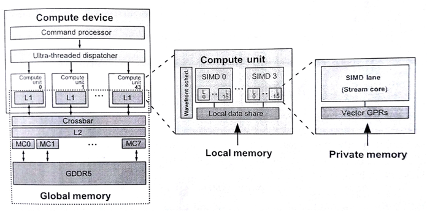
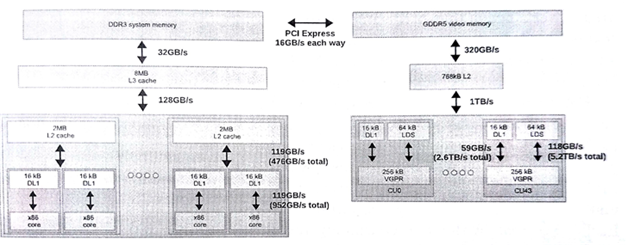
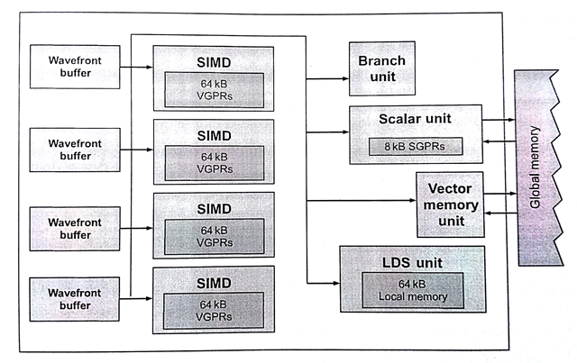
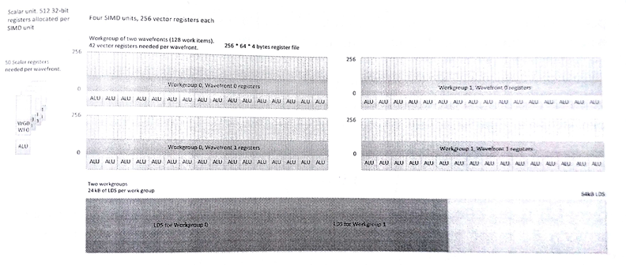

#8.2 AMD RADEON R9 290X GPU

本节我们将讨论一下AMD GPU中的“波面阵”(在NVIDIA显卡中称为“线程块”)。这个概念是有助于我们区分OpenCL工作项和CUDA线程。不过，有时会无可避免的使用“线程”这个词来对GPU的工作方式进行描述。本书中我们将会使用“线程”来描述硬件线程。虽然，本节指定的设备为AMD Radeon R9 290X GPU，但是硬件线程与工作项映射的关系、线程调度和抢占的考量，以及内存系统的布局，不同厂商的同类产品其实很相似。

GPU上OpenCL的目标代码与CPU上的差别很大。读者应该还记得，图像处理器主要用来对3D图像进行渲染。这种设计让使得资源的优先级有所不同，与CPU架构也有很大的区别。目前GPU市场上，GPU的一些主要特性的差距越来越小，这些特性我们在第2章讨论过：

1. 执行宽SIMD：大量执行单元对不同的数据，执行相同的指令。
2. 大量多线程：GPU计算核支持并发大量线程。
3. 硬件便签式内存：物理内存可由编程者控制。

下面罗列出来的区别则更加微妙，不过其根据工作分配和交互对应用性能进行提高：

- 支持硬件同步：并发线程间支持细粒度交互。
- 硬件管理任务分配：工作队列管理与负载均和由硬件控制。

硬件同步能为计算单元中的多个波面阵减少同步开销，并且细粒度交互的开销非常低。

GPU为任务分发提供广阔的硬件空间，因为图像处理器支持三维图像。游戏任务在显卡的流水线上交错排布，让图形任务的管理变得更加复杂。图8.5中展示了OpenCL模型在AMD Radeon R9 290X GPU映射关系，其架构包含一个命令处理器和工作组生成器(生成工作组供硬件调度)。调度器会将计算任务分配到设备的44个核上。有关计算单元的内容将在8.2.2中详细讨论。

图8.5 OpenCL执行模型和内存模型在Radeon R9 290X上的映射

为了使用GPU获得高性能加速，调度需要十分高效。对于图像处理器，波面阵调度的开销必须很低，因为工作块可能很小(例如，一个像素只包含三个元素)。因此，当我们需要使用GPU获取较高的性能时，我们需要：

- 提供大量的内核任务供硬件分发
- 如果内核过小，考虑将内核进行合并

为每个内核提供足够工作，这样就能持续的占用工作组的流水线，所以调度器总能收到很多的任务，并且调度器通常会将给多的任务推到SIMD单元上。所以我们希望，设备每一次的吞吐可以创建大量的波面阵发送给GPU。

第二点是因为OpenCL设备支持队列模式。当OpenCL运行时选择执行相关设备上任务队列中的任务时，运行时会扫描队列中的任务，并选择合适大小的任务进行执行。这种任务由一个GPU工作命令缓存构成，其命令的执行放置在GPU的前端流水线上。其执行内容包括(1)构建一个队列，(2)将该队列放置在内存的某个位置上，(3)告诉设备这个队列在哪里，(4)要求设备执行这个队列。因为操作阶段这几个步骤是串行的关系，所以对于单个工作块来说，就会导致较高的延迟。另外，GPU在驱动层之下执行内核的过程中，为了能让GPU正常工作，需要在大量执行内核的上下文中进行切换。在CPU端，如果涉及到线程上下文切换，那应用的性能肯定不会太好。所以，如果任务量太小，就会出现多个上下文切换的情况，从而导致应用性能的下降。不过，这里有个开销常量，也就是对于单个工作队列的分配，以及之后对队列上任务执行的开销。通过传递大内核的方(或较长的内核序列)，可以避免这种开销的累积。这样做的目的，就是为了增加每个队列中所要处理的任务量。

##8.2.1 线程和内存系统

CPU缓存层级结构的设计就是为了减少内存访问流的延迟，一旦内存访问流出现了重大的延迟，那么会对性能造成很大的影响。另外，因为GPU核使用线程和宽SIMD单元，所以其能在和标量相同的延迟开销下，将数据吞吐量最大化。图8.6展示了一个包含FX-8350 CPU和Radeon R9 290X GPU系统的内存层级结构。

这种内存系统中，GPU具有如下特征：

- 大量的寄存器
- 用于管理软件的便签式内存，在AMD硬件中称为*共享本地数据*(LDS, local data shares)
- 高级别的片上多线程
- 单个L2缓存
- 高带宽内存

图8.6 分布式系统中的内存带宽

如之前所提到的，图像任务与计算任务有很大的区别，这就导致GPU需要有自己的执行和内存模型。实际上，GPU比CPU更加少的依赖数据重用，并且GPU的缓存大小要比CPU的小很多。即使在x86核和Radeon R9 290X计算单元上的L1缓存数据大小相同，GPU一次执行40个波面阵的话，每个波面阵所分配到的缓存更加的有限。GPU对于缓存的弱依赖是由一系列原因的，其中包括时域图像数据不可复用，和由于数据集过大和大量的线程，无法保证为每个工作集提供足够的缓存空间。当数据复用发生时，多线程和高带宽内存将有助于克服缓存空间有限的情况。

GPU内存系统中，每个计算单元中有一个L2缓存。计算单元中的单L2缓存是为了保证GPU中L1缓存和外部缓存数据一致性而设计。如果向L2写入数据从而导致寄存器数据溢出，那么后续的每次访问则会有很高的的延迟，并且访存操作会阻塞在L2缓存处。

为了避免溢出，GPU提供了大量的寄存器。例如，在x86架构下通用寄存器的数量是固定的(每个线程上下文中有16个通用寄存器)，Radeon R9 290X显卡单个波面阵可用的寄存器数量为16384个！波面阵尝试只使用寄存器进行计算，并且也会使用到LDS，也会尽可能避免访存冲突。

LDS允许高带宽低延迟(编程可控)的读写访问。这种可编程模式的数据复用要比硬件控制更加高效。减少垃圾数据(加载到缓存而从不使用的数据)访问，可以认为LDS的容量要比同级的缓存小得多。另外，减少控制逻辑和结构体标记就可以节省出很多LDS空间。

GPU核中允许硬件控制多线程，可以很好的掩盖内存访问延迟。为了让性能和利用率达到最高，那么就要有足够多的波面阵执行起来。每个SIMD单元上能运行4个以上(包括4个)波面阵，或是很多应用需要每个计算单元上能运行16个波面阵。如果每个SIMD单元可以运行10个波面阵，那么就有显卡中就会同时有40个活动的波面阵。为了能更加快速的进行切换，波面阵的状态则保存在寄存器中，而非缓存中。虽然大量的博免征可以掩盖内存访问延迟，但是，每个波面阵也都是需要资源支持的，这里必须要做一个权衡。

为了减少每个波面阵产生的请求，系统中的缓存会通过一种过滤机制合并读取操作，并且将写入操作合并，尽可能一次性写入更多的内容——这种机制被称为*合并访问*(coalesing)。大向量从规划好的内存(基于DRAM)中读取数据会更加的高效。

图8.6中CPU和GPU是通过PCIe总线连接在一起，两设备间的数据传输则由该总线完成。应为PCIe总线的带宽要比DRAM低很多，和片上内存的带宽没法进行比较。在CPU和GPU交互比较多的应用中，带宽会成为应用的性能瓶颈。OpenCL应用中，我们必须最小化与执行相关的数据拷贝。使用离散GPU时，如果应用总要将GPU执行的数据通过PCIe进行拷贝，那么应用就不可能达到最佳的性能。

##8.2.2 指令集和执行单元

图8.7 Radeon R9 290X计算单元的微架构

##8.2.3 资源分配

GPU中的每个SIMD单元都有固定数量的寄存器和LDS存储空间。

图8.8 R9 290X GPU物理内存与OpenCL内存间的映射关系

