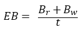
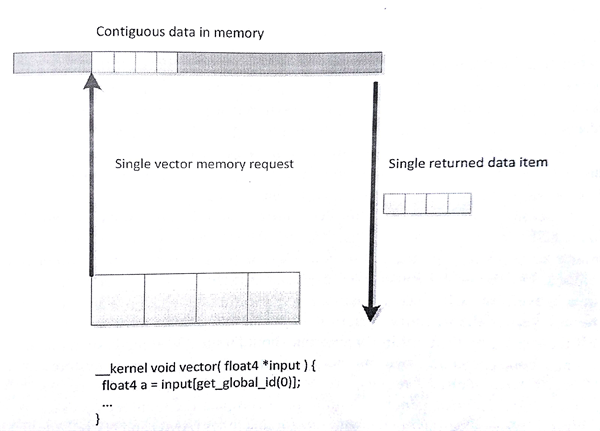
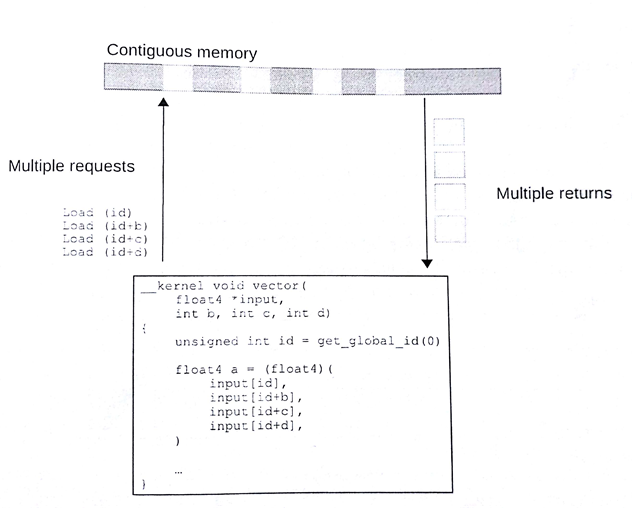
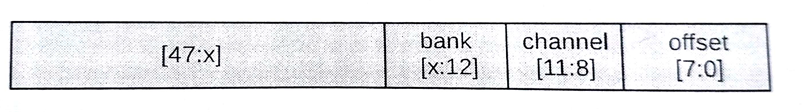
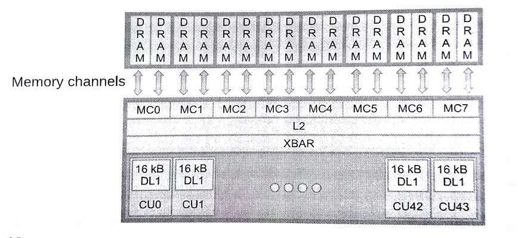
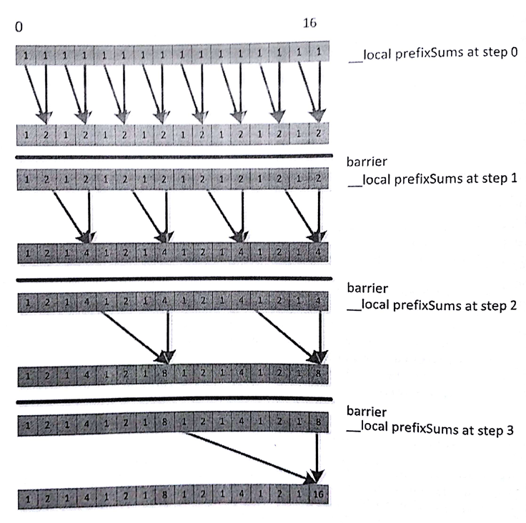
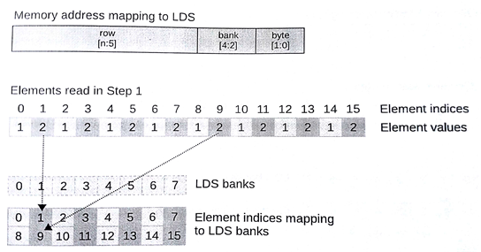
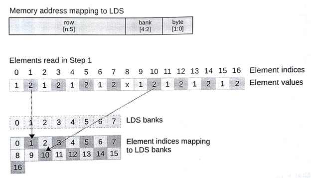

#8.3 OpenCL内存性能的考量

##8.3.1 全局内存

与内存相关的话题我们在第2章有详细的讨论过。OpenCL应用的性能与是否高效的使用的内存有着很大的关系。不过，高效的内存则依赖与具体的硬件(执行OpenCL内核的设备)。因此，同样的访存模式，在GPU上是高效的，不过在CPU上就不一定了。因为GPU的供应商繁多，且与CPU在制造方面有很大的区别。

所有例子中，内核吞吐量的级别是内存性能分析的开端。下面简单的计算公式，就是用来计算内核的带宽大小：

 (8.2)

EB代表有效带宽，Br代表从全局内存上读取的数据量(单位：byte)，Bw表示写入全局内存的数据量(单位：byte)，t代表内核运行的时间。

时间t的获取，可以通过一些性能测评工具，比如：ADM的CodeXL。Br和Bw可以通过每个工作项所读取或写入的数据量，然后乘以工作项的数量计算得出。所以，在某些情况下，这些读写的数据量都是估算出来的。

当我们测得当前执行内核的带宽，我们可以将测出带宽与执行设备的峰值带宽进行比较，看一下二者在数值上差多少。如果二者很接近，那说明我们充分的利用了当前内存系统；如果二者相差甚远，那我们就需要考虑重构我们内存访问的方式，以提高内存的利用率，增大内核带宽。

OpenCL程序在对内存访问时，需要考虑对内存所处的位置。大多数架构在运行OpenCL内核时，会基于不同等级的矢量进行(可能像SSE，或使用管道导向型输入语言进行在佛那个向量化，例如AMD的IL或NVIDIA的PTX)，内存系统会将向量中的数据打包一起处理以加速应用。另外，局部访问通常会使用缓存进行。

大多数现代CPU都支持不同版本的SSE和AVX向量指令集。我们将内存部分设计成全对齐的模式，向量读取这样的内存会有使用到相关的指令集，并且向量指令会使内存访问更加高效。我们可以给定一个较小的向量尺寸(比如float4)，这样的话编译器会生成更加高效的向量读取指令。这样很好的利用了缓存行，在缓存和寄存器间做数据移动是最高效的。不过，CPU在处理未对齐的内存，或更多的随机访问时，缓存会帮助掩盖一些性能损失。图8.9和图8.10提供了两个例子，一个用于读取一段连续的4个数据，另一个则是通过随机访问4个数据。如果缓存行较窄，则会出现很多次缓存未命中，这样的情况会大大影响应用的性能。

图8.9 内存系统中使用向量的读取数据的方式会更加高效。当工作项访问连续的数据时，GPU硬件会使用合并访问的方式获取数据。

图8.10 访问非连续元素时，性能会有一定的损失。

之前的章节中我们曾讨论过，GPU内存架构与CPU的内存架构有着很大的不同。GPU使用多线程的方式来掩盖不同级别的内存延迟，CPU则会更多的是用ALU的能力，而非缓存和复杂的乱序逻辑。传统GPU具有更多的计算资源可用，如果我们不想GPU饿死，就需要具有更加高带宽的内存系统。很多现代GPU架构，特别是高性能桌面版本，比如AMD的Radeon系列和NVIDIA的GeForce系列，都在使用宽SIMD架构。试想8.10图中的例子，将向量扩展成(AMD Radeon R9支持的)64位硬件向量。

高效的访问在不同的架构中也有不同的方式。对于x86 CPU来说使用的是SSE指令集，我们可能会使用128位的float4类型作为数据处理的单元，这样可能会增加缓存行的利用率，减少缓存未命中的概率。对于AMD Radeon R9 290X GPU架构，同一波面阵中连续的工作项就可以同时对内存进行访问。如果内存系统不能及时的处理这些请求，则会造成访存延迟。对于最高的性能，同一波面阵的工作项同时发起32位的读取请求时，就意味着最多需要读取256字节(32bit x 64个工作项)内存数据，这样内存系统只需要相应开辟一块较大内存上的请求。为了可在不同的架构间进行移植，一个好的解决方式就是让内存访问的效率尽可能的高，可以在宽矢量设备(AMD和NVIDIA GPU)和窄矢量设备(x86 CPU)都有很好的访存效率。为了达到这种效果，我们可以通过工作组计算出所要放访问的内存起始地址，该地址应为work-groupSIze * loadSize对齐，其中loadSize是每个工作项所加载的数据大小，其应该是一个合理的值——对于AMD GCN架构的设备来说，32位是一个不错大小；对于x86 CPU和旧一些的GPU架构来说，128位则是很好的选择；对支持AVX架构的设备来说，256位则是不二之选。为什么32位对于AMD GCN架构来说是一个不错的选择，下面我们就来解释一下。

要处理不同的内存系统，需要面对很多问题，比如：减少片外链接DRAM的访存冲突。先让我们来看一下AMD Radeon架构中如何进行地质分配。图8.11中低8位展示了给定内存块中的数据内存起始地址；这段信息可以存储在缓存行和子缓存行中，供我们进行局部读取。如果尝试读取二维数据中一列的数据，对于行优先的存储方式，这种方式对于片上总线来说是低效的。其也意味着，设备上同时执行的多个工作组，访问的内存通道和内存块都有所不同。

图8.11 将Radeon R9 290X地址空间的内存通道与DRAM块间的映射

图8.12 Radeon R9 290X内存子系统

每个内存通道的控制器与片外内存进行连接(图8.12)。我们希望执行设备能够通过内存系统，访问到其中的所有内存块与内存通道。不过，一个波面阵中某个矢量将会命中多个内存通道(或内存块)，并占用和阻塞他们，导致其他波面阵对相应地址访问的延迟，从而导致带宽的下降。最佳的方式是，给定的波面阵能够连续的读取指定内存通道和内存块上的数据，允许更多波面阵可以并行的对内存进行访问，形成高效的数据流。

为了避免使用多个通道，一个波面阵所能访问到的区域在64个字(256字节)之内，这就能保证所有工作项在读取32位数据时，是从连续的地址上获取。这里需要讨论一下访存最坏的结果——"当多个波面阵中的每个工作项对同一地址的数据进行访问"——每个工作项中的变量都将命中同一内存通道和内存块，并且串行的获取数据，访存吞吐量比顶峰时降低数倍。更多的有关AMD架构主题的内容，可以在《AMD的OpenCL编程指南》中找到[4]。同样的信息也在其他GPU供应商的计算架构中出现——例如，NVIDIA的《CUDA编程指南》[5]。

##8.3.2 局部内存——软件可控缓存

大多数支持OpenCL的设备都支持不同形式的缓存。由于面向图像的设计，很多GPU只提供只读数据缓存，这样能复用大量的数据。

OpenCL使用缓存最简单的方式就是使用图像类型(第6和第7章讨论过)。在GPU上，图像可以将数据映射成硬件可读纹理。假设复杂的滤波器不需要进行二维内存访问，那么访问内存效率将会提高。不过，GPU缓存相较波面阵所要读取的内存，则是相形见绌。编程者可通过代码控制便签式内存在局部空间的大小，这在能够高效获取数据的同时，减少了硬件控制缓存的开销，有效的节约资源。这对于工作组内工作项的数据交换来说，能够减少栅栏冲突和访问延迟。(图5.5就是一个例子)

当然，在考虑对数据进行优化时，需要认真的考虑如何利用数据的局部性。在很多例子中，其消耗在于使用额外的拷贝指令将数据搬移到局部内存中，之后搬运到ALU中(可能通过寄存器)进行计算，这种方式的效率通常要比简单的复用缓存中数据的效率低得多。有大量的读取和写入操作复用同一地址时，将数据搬移到局部内存中将会很有用，读取和写入操作对局部内存的操作延迟要远远小于对于全局内存的操作。并且，在对二维数据进行访问时，就不需要通过全局变量进行数据加载，从而减少缓存加载所需要的时间。

在下例中的读/写操作，将会大大收益与局部内存，特别是给定宽度的只读缓存。读者可以尝试，写出前缀求和的C代码，和下面的代码进行对照：


void localPrefixSum(
  __global unsigned *input,
  __global unsigned *output,
  __local  unsigned *prefixSums,
           unsigned numElements){
  
  /* Copy data from global memory to local memory */
  for (unsigned index = get_local_id(0);
  	index < numElements;
    index += get_local_size(0)){
    prefixSums[index] = input[index];
  }
  
  /* Run through levels of tree, each time halving the size
   * of the element set performing reduction phase */
  int offset = 1;
  for (unsigned level = numElements / 2;
  	level > 0;
    level /= 2){
    barrier(CLK_LOCAL_MEM_FENCE);
    
    for (int sumElement = get_local_id(0);
    	sumElement < level;
        sumElement += get_local_size(0)){
        int ai = offset * (2 * sumElement + 1) - 1;
        int bi = offset * (2 * sumElement + 2) - 1;
        prefixSums[bi] = prefixSums[ai] + prefixSums[bi];
    }
    offset *= 2;
  }
  
  barrier(CLK_LOCAL_MEM_FENCE);
  
  /* Need to clear the last element */
  if (get_local_id(0) == 0){
    prefixSums[numElements - 1] = 0;
  }
  
  /* Push values back down the tree */
  for (int level = 1; level < numElements; level *= 2){
    offset /= 2;
    barrier(CLK_LOCAL_MEM_FENCE);
    
    for (int sumElement = get_local_id(0);
    	sumElement < level;
        sumElement += get_local_size(0)){
        int ai = offset * (2 * sumElement + 1) - 1;
        int bi = offset * (2 * sumElement + 2) - 1;
        unsigned temporary = prefixSums[ai];
        prefixSums[ai] = prefixSums[bi];
        prefixSums[bi] = temporary + prefixSums[bi];
    }
  }
  
  barrier(CLK_LOCAL_MEM_FENCE);
  
  /* Write the data out to global memory */
  for (unsigned index = get_local_id(0);
  	index < numElements;
    index += get_local_size(0)){
    output[index] = prefixSums[index];
  }
}


程序清单8.2 单工作组的前缀求和

图8.13

图8.14

图8.15

----------

[4] Advanced Micro Device, The AMD Accelerated Paralel Processing-OpenCL Programming Guide, Advanced Micro Devices, Inc,. Sunnyvale, CA, 2012.

[5] NVIDIA, CUDA C Programming Guide, NVIDIA Corporation, Santa Clara, CA, 2012.
