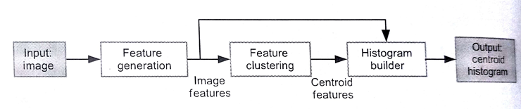
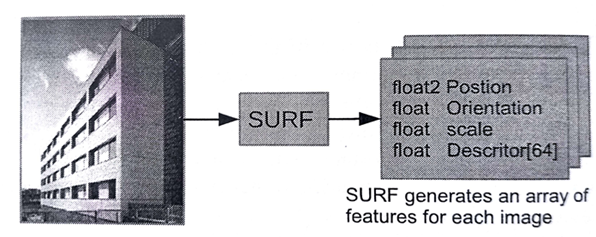

#9.1 图像聚类简介

图像分类源于机器视觉，其根据图像可见内容对图像进行分类。例如，某个图像算法可能会用来告诉你该图片中是否有人。虽然检测人可能是很简单的事情，但能将图像进行准确分类的算法，仍然是目前的所要面临的挑战。

BoW模型通常会用于文本分类或自然语言处理。BoW模型中每个词出现的频度都会作为一个训练参数传入对应的机器学习算法中。除了进行文本分类，BoW也可以应用于图像。为了让BoW能对图像进行分类，我们需要从图像中获取一组词(和文本分类一样)，以及对应词的出现频率。机器视觉中，这里的“词”通常被看做是图像的一个“特征”。特征算法将图像缩小成一组特征值。图9.1展示了个图像分类的高端算法，其包括生成特征、聚合和直方图建立这几步。

图9.1 图像分类流程。像SURF这样的算法可以用来产生特征。像k-means类的聚合算法之后会产生一组质心特征，这些特征可以用来描述原始图像。通过直方图构建算法将这些计算出的特征赋予质心。

图9.2 使用SURF算法生成特征。SURF算法可以将一副图像作为输入，并且产生一组对应的特征。每个特征包括图像位置信息和一个具有64个值的描述符。

下面简单的描述一下这几步：

1. 生成特征：我们已经将特征产生算法应用于BoW模型，将其称为*加速稳健特征算法*(SURF，Speeded Up Robust Features)。SURF算法在2006年，由Bay等人在欧洲计算机视觉会议(ECCV)上发表[1]，其对不同大小的图像进行尺度不变的变换。如图9.2所示，将图像出入SURF算法中，将会得到一组用来描述原始图像的特征值。每个特征值包含图像位置和描述矢量。每个特征中的描述符向量是一个64维的向量。没描述符中包括该特征颜色和特征位置周围颜色梯度关系。本章中的特征，都具有一个有着64个元素的描述符。其余的成员变量则不是本章关注的焦点。
2. 图像聚合：SURF产生的描述符通常都经过量化，通常会经过k-means聚合，然后映射到群组中。每个群组的质心就是所谓的“视觉词”。
3. 直方图构建：这一阶段的任务是将SURF算法产生的描述符设置到直方图的视觉词中去。为了完成这项工作，我们需要确定描述符和质心的对应关系。本例中，SURF产生的特征描述符和质心都由64维构成。我们通过计算描述符和所有质心的欧式距离，并且将描述符赋予距离最近的质心。直方图在这里就是用于统计每个质心被赋予描述符的次数。

使用这种方法，我们就能表示视觉词出现的频度。机器算法，例如支持向量机就能使用模型对图片进行分类。这一过程在图9.1中展示。

本章我们将探索在直方图构建步骤上的并行化。我们首先使用在CPU上的串行算法对该算法做一个具体的了解，然后使用OpenMP进行CPU版本的并行化优化。然后将多线程实现换成OpenCL，让这一阶段的计算在GPU上完成。我们会有多个GPU版本的实现，包括原始实现，对全局内存进行优化的实现，以及利用局部内存的实现。本章最后，我们将使用AMD的Radeon HD 7970 GPU对相应的实现进行性能评估。

> 贴士
> 本章着重于图像分类算法中的直方图构建步骤。
> 读者如果对特征生成算法感兴趣，这里提供一个开源版本的SURF实现(OpenCL)：https://code.google.com/p/clsurf/
> google code无法使用，GitHub地址：https://github.com/perhaad/clsurf

----------------

[1] H. Bay, T. Tuytelaars, L.V.Gool, SURF:speed up robust features, in: ECCV, 2006, pp.404-417.