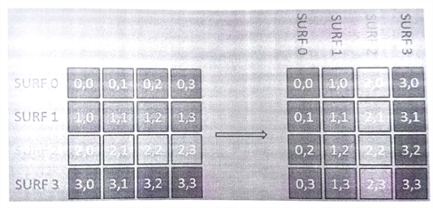
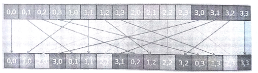

#9.3 OpenCL实现

本节，我们将了解一下如何在GPU上实现直方图构建。首先实现实现了一个常规内核，该内核代码基于串行和OpenMP版本的算法。然后，再来对GPU实现进行优化，这里使用的优化策略为：合并访问和局部内存。

##9.3.1 常规GPU实现：GPU1

根据清单9.2中的OpenMP实现，我们可以实现一个最简单OpenCL版本，也就是将循环迭代拆开，让每个工作项完成一个标识符的归属计算。

不过，OpenMP实现中，我们遇到了条件竞争的问题，这里工作项需要对在全局内存上的直方图进行更新。为了解决这一问题，在OpenCL中我们依旧使用原子操作。下面的OpenCL内核就是我们的实现。我们暂且称这段代码为GPU1：


__kernel
void kernelGPU1(
  __global float *descriptors,
  __global float *centroids,
  __global int *histogram,
  int n_descriptors,
  int n_centroids,
  int nfeatures){

  // Global ID identifies SURF descriptor
  int desc_id = get_global_id(0);
  
  int membership = 0;
  float min_dist = FLT_MAX;
  
  // For each cluster, compute the membership
  for (int j = 0; j < n_centroids; j++){
    float dist = 0;
    
    // n_features: No. of elements in each descriptor(64)
    // Calculate the distance between the descriptor and the centroid
    for (int k = 0; k < n_features; k++){
      float temp = descriptors[desc_id * n_features + k] -
        centroids[j * n_features + k];
      dist += temp * temp;
    }
    
    // Update the minimum distance
    if (dist < min_dist){
      min_dist = dist;
      membership = j;
    }
  }
  
  // Atomic increment of histogram bin
  atomic_fetch_add_explicit(&histogram[membership], 1, memory_order_relaxed, memory_scope_device);
}


代码清单9.3 内核GPU1，直方图基线内核

注意清单9.3中，第37行的原子加操作，使用的自由序进行。我们选择这个内存序的原因是，更新操作比较简单，并不需要对内存访问顺序进行严格要求。详细内容可回顾第7章中的相关章节。

##9.3.2 合并访问内存：GPU2

例子中对于数据的访问不存在跨距，所以工作项可以在GPU执行单指令多数据命令(SIMD)。并且SURF描述符和集群质心矢量都具有64个连续数据。再来看看清单9.3中的第24行，并且注意描述符访问的方式。对于给定的GPU硬件来说，第24行对于内存的访问是否高效呢？

假设有4个并行的工作项，其全局索引分别是0到3。在GPU执行最内部的循环时，这个四个工作项所访问的数据间具有很大的跨距——在这个版本的内核代码中，数据跨距为n_features。假设我们现在在处理质心0(j=0)，并且正在处理质心0与特征0(k=0)之间的距离。那么工作项分别访问的数据为：descriptors[0]、descriptors[64]、descriptors[128]、descriptors[192]。那么计算下一个特征时就要访问descriptors[1]、descriptors[65]、descriptors[129]、descriptors[193]，以此类推。

第8章中我们介绍了对于连续数据的合并访问方式，该方式只向内存系统发出更少的请求，以高效的方式获取相应的数据。不过，跨距访问方式需要产生多个访存请求，从而导致性能下降。这种带有跨距的访存方式是无法进行合并访问的。

为了通过使用合并访问的方式提升内存带宽的利用率，我们需要调整数据在descriptors存放的顺序。可以通过一种常用的矩阵操作来完成——转置，如图9.3所示。转置过程中，矩阵的行列坐标互换。我们可以创建一个简单的内核来完成这项工作。



图9.3 将描述符中的数据进行转置，以便进行合并访问



图9.4 对一维数组进行转置。

一维数组的转置如图9.4所示。转置后，descriptors[0]、descriptors[64]、descriptors[128]、descriptors[192]就是连续的。并且内核内部可以进行合并访问，只需要一个访存请求，即可直接将4个连续的数据取出。


__kernel
void kernelGPU2(
  __global float *descriptors,
  __global float *centroids,
  __global int *histogram,
  int n_descriptors,
  int n_centroids,
  int nfeatures){

  // Global ID identifies SURF descriptor
  int desc_id = get_global_id(0);
  
  int membership = 0;
  float min_dist = FLT_MAX;
  
  // For each cluster, compute the membership
  for (int j = 0; j < n_centroids; j++){
    float dist = 0;
    
    // n_features: No. of elements in each descriptor(64)
    // Calculate the distance between the descriptor and the centroid
    for (int k = 0; k < n_features; k++){
      float temp = descriptors[k * n_descriptors + desc_id] -
        centroids[j * n_features + k];
      dist += temp * temp;
    }
    
    // Update the minimum distance
    if (dist < min_dist){
      min_dist = dist;
      membership = j;
    }
  }
  
  // Atomic increment of histogram bin
  atomic_fetch_add_explicit(&histogram[membership], 1, memory_order_relaxed, memory_scope_device);
}


代码清单9.4 使用内存合并访问的内核——GPU2

清单9.4中的第24行，现在使用的是k * n_descriptors + desc_id，可与清单9.3进行对比。当k和n_descriptors具有相同的值时，所有工作项就挨个对数据进行计算，不同工作项可以通过唯一标识符对数据进行访问(desc_id)。我们之前举了4个工作组的例子，在k=0时，就只需要访问descriptors[0]、descriptors[1]、descriptors[2]和descriptors[3]即可。当k=1时，则需要访问descriptors[64]、descriptors[65]、descriptors[66]和descriptors[67]。这样的访存方式是最理想的，并且在GPU上进行合并访问可以高效的对内存系统进行操作。

##9.3.3 向量化计算：GPU3

当SURF算法生成特征之后，描述符的长度固定为64维，这时使用向量float4可以对应用进行提速。在CPU上，对于其扩展流媒体SIMD指令来说，能够获得较高的吞吐量。同样的方式也适用于GPU(比如，AMD Radeon 6xxx 系列)，在GPU上使用向量化方式的计算也能带来相应的性能收益。AMD和NVIDIA的新型GPU都不会显式的执行向量指令，不过在某些情况下向量的方式也会提升内存系统的使用效率。

```c++
float a[4], b[4], c[4];

a[0] = b[0] + c[0];
a[1] = b[1] + c[1];
a[2] = b[2] + c[2];
a[3] = b[3] + c[3];
```

向量化可以推广到一些可扩展的数据类型，比如：向量、矩阵和高维数组。这里的例子中，我们将数组中的元素由编程者显式的放入float4类型中。下面的代码就向量化所要进行的一些操作。

```c++
float a[4], b[4], c[4];

float4 b4 = (float4)(b[0], b[1], b[2], b[3]);
float4 c4 = (float4)(b[0], b[1], b[2], b[3]);
float4 a4 = b4 + c4;
```

为了将向量化应用到我们的算法中，我们在这里更新一下内核实现(代码清单9.5)，称这个内核为GPU3。


__kernel
void kernelGPU3(
  __global float *descriptors,
  __global float *centroids,
  __global int *histogram,
  int n_descriptors,
  int n_centroids,
  int nfeatures){

  // Global ID identifies SURF descriptor
  int desc_id = get_global_id(0);
  
  int membership = 0;
  float min_dist = FLT_MAX;
  
  // For each cluster, compute the membership
  for (int j = 0; j < n_centroids; j++){
    float dist = 0;
    
    // n_features: No. of elements in each descriptor(64)
    // Calculate the distance between the descriptor and the centroid
    // The increment of 4 is due to the explicit verctorization where
    // the distance between 4 elements is calculated in each
    // loop iteration
    for (int k = 0; k < n_features; k++){
      float4 surf_temp = (float4)(
        descriptors[(k + 0) * n_descriptors + desc_id],
        descriptors[(k + 1) * n_descriptors + desc_id],
        descriptors[(k + 2) * n_descriptors + desc_id],
        descriptors[(k + 3) * n_descriptors + desc_id]);
      float4 cluster_temp = (float4)(
       	centroids[j * n_feature + k],
        centroids[j * n_feature + k + 1]
        centroids[j * n_feature + k + 2]
        centroids[j * n_feature + k + 3]);
        
      float4 temp = surf_temp - cluster_temp;
      temp = temp * temp;
      
      dist += temp.x + temp.y + temp.z + temp.w;
    }
    
    // Update the minimum distance
    if (dist < min_dist){
      min_dist = dist;
      membership = j;
    }
  }
  
  // Atomic increment of histogram bin
  atomic_fetch_add_explicit(&histogram[membership], 1, memory_order_relaxed, memory_scope_device);
}


代码清单9.5 使用向量化的内核代码——GPU3

##9.3.4 将SURF特征放入局部内存：GPU4

下面是代码清单9.4中，访问descriptors和centroids的代码片段：

```c++
for (int k = 0; k < n_features; k++){
  float temp = descriptors[k * n_features + k] -
    centroids[j * n_features + k];
  dist += temp * temp;
}
```

从上面的片段可以看出，要对这个内存进行多次的访问。有没有可能将这段内存放置到OpenCL特定的内存空间中，以提升性能呢？

这里访问centroids的位置可以使用工作项的索引进行表示。常量内存非常适合以这种方式进行访问，下节中我们将介绍如何将centroids放入常量内存。当前版本中，重点放在对descriptors访存的优化。当使用工作项索引对descriptors数据进行访存时，因为其存在访存跨度的原因，所以不是很适合放入常量内存中。那么这个数组能放入到局部内存中吗？

GPU上的局部内存是一段具有高带宽、低延迟的内存区域，其可以将数据共享给工作组内每一个工作项。GPU上有专用的局部内存，访问局部内存的速度通常要比全局内存快很多。同样，与全局内存访问不同，访问局部内存通常都不需要合并访问，就算是在局部内存上产生了内存访问冲突，其性能也要优于全局内存。不过，局部内存的大小有限——在AMD Radeon HD 7970 GPU上每个计算单元只有64KB大小的局部内存，所以能分配给一个每个工作组的只有32KB。若是为每个工作组分配一个很大的内存，则会限制GPU上执行线程的数量。对于GPU来说，减少线程就意味着不能很好的掩盖访存延迟，同样也会让计算资源闲置。

最初，数据放到局部内存上似乎并不是最好的选择，因为局部内存能在工作项间共享数据，不过对于descriptors来说没有数据是需要共享的。不过，对于很多GPU，局部内存具有一些额外的优势。首先，局部内存与本地数据存(LDS)相对应，其比L1缓存大4倍。其次再说缓存命中，LDS内存访存的延迟也要比L1缓存低很多。为了充分复用，数据放在LDS将会带来比放在L1缓存上更好的性能，因为LDS的延迟很小，即使是高频度访问也能轻松应对。这里所要权衡的是局部内存使用的多少与执行工作组数量，换句话说就是更多的使用执行单元还是内存系统。优化策略的权衡，需要根据不同的架构特点决定。代码清单9.6展示了，descriptors使用局部内存的内核代码。


__kernel
void kernelGPU4(
  __global float *descriptors,
  __global float *centroids,
  __global int *histogram,
  int n_descriptors,
  int n_centroids,
  int nfeatures){

  // Global ID identifies SURF descriptor
  int desc_id = get_global_id(0);
  int local_id = get_local_id(0);
  int local_size = get_local_size(0);
  
  // Store the descriptors in local memory
  __local float desc_local[4096]; // 64 descriptors * 64 work-items
  for (int i = 0; i < n_features; i++){
    desc_local[i * local_size + local_id] =
    	descriptors[i * n_descriptors + desc_id];
  }
  barrier(CLK_LOCAL_MEM_FENCE);
  
  int membership = 0;
  float min_dist = FLT_MAX;
  
  // For each cluster, compute the membership
  for (int j = 0; j < n_centroids; j++){
    float dist = 0;
    
    // n_features: No. of elements in each descriptor(64)
    // Calculate the distance between the descriptor and the centroid
    for (int k = 0; k < n_features; k++){
      float temp = descriptors[k * local_size + desc_id] -
        centroids[j * n_features + k];
      dist += temp * temp;
    }
    
    // Update the minimum distance
    if (dist < min_dist){
      min_dist = dist;
      membership = j;
    }
  }
  
  // Atomic increment of histogram bin
  atomic_fetch_add_explicit(&histogram[membership], 1, memory_order_relaxed, memory_scope_device);
}


代码清单9.6 将descriptor数据存放在局部内存中的内核——GPU4

访问descriptor时，n_descriptors和desc_id对于所有工作项来说都是固定的。索引值都是基于k变化的。因此，每个工作项都能访问到desctiptor中的n_feature个元素(64)。GPU上L1缓存的大小非常小，每次缓存访问丢失都会给访问全局内存的过程带来更多冗余的开销。

将secriptors放入LDS将需要64x4=256字节。一个波面阵中有64个工作项，每个波面阵就需要是用16KB的LDS空间用来缓存desctiptor。当有64KB的LDS空间时，就能在每个计算单元上运行4个波面阵(每个波面阵只有一个工作项)。在HD 7970上，每个计算单元由4个SIMD单元组成，这样的话每个SIMD单元就只能处理一个波面阵，SIMD单元之间的延迟掩盖就没有了。为了获取最佳性能，我们需要在低延迟访问和减少并行化中进行权衡。

##9.3.5 将聚类中点坐标放入常量内存：GPU5

第4章中我们讨论过卷积操作，并且在第7章介绍过内存模型，常量内存所放置的数据可以让所有工作项同时访问。通常放置在常量内存中的数据有卷积的内核和一些常量数据。直方图的例子中，每个质心的描述符就是固定的数据。访问centroids时，地址要根据两层循环的索引进行计算得出，并非按照工作项索引。因此，所有工作项都要进行一定的计算才能产生所要访问的地址。

GPU常量内存通常会映射到一块较为特殊的缓存硬件上，其大小是固定的。所以，将centroids放置到常量内存中时，需要考虑其数据的大小。本例中Radeon HD 7970，其常量内存大小为64KB。本例中每个特征的质心数据有256字节。因此，我们最多只能同时将256个质心放置到常量内存中。

相信会有读者对映射到常量内存上数据的性能有疑问。如果所有工作项同时访问同一个地址，以非合并访问的方式下，是否对常量内存只产生一个访问请求？大多数现代GPU上，对这个问题的回答是“是”：只产生一个访问请求。不过，与LDS上的descriptors类似，将centroids放置在常量内存上也会带来性能收益。首先，使用常量内存会减小GPU上L1缓存的压力。GPU上的L1缓存比较小，现在将一块64KB的空间移除L1缓存，将其他数据放置在这里，从而会带来巨大的性能提升。其次，GPU常量内存的访存延迟也要比通用L1缓存低很多。当我们的数据不是那么多的时候，我们可以考虑将其放置在常量内存中，这将带来很好的性能收益。

将centroids数组映射到常量内存的方式很简单，只需要将`__global`改成`__constant`即可。具体代码见代码清单9.7。


__kernel
void kernelGPU4(
  __global float *descriptors,
  __constant float *centroids,
  __global int *histogram,
  int n_descriptors,
  int n_centroids,
  int nfeatures){

  // Global ID identifies SURF descriptor
  int desc_id = get_global_id(0);
  int local_id = get_local_id(0);
  int local_size = get_local_size(0);
  
  // Store the descriptors in local memory
  __local float desc_local[4096]; // 64 descriptors * 64 work-items
  for (int i = 0; i < n_features; i++){
    desc_local[i * local_size + local_id] =
    	descriptors[i * n_descriptors + desc_id];
  }
  barrier(CLK_LOCAL_MEM_FENCE);
  
  int membership = 0;
  float min_dist = FLT_MAX;
  
  // For each cluster, compute the membership
  for (int j = 0; j < n_centroids; j++){
    float dist = 0;
    
    // n_features: No. of elements in each descriptor(64)
    // Calculate the distance between the descriptor and the centroid
    for (int k = 0; k < n_features; k++){
      float temp = descriptors[k * local_size + desc_id] -
        centroids[j * n_features + k];
      dist += temp * temp;
    }
    
    // Update the minimum distance
    if (dist < min_dist){
      min_dist = dist;
      membership = j;
    }
  }
  
  // Atomic increment of histogram bin
  atomic_fetch_add_explicit(&histogram[membership], 1, memory_order_relaxed, memory_scope_device);
}


代码清单9.7 将质心数据放置在常量内存中——GPU5
